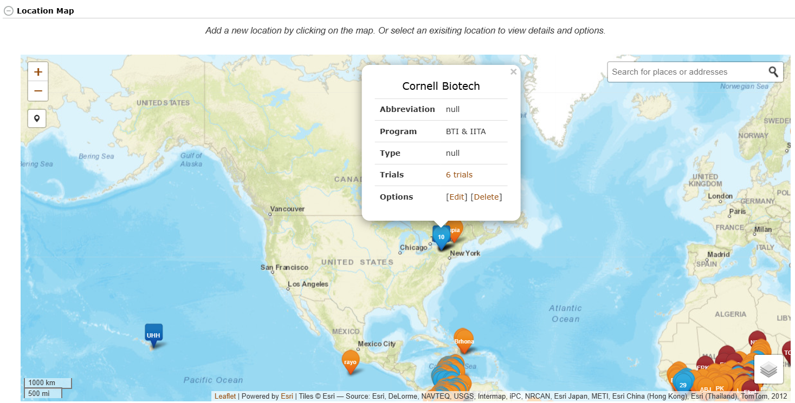

# Introduction {.unnumbered}

Placeholder


<!--chapter:end:index.Rmd-->


# Basic Website Usage

Placeholder


## Creating a User Account
### Verifying first that you do not already have an account
### Creating a user account
## Managing your Account
### Login
### Editing Account Settings
### Changing Your Account Status: From “User” to “Submitter”
### Submitting Feedback on an SGN Database
## Menu Layout
### Menu Options
#### Search {.unnumbered}
#### Manage {.unnumbered}
#### Analyze {.unnumbered}
## Working with Lists {#working-with-lists}
### Creating lists
### Viewing and editing lists
## User Permissions

<!--chapter:end:basic_website_usage.Rmd-->


# Searching the Database

Placeholder


## The Search Wizard {#search-wizard}
### How the Search Wizard Works
### How to use retrieved data 
#### Getting more Info {-}
#### Saving to a list {-}
#### Downloading Data {-}
##### Metadata {-}
##### Phenotypes {-}
##### Genotypes {-}
#### Saving the wizard selections {-}
### Updating the Wizard
## Accessions and Plot Search
## Trials Search
## Trait Search
## Ontology Browser
## Search Seedlots

<!--chapter:end:searching_the_database.Rmd-->

# Managing User Roles

```{r echo=FALSE, out.width='95%', fig.align='center'}

```

## What are User Roles?

Every user account in Breedbase has one or more associated "roles" that determine the authorizations (what the user is allowed to do) in the database. There are three fundamental roles, "curator", "submitter", and "user", which determine basic read/write levels. The "curator" status can read and write everything in the database. The "submitter" status can add information and edit or delete previously submitted information. The "user" type can only read data. Additional roles represent the breeding programs, and are sometimes used to fine-tune write and edit capabilities, as it necessary for multiple users in a breeding program to edit each other's data.

## The Manage User Roles page

In the "Manage" menu, select the item "User Roles". This will show the current users in the database with their associated roles. If you are logged in as a curator, the table will show system roles as well as breeding program roles; if you are logged in as a submitter or user, it will show breeding program membership.

If logged in as a "curator", the roles can be added or deleted.

-   To delete a role, click on the X in the role name. A confirm dialog will be displayed to prevent accidental deletion.
-   To add a role, click on the plus sign next to the roles. A dialog will pop up with a list of roles. Select the desired role and click "Submit".
-   The new role should be displayed next to the user immediately.
-   Role deletions and additions will be effective immediately.

It is recommended that few users be given the "curator" privileges to avoid confusion over data ownership and accidental data overwriting and deletion.

<!--chapter:end:managing_user_roles.Rmd-->

# Managing Breeding Programs

New breeding programs can be added by using “Add New Program” button on the “Manage Breeding Programs” page.

```{r echo=FALSE, out.width='95%', fig.align='center'}

```

Clicking on the “Add New Program” button will generate a blank form for you to fill out the name and description of the breeding program that you want to add. After completing the form, click on “Add Breeding Program” button to finish the process.

```{r echo=FALSE, out.width='95%', fig.align='center'}

```

<!--chapter:end:managing_breeding_programs.Rmd-->

# Managing Locations

Field locations can be managed using the “**Manage Locations**” page. On this page, locations in the database are organized based on their breeding programs. Each location has a link to trials conducted in that location. To add a new location, click on the “Upload New Locations” button that links to the “Upload Locations” form.

```{r echo=FALSE, out.width='95%', fig.align='center'}
knitr::include_graphics('assets/images/image141.png')
```

The "Upload Locations" describes how to build a spreadsheet with location data for upload. Name, abbreviation, country code, country name, program, type, latitute, longitude, and elevation are all required. The NOAA station ID is optional. Link a spreadhsheet to the form and click "Upload" to add those locations to the database. 

```{r echo=FALSE, out.width='95%', fig.align='center'}
knitr::include_graphics('assets/images/image187.png')
```

Alternatively, locations can be viewed and added via the map. Hover over an icon on the map to see the location details and trials linked to that location. Click on the map to open the new location dialog. Fill in the same information that would be used in the spreadsheet upload to add a new location. 

```{r echo=FALSE, out.width=95%, fig.align='center}

```

<!--chapter:end:managing_locations.Rmd-->


# Managing Accessions

Placeholder


## Add Accessions Using A List
## Uploading Accessions and Accession's Info From A File
## Email alert for accession upload
## Add Parentage (Pedigree) Information to Accessions
## Working with grafts
## Bulk renaming of accessions

<!--chapter:end:managing_accessions.Rmd-->


# Managing Seed Lots

Placeholder


## Add New Seedlot(s)
## Seedlot Transactions
## Seed Inventory
## Find Seedlots For a List of Accessions
## Create a seedlot for an Accession or Cross
## Add quality data to a seedlot
## Seedlot Maintenance Events
### Setup
### Adding Events
#### Uploading Events with Excel Template {-}
#### Recording Events on Website {-}
### Displaying Events
### Downloading Events
## Deleting Seedlots

<!--chapter:end:managing_seedlots.Rmd-->

# Managing Populations

Populations are modeled as groups of accessions. This grouping can be useful in downstream analyses. To manage these populations go to Manage Accessions and scroll tp the bottom.

```{r echo=FALSE, out.width='95%', fig.align='center'}

```

To add a new population click "Create Population". The following dialog will appear where you choose a list of accessions and give a name to the new population. Please note it is also possible to create a population when you are uploading new accessions into the database.

```{r echo=FALSE, out.width='75%', fig.align='center'}
knitr::include_graphics('assets/images/manage_populations_add_population.png')
```

Click on the plus (+) button next to Populations to see all the available populations. Click on a population name to see the accessions in the population.

```{r echo=FALSE, out.width='95%', fig.align='center'}

```

From here you can delete accessions from a population as well as add new accessions to the population.

```{r echo=FALSE, out.width='95%', fig.align='center'}

```

<!--chapter:end:managing_populations.Rmd-->


# Managing Crosses

Placeholder


## Crossing Experiment
### Add New Crossing Experiment
## Cross
### Add New Crosses
#### Add a cross by using the "Add New Cross" dialog {-}
#### Upload New Crosses {-}
### Update Crosses by Uploading
## Cross Wishlist
### Create a Cross Wishlist
#### Step 1. Select the accessions to be crossed in your trial {-}
#### Step 2. Select the female plots to be considered in the crosses {-}
#### Step 3. Transfer the cross wishlist to your mobile crossing application {-}
## Crossing Experiment Detail Page
## Cross Detail Page

<!--chapter:end:managing_crosses.Rmd-->


# Managing Field Trials

Placeholder


## Trial Detail Page
## Adding Trials
### Prerequisites
### Adding a trial by using “Design New Trial” form
#### Step 1. Begin the "Design New Trial" workflow {-}
#### Step 2. Enter Trial Information {-}
#### Step 3. Enter Design Information {-}
#### Step 4. Enter Trial Linkage Information (Optional) {-}
#### Step 5. Enter Field Map Information (Optional) {-}
#### Step 6. Custom Plot Naming (Optional) {-}
#### Step 7. Review Designed Trial {-}
#### Step 8. Add Field Management Factors to your design (Optional) {-}
#### Step 9. Saving new trial in the database {-}
### Adding a trial from an uploaded file
#### Step 1: {-}
##### Minimum File requirements {-}
##### File validation {-}
##### Uploading a trial with Field Management Factors {-}
#### Step 2: {-}
#### Step 3: {-}
#### Step 4: {-}
#### Step 5: {-}
#### Step 6: {-}
#### Completion screen {-}
### Multi-location trials
### Email alert for multiple trial design upload {-}
### Viewing Plot Layout and Trait HeatMap
#### Viewing plot layout
#### Viewing plot layout for multiple trials
#### Tracking plot images on fieldMap {-}
#### Viewing assayed trait heatmap {-}
#### Suppressing Plot Phenotype {-}
#### Correcting spatial autocorrelation
### Adding additional information in the *Trial Detail* page
#### Physical Trial Layout File requirements {-}
#### Downloading Field Map Spreadsheet {-}
#### Editing Physical Trial Layout {-}
### Downloading the Trial Layout from the *Trial Detail* page
### Adding Plant Entries To Your Trial
#### Automatically Generate Plant Entries {-}
#### Upload Plant Entries {-}
### Adding Tissue Sample Entries To Your Trial
### Uploading GPS Coordinates For Plots
### Uploading Additional Files To Trial
## Updating Trial Data
## Deleting Trial Data

<!--chapter:end:managing_field_trials.Rmd-->


# Managing Genotyping Plates

Placeholder


## Adding a New Genotyping Plate
## Genotyping Plate Detail Page

<!--chapter:end:managing_genotyping_plates.Rmd-->


# Using Field Book App {#using-fieldbook-app}

Placeholder


## A typical workflow
## Creating Field Layout Files for the Field Book App {#creating-layout-files}
### Creating “Field Layout Files” by using “Field Book Tools” page.
### Creating “Field Layout Files” by using “Trial Detail” page.
## Creating Trait Files for the Field Book App {#creating-trait-files}
### Creating a Trait List
### Creating a Trait File
## Transferring Files from Your Computer to Android Tablet
### Files on your computer
### Files on your Android tablet
## Setting up “Field Book App” for data collection
## Exporting Files from Field Book App
## Uploading Phenotype Files to an SGN database {#uploading-pheno-files}

<!--chapter:end:using_fieldbook_app.Rmd-->


# Managing Phenotypic Data

Placeholder


## Uploading Fieldbook Phenotypes
### Export Field Book Database File
### Upload Field Book Database File
## Uploading Spreadsheet Phenotypes
### Generating Spreadsheet File
### Uploading Spreadsheet File

<!--chapter:end:managing_phenotypic_data.Rmd-->


# Managing Barcodes

Placeholder


<!--chapter:end:managing_barcodes.Rmd-->


# Using the Label Designer

Placeholder


### First Select a Datasource
### Set Page and Label Size
### Design Your Label
### Adjust Formatting, Save, and Download

<!--chapter:end:using_label_designer.Rmd-->

# Managing Downloads

You can download phenotype, trial meta-data, pedigree, GBS genotype and GBS genotype QC files from the database to your computer by using “Lists”. To download, clicking on “Download” in the “Manage” menu.

```{r echo=FALSE, out.width='95%', fig.align='center'}

```

For each category, you can select a list of accessions from your “Lists” to download their phenotypes, pedigree, GBS genotype, GBS genotype QC. In the case of downloading trial meta-data, you would provide a list of trials, while for downloading phenotype and GBS genotype QC, you can also use a list of trials or traits.

```{r echo=FALSE, out.width='95%', fig.align='center'}

```

```{r echo=FALSE, out.width='95%', fig.align='center'}
knitr::include_graphics('assets/images/image287.png')
```

```{r echo=FALSE, out.width='95%', fig.align='center'}
knitr::include_graphics('assets/images/image182.png')
```

<!--chapter:end:managing_downloads.Rmd-->


# Managing ODK Data Collection

Placeholder


## ONA Crossing Information
### Managing ONA Crossing Information
### Reviewing Plant Status
### Graphical Summary For Performed Crosses
### Summary Information For Performed Crosses

<!--chapter:end:managing_odk_collection.Rmd-->


# Managing Tissue Samples

Placeholder


## Tissue samples from field trials
## Genotyping Plate Tissue Samples (96 or 384 well plates)

<!--chapter:end:managing_tissue_samples.Rmd-->


# Managing Observation Variables

Placeholder


## Managing Observation Variables with Traits, Methods, and Scales

<!--chapter:end:managing_observation_variables.Rmd-->


# Managing Drone Image Data

Placeholder


## Image-Phenotyping Dashboard
## Image Input
## Standard Process
## Ground Control Points

<!--chapter:end:managing_drone_imagery.Rmd-->


# Managing VCF Data

Placeholder


## Uploading VCF Data
## Searching and Downloading VCF Data
## Searching Protocols
## Detail Pages and Deletion

<!--chapter:end:managing_vcf_data.Rmd-->


# Managing Spectral Data

Placeholder


## Upload Spectral Data
## Evaluate and Remove Outliers
## Plot Spectra
## Aggregate Spectra
## References

<!--chapter:end:managing_spectral_data.Rmd-->


# Managing Sequence Metadata

Placeholder


## What is Sequence Metadata?
## Loading Sequence Metadata
## Searching Sequence Metadata
### Basic Search 
### Advanced Search
## Marker Integration
## Sequence Metadata API

<!--chapter:end:managing_sequence_metadata.Rmd-->


# Managing Outliers in Dataset

Placeholder


## What is Outliers Functionality in Dataset ?
## Accessing Trait Visualization
## Interpreting Visual Elements
## Choosing Cut-Off Values
## Setting Deviation Multiplier
## Utilizing Graph Controls

<!--chapter:end:managing_outliers_in_dataset.Rmd-->


# Data Analysis Tools

Placeholder


## Selection Index
## Genomic Selection
### Building a Model - Method 1: {#method-1}
#### Estimating breeding values in a selection population {-}
### Building a Model - Method 2 {#method-2}
### Building a Model - Method 3
## Genome Browsing
### Browsing Genotype data by Accession
### Browsing Genotype data by Trial
## Principal Component Analysis (PCA)
## ANOVA
## Clustering (K-Means, Hierarchical)
## Genetic Gain
## Kinship and Inbreeding Coefficients
## Creating Crossing Groups
## Search Wizard Genomic Relationship Matrix (GRM) Download
## Search Wizard Genome Wide Association Study (GWAS)
## Spectral Analysis {#spectral-analysis}
### Dataset selection
### Cross-validation
### Preprocessing
### Algorithms
### Output: common model summary statistics
### Export model for later use
### Predict phenotypes from an exported model (routine use)
### FAQ
## General Mixed Model Tool
## Genomic Prediction of Cross Performance (GPCP)
## Tool Compatibility

<!--chapter:end:data_analysis_tools.Rmd-->

