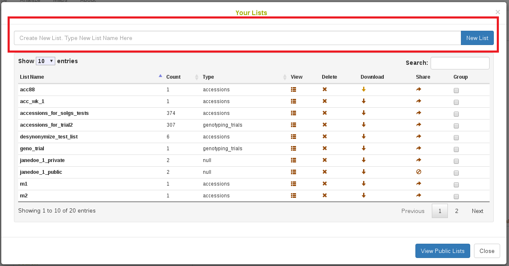

---
output:
  word_document: default
  html_document: default
  pdf_document: default
---
# Basic Website Usage

## Creating a User Account

### Verifying first that you do not already have an account

Before creating an account, please verify first that you don’t already have an account. You can use “Search” menu to check if you already registered as a user.

In the "Search" menu, selecting the "People" tab and search your name. If nothing is found, proceed with the instructions below. Otherwise, clicking the “Login” button. If you have forgotten your password, you can retrieve it by clicking the "Forgot your password?" link on the login page.

### Creating a user account

On the right of the toolbar, clicking on “Login.” It will take you to the login page. On the login page, clicking on the link “sign up for an account.” It will take you to the page below:

```{r echo=FALSE, out.width='95%', fig.align='center'}

```

Filling in all of the information, then clicking "Create Account."

After you submit the information, an email will be sent to the provided email address. Checking your email and clicking on the link to activate your account.

## Managing your Account

### Login

To login, clicking the "Login" link in the toolbar on any page and enter your username and password.

If you have forgotten your password, you can retrieve it by clicking the "Forgot your password?" link on the login page.

```{r echo=FALSE, out.width='95%', fig.align='center'}

```

### Editing Account Settings

Account settings can be edited by clicking on the "my profile" link displayed as your user name, on the right of the toolbar. You must login, in order to access and change account settings.

```{r echo=FALSE, out.width='95%', fig.align='center'}

```

You can add personal information to your account using the "View or update personal information" link.

To change your password, username, or your contact email, clicking on “Update account information” link. You must provide your old password before you can make any changes.

```{r echo=FALSE, out.width='95%', fig.align='center'}

```

### Changing Your Account Status: From “User” to “Submitter”

After you create an account, your account has a "user" status. This account has limited privileges.

Accounts with “user” status are able to:

-   Change personal information
-   Post comments on pages
-   Post to the forum

To upgrade your account status to "submitter,” contact the database curators using the "contact" link provided at the footer of each page. Submitter accounts can add data, such as new plots, accessions, phenotype data and images.

### Submitting Feedback on an SGN Database

We appreciate your feedback! Feel free to submit any questions or suggestions by using the "Feedback" link provided at the footer of each page.

## Menu Layout

SGN Database websites have a toolbar on the top of each page with a number of menus for convenient access of major functions. The menus, as pictured below, are “search,” “manage,” “analyze,” and “maps.” The toolbar also provides a quick search, a “log in” button, and a “new user” button.

```{r echo=FALSE, out.width='95%', fig.align='center'}

```

### Menu Options

#### Search {-}

In the Search menu, the options are:

| Tab                   | Description                                                                                                                            |
|-----------------------|----------------------------------------------------------------------------------------------------------------------------------------|
| Wizard                | Search different accessions and plots by location, year, trial, and trait data. Can also be used to create lists of different types.   |
| Accession and plots   | Search accessions and plots using a variety of criteria                                                                                |
| Trials                | Search trials by name, description, breeding program, year, location, and trial type.                                                  |
| Markers               | Search different markers                                                                                                               |
| Images                | Search images contained in the SGN database                                                                                            |
| People                | Search database users                                                                                                               |

#### Manage {-}

In the Manage menu, the options are:

| Tab                 | Description                                                                                        |
|---------------------|----------------------------------------------------------------------------------------------------|
| Breeding Programs   | View, add and delete breeding programs                                                             |
| Locations           | View, add and delete locations                                                                     |
| Accessions          | Manage and search different accessions                                                             |
| Seedlots            | Manage and search different seedlots                                                               |
| Crosses             | Create new crosses in the database                                                                 |
| Field Trials        | Manage field trials. Create trials using different field layouts.                                  |
| Genotyping Plates   | Manage genotyping plates. Create 96 or 384 well plates.                                            |
| Phenotyping         | Upload phenotyping files from the Tablet Field Book application                                    |
| Field Book App      | Manage the field book app data (download files to tablet)                                          |
| Barcodes            | Refers to the old barcode system, mainly historical                                                |
| Download            | Download information in the database based on lists                                                |

#### Analyze {-}

**Clicking on the "Analyze" link will give a full menu of all analysis functions**  
In the Analyze menu, the options are:

| Tab                   | Description                                                                             |
| --------------------- | --------------------------------------------------------------------------------------- |
| **Breeder Tools**     |                                                                                         |
| Breeder Home          | Access breeding functionalities. Lists important and helpful links.                     |
| Barcode Tools         | Manage, create, and download barcodes. Also access barcode tools.                       |
| Genomic Selection     | Can search for traits, start building a GS model, and predict values based on genotypes |
| **Sequence Analysis** |                                                                                         |
| BLAST                 | Sequence homology search                                                                |
| **Other**             |                                                                                         |
| Ontology Browser      | Browse all recorded ontologies                                                          |

## Working with Lists {#working-with-lists}

Lists are collections of identifiers that are stored in the database. Lists can be composed of accessions, plots, traits, locations, and trials. Lists are attached to the individual user's account, and can only be created and seen by the user while logged in. SGN databases make heavy use of lists in a number of tools on the website. For example, trials are created using lists of accessions.

### Creating lists

Lists can be generated in various ways:

One way to create a list is by clicking on the "Lists" link located on the toolbar.

```{r echo=FALSE, out.width='95%', fig.align='center'}

```

To create a new list, enter the name of your new list and then clicking on the “New List” button. The name of the list can be anything, but should be unique and should be something to help you easily identify.

```{r echo=FALSE, out.width='95%', fig.align='center'}

```

You can find the list that you entered on the “Your Lists” page. To add items to your list, click on the "View" icon to open “List Contents” page.

```{r echo=FALSE, out.width='95%', fig.align='center'}

```

On the “List Contents” page, enter items that you want to add to the list, then click on “Add” button.

```{r echo=FALSE, out.width='95%', fig.align='center'}

```

The page will be updated and will display your items in a table at the bottom of the page. It is possible to sort the list if you need.

```{r echo=FALSE, out.width='95%', fig.align='center'}

```

Select the type of items in your list. To verify that the items that you added to your list are already stored in the database and that you selected a correct type for the items, click on the “Validate” button.

```{r echo=FALSE, out.width='95%', fig.align='center'}

```

If those items are already in the database, a message will indicate that “This list passed validation”

```{r echo=FALSE, out.width='50%', fig.align='center'}
knitr::include_graphics('assets/images/image346.png')
```

Note that a list cannot contain duplicate elements. If a duplicate item is entered, the list manager will inform the user that the element is already in the list and will not add it again.

Another easy way to create a list is to use \@ref(search-wizard), which can be accessed from the Search menu.

### Viewing and editing lists

Lists can be viewed and edited using the "Lists" link on the toolbar. Clicking on the link will open a window that displays all of your lists, as well as an option to create new lists.

```{r echo=FALSE, out.width='95%', fig.align='center'}

```

This page shows all lists that have been created, including those created by using the Search Wizard. You can view and edit your lists by using “Actions” buttons.

1. Clicking on the "view" icon will open a new window called "List Contents" that allows you to change the list name, the type of the list, add new items, or delete existing items.

2. Clicking on the “delete” icon will delete your list. **Caution: this action cannot be undone**.

3. Clicking on the “download” icon will download the contents of your list to your computer.

4. Clicking on the “make public” icon will make your list available for other users to view and use your list.

```{r echo=FALSE, out.width='95%', fig.align='center'}

```


## User Permissions

Breedbase accounts are assigned one or more of four different roles to determine the level of access they have within the database. The possible roles are **User**, **Submitter**, **Sequencer**, and **Curator**. Each role grants specific permissions, and careful management of them helps prevent data from being altered or deleted in error.

```{r echo=FALSE, out.width='50%', fig.align='center'}

```

Accounts are also assigned Breeding Program role(s) to grant access to the specfic breeding program(s) they work with.

- The **User** role gives an account permission to view and download data throughout the database.
- The **Submitter** role gives an account permission to design field experiments and to upload and edit data using the tools in the “Manage” section. In order to submit and manage breeding data within a given breeding program, a submitter also must have a matching Breeding Program role.
- The **Sequencer** role gives an account permission to design genotyping experiments and submit plates to a genotyping service.
- The **Curator** role gives an account permission to do all of the above, as well as to delete data within the database. The Curator role also enables the addition or deletion of roles for all database accounts in the 'Manage User Roles' tool.