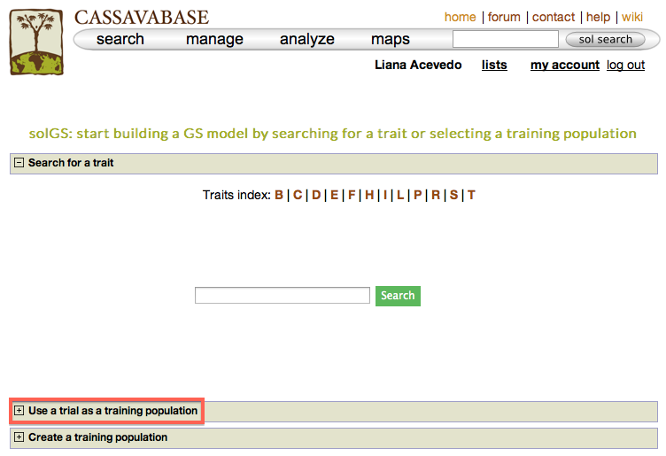
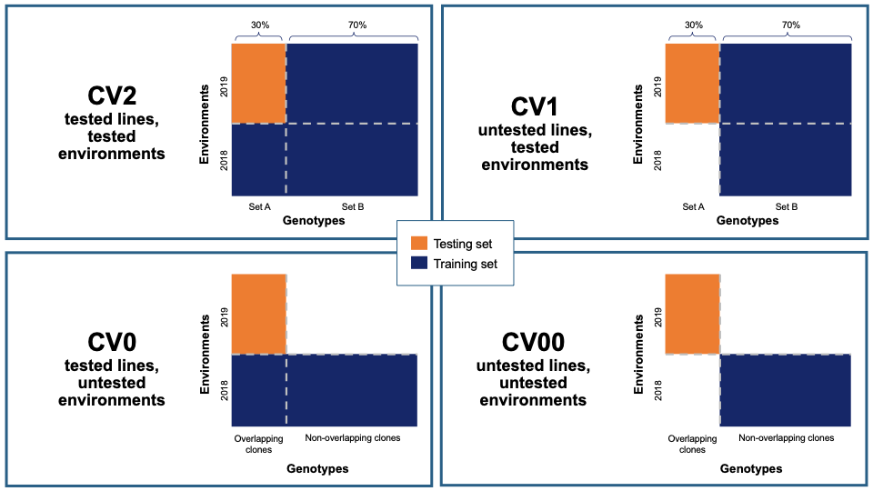

# Data Analysis Tools

SGN databases provides several tools for phenotype data analysis, marker-assisted selection, sequence and expression analyses, as well as ontology browser. These tools can be found in the “Analyze” menu.

```{r echo=FALSE, out.width="95%", fig.align="center"}

```

## Selection Index

To determine rankings of accessions based on more than one desirable trait, SGN databases provide a “Selection Index” tool that allows you to specify a weighting on each trait. To access the tool, clicking on “Selection Index” in the “Analyze” menu.

```{r echo=FALSE, out.width="95%", fig.align="center"}

```

On the Selection Index page, selecting a trial that you want to analyze.

```{r echo=FALSE, out.width="95%", fig.align="center"}

```

After you selected a trial, you can find traits that were assayed in that trial in the “Trait” box.

```{r echo=FALSE, out.width="95%", fig.align="center"}

```

Selecting a trait that you want to include in the analysis will open a new dialogue showing the selected trait and a box that you can assign a “Weight” of that trait. After you are done, you can continue by selecting another trait by clicking on “Add another trait” link.

```{r echo=FALSE, out.width="95%", fig.align="center"}

```

After you selected another trait, this page will automatically update information for you by showing all of the traits that you selected for the analysis.

```{r echo=FALSE, out.width="95%", fig.align="center"}

```

You also have options to choose a reference accession, choose to include accessions with missing phenotypes, scaling values to a reference accession. After you complete your setting, clicking on “Calculate Rankings”

```{r echo=FALSE, out.width="95%", fig.align="center"}

```

The Selection Index tool will generate rankings of accessions based on the information that you specified. You can copy the results to your system clipboard, convert the table data to CSV format, or print the data.

```{r echo=FALSE, out.width="95%", fig.align="center"}

```

Clicking on “Raw Average” will display average values of the phenotypes of those ranked accessions.

```{r echo=FALSE, out.width="95%", fig.align="center"}

```

Selection Index tool also allows you to save top ranked accessions directly to “Lists”. You can retrieve top ranked accessions by selecting a number or a percent.

```{r echo=FALSE, out.width="95%", fig.align="center"}

```

## Genomic Selection

The prediction of breeding values for a trait is a one step or two steps process, depending on what stage in your breeding cycle you are. The first step is to build a prediction model for a trait using a training population of clones with phenotype and genotype data. If you have yet to select parents for crossing for your first cycle of selection you can use the breeding values of the training population. If you are at later stages of your selection program, you need to do the second step which is applying the prediction model on your selection population. All clones in your training and selection populations must exist in the database.

To use the genomic selection tool, on [*cassavabase.org*](http://cassavabase.org/), select "Genomic Selection" from the "analyze" pull-down menu.

```{r echo=FALSE, out.width="95%", fig.align="center"}

```

There are three ways to build a model for a trait.

### Building a Model - Method 1: {#method-1}

One way to build a model is, using a trait name, to search for trials in which the trait was phenotyped and use a trial or a combination of trials to build a model for the trait. For example, if you search for "mosaic disease severity, you will get a list of trials you can use as training populations.

```{r echo=FALSE, out.width="95%", fig.align="center"}

```

You will get a list of trials (as shown below) in which the trait of your interested was phenotyped. From the list, you can use a single trial as a training population or combine several trails to form a training population for the prediction model of the trait. Let"s say, you want to create a training population using individuals from trials "cassava ibadan 2001/02" and "cassava ibadan 02/03" and build a model for "cassava mosaic disease severity" using all clones from the training population.

```{r echo=FALSE, out.width="95%", fig.align="center"}

```

Select the trials to combine (the same coloured), click ‘done selecting’, click the "combine trials and build model" button, and you will get a model and its output for the trait. On the model detail page, you can view the description of input data used in the model, output from the model and search interface for selection populations the model you can apply to predict their breeding values. The description of the input data for the model includes the number of phenotyped clones, and the number of markers, scatter and frequency distribution plots for the phenotype data, relationship between the phenotype data and GEBVs, population structure. The model output includes model parameters, heritability of the trait , prediction accuracy, GEBVs of the individuals from the training population and marker effects.

```{r echo=FALSE, out.width="95%", fig.align="center"}

```

Expand each section to see detailed information.

If you expand the ‘Trait phenotype data’ section, you will find plots to explore the phenotype data used in the model. You can assess the phenotype data using a scatter and histogram plots and the descriptive statistics.

```{r echo=FALSE, out.width="95%", fig.align="center"}

```

```{r echo=FALSE, out.width="95%", fig.align="center"}

```

A regression line between observed phenotypes and GEBVs shows the relationship between the two.

```{r echo=FALSE, out.width="95%", fig.align="center"}

```

You can also explore if there is any sub-clustering in the training population using PCA.

```{r echo=FALSE, out.width="95%", fig.align="center"}

```

To check the model accuracy, a 10-fold cross-validation test, expand the ‘model accuracy’ section.

```{r echo=FALSE, out.width="95%", fig.align="center"}

```

Marker effects are also available for download. To do so, expanad the ‘Marker Effects’ section and click the ‘Download all marker effects’ link and you will get a tab delimited output to save on your computer.

```{r echo=FALSE, out.width="95%", fig.align="center"}

```

The breeding values of the individuals used in the training population are displayed graphically. Mousing over each data point displays the clone and its breeding value. To examine better, you can zoom in into the plot by selecting an area on the plot. You can download them also by following the "Download all GEBVs" link.

```{r echo=FALSE, out.width="95%", fig.align="center"}

```


#### Estimating breeding values in a selection population {-}

If you already have a selection population (in the database), from the same model page, you can apply the model to the selection population and estimate breeding values for all the clones in the population. You can search for a selection population of clones in the database using the search interface or you can make a custom list of clones using the [*list interface*](#working-with-lists). If you click the "search for all relevant selection populations", you will see all relevant selection populations for that model. However, this option takes long time decause of the large set of populations in the database and the filtering. Therefore, the fastest way is to search for each of your selection populations by name. If you are logged in to the website you will also see a list of your custom set of genotyped clones.

```{r echo=FALSE, out.width="95%", fig.align="center"}

```

To apply the model to a selection population, simply click your population name or "Predict Now" and you will get the predicted breeding values. When you see a name of (or acronym\]) of the trait, follow the link and you will see an interactive plot of the breeding values and a link to download the breeding values of your selection population.

```{r echo=FALSE, out.width="95%", fig.align="center"}

```

### Building a Model - Method 2 {#method-2}

Another way to build a model is by selecting a trial, instead of selecting and searching for a specific trait. This approach is useful when you know a particular trial that is relevant to the environment you are targeting to breed material for. This method allows you to build models and predict genomic estimated breeding values (GEBVs) for several traits within a single trial at once. You can also calculate selection index for your clones when GEBVs are estimated for multiple traits.

To do this select the "Genomic Selection" link found under the "analyze" menu. This will take you to the same home page as used with Method 1. However, instead of entering information to search for in "Search for a trait", click on "Use a trait as a trial population". This will expand a new menu that will show all available trials.

```{r echo=FALSE, out.width="95%", fig.align="center"}

```

```{r echo=FALSE, out.width="25%", fig.align="center"}

```

```{r echo=FALSE, out.width="95%", fig.align="center"}

```

To begin creating the model, select the existing trial that you would like to use. In this example I will be using the trial and trait data from "Cassava Ibadan 2002/03" trial. Clicking on a trial will take you to a page where you can find information such as number of markers and number of phenotypes clones.

```{r echo=FALSE, out.width="95%", fig.align="center"}

```

In addition to the number of phenotype clones and number of markers, the main page for the trial selected also has information and graphs on phenotypic correlation for all of the traits. By moving your cursor over the graph you can read the different values for correlation between two traits. A key with all of the trait names of the acronyms used can be found in the tab below the graph.

```{r echo=FALSE, out.width="95%", fig.align="center"}

```

Below the "Training population summary" there is a tab for "Traits". Clicking on this tab will show all available traits for the specific trial. You can create a model by choosing one or multiple traits in the trial and clicking "Build Model". In this example, the traits for "cassava bacterial blight severity" and "cassava mosaic disease severity" have been selected.

```{r echo=FALSE, out.width="95%", fig.align="center"}
knitr::include_graphics("assets/images/image69.png")
```

Clicking on "Build Model" will take you to a new page with the models outputs for the traits. Under the "Genomic Selection Model Output" tab you can view the model output and the model accuracy. Clicking on any of the traits will take you to a page with information about the model output on that individual trait within the trial. There you can view all of the trait information that was seen in more detail in [*Method 1*](#method-1).

```{r echo=FALSE, out.width="95%", fig.align="center"}

```

You can apply the models to simultaneously predict GEBVs for respective traits in a selection population by clicking on "Predict Now" or the name of the selection population. You can also apply the models to any set of genotyped clones that you can create using the "lists" feature. For more information on lists, click [*here*](#working-with-lists). Follow the link to the trait name to view and download the predicted GEBVs for the trait in a selection population.

```{r echo=FALSE, out.width="95%", fig.align="center"}

```

To compare clones based on their performance on multiple traits, you can calculate selection indices using the form below. Choose from the pulldown menu the population with predicted GEBVs for the traits and assign relative weights for each trait. The relative weight of each trait must be between 0 - 1. 0 being of least weight and importance, not wanting to consider that particular trait in selecting a genotype and 1 being a trait that you give highest importance.

In this example we will be using the "Cassava Ibadan 2002/03" population and assigning values to each of the traits. Remember that there is a list of acronyms and trait names at the bottom of the page for reference. After entering whatever values you would like for each trait click on the "Calculate" button to generate results. This will create a list of the top 10 genotypes that most closely match the criteria that you entered. The list will be displayed right below the "selection index" tab. This information can also be downloaded onto your computer by clicking on the "Download selection indices" link underneath the listed genotypes and selection indices.

```{r echo=FALSE, out.width="95%", fig.align="center"}

```

### Building a Model - Method 3

In addition to creating a model by searching for pre-existing traits or by preexisting trial name, models can also be created by using your own list of clones. This creates a model by using or creating a training population.

The page to use the third Method for creating a population model is the same as for the other two models. Select "Genomic Selection" from under the "analyze" menu of the main toolbar. This will take you to the Genomic Selection homepage and show you all three available methods to create a model. To see and use Method 3 scroll down and click on the tab labeled "Create a Training Population". This will open a set of tools that will allow you to use pre-existing lists or to create a new list.

```{r echo=FALSE, out.width="95%", fig.align="center"}

```

Once the "Create a Training Population" tab is opened you have the option to use a pre-existing list or create new one. To learn how to create a list, click [*here*](#working-with-lists). The "Make a new list of plots" link will take you directly to the Search Wizard that is usually used to create lists.

Please note: the only lists that can be used in Method 3 to create a model are lists of plots and trials. If the pre-existing list is not of plots or trials (for example, traits, or locations) it will not show up and cannot be used as a training population. When you create you use a list of trials, the trials data will be combined to create a training data set.

To use your custom list of plots or trials as a training population, select the list and click "Go". This will take you to a detail page for the training population.

```{r echo=FALSE, out.width="95%", fig.align="center"}

```

From here on you can build models and predict breeding values as described in [*Method 2*](#method-2)**.**

## Genome Browsing

There are two ways to evaluate genotype information within the browser, from an accession detail page or a trial detail page.

### Browsing Genotype data by Accession

If you are interested in browsing genotype information for a single accession, for example ‘BAHKYEHEMAA’, navigate to the accession detail page.

```{r echo=FALSE, out.width="50%", fig.align="center"}

```

Near the bottom of the detail page is a collapsible section called “Accession Jbrowse”.

```{r echo=FALSE, out.width="50%", fig.align="center"}

```

This section will contain a link to the accession jbrowse page if the necessary genotype data is available. Clicking the link should take you to a page that looks like this, a which point you can browsre the genotype data in the form of a vcf track aligned to the latest build of the genome.

```{r echo=FALSE, out.width="95%", fig.align="center"}

```

### Browsing Genotype data by Trial

If you are interested in browsing genotype information for the accessions within a given trial, navigate to the trial detail page.

```{r echo=FALSE, out.width="50%", fig.align="center"}

```

Halfway down the page is a collapsible section called “Trial Jbrowse”. This section will contain a link to the trial jbrowse page if the necessary genotype data for at least two accessions planted in the trial is available.

```{r echo=FALSE, out.width="50%", fig.align="center"}

```

Clicking the link should take you to a page that looks like this, a which point you can browse the genotype data in the form of vcf tracks aligned to the latest build of the genome.

```{r echo=FALSE, out.width="95%", fig.align="center"}

```

## Principal Component Analysis (PCA)

Principal component analysis helps estimate and visualize if there is sub-grouping of individuals within a dataset based on a number of variables. Currently, you can use marker data to run PCA on datasets.

You can run PCA from multiple places on the website. To do PCA on

(1) individuals from a trial, go to the trial detail page and find the PCA tool under the "Analysis tools" section.

(2) individuals from a training population you used in a GS modeling, do your modeling and find the PCA tool in the model output page.

(3) individuals in a training population and selection population you applied the training model, do your modeling, apply the model on the selection population and find the PCA tool on the selection population prediction output page.

(4) individuals in a list of accessions you created, for example using the search wizard, go to the "Analyze" menu and select the "Population Structure", select your list of individuals and run PCA.

(5) individuals from multiple trials, create a list of the trials using the search wizard, go to the "Analyze" menu and select the "Population Structure", select your list of trials and run PCA.

```{r echo=FALSE, out.width="95%", fig.align="center"}

```

With all the options, you will get a interactive plot of the two PCs (shown below) that explain the largest variance. Point the cursor at any data point and you will see the individual name with its corresponding PCs scores. By clicking the ‘Download all PCs’, you can also download the 10 PCs scores in the text format.


## ANOVA

Currently, ANOVA is implemented for a single trial (single year and single location). You can do ANOVA for RCBD, CRD, Alpha and Augmented trial designs. ANOVA is done using linear mixed effects model, where the genotypes is fixed effect and the replications and blocks are random effects. Fixed effect significance level is computed using "lmer" from "lmeTest" R package.

You can do ANOVA from two places: trial detail and training population detail. In both cases, if the phenotype data was from the supported trial designs,

-- Go to the ANOVA section down in the trial or training population page

-- Select the trait of you want to perform ANOVA

-- Click the "Run ANOVA" and wait for the result

```{r echo=FALSE, out.width="95%", fig.align="center"}

```

## Clustering (K-Means, Hierarchical)

The K-Means method allows you to partition a dataset into groups (K number). The hierarchical clustering, agglomerative, allows you to explore underlying similarity and visualize in a tree structure (dendrogram) the different levels of similarities (clusters) among samples.  You can do clustering based on marker data, phenotype data and GEBVs. When you use phenotype data, first clone averages for each trait are calculated. Both methods use Euclidean distance as a measure of similarity. For the hierachical clustering, the complete-linkage (farthest neighbour) method is used to link up clusters.

There are three pathways to using this tool.

(1) When you have data in the form of a list or dataset from the search wizard:

   (A) -- go to the "Analyze" menu and select the clustering option

   (B) -- make sure you are logged in

   (C) -- Select the relevant genotyping protocol, if you are clustering using genotype data

   (D) -- select your list or dataset, click "Go"

   (E) -- select clustering type

   (F) -- select the data type to use

   (G) -- If you are running K-Means clustering, provide the number of partitions (K).  If left blank it will partition the data set into optimal numbers for the dataset.

   (H) -- click the "Run Cluster" and wait for the analysis to finish or queue the request and wait for an email with the analysis result.

   (I) -- You can download the outputs following the download links.

(2) From the trial detail page:

   (A) -- Go to the "Analysis Tools" section

   (B) -- Follow steps D to G in (1)

(3) In the solGS pipeline:

   (A) -- Once you you are in a model output put page, you will see a section where you can do clustering in the same way as above (option 2).

K-Means clustering:

```{r echo=FALSE, out.width="95%", fig.align="center"}

```

Hierarchical clustering:

```{r echo=FALSE, out.width="95%", fig.align="center"}

```

## Genetic Gain

You can check for genetic gain by comparing the the GEBVs of a training and a selection population. You can do this in the solGS pipepline once you build a model and apply the model to predict the GEBVs of a selection population. Once at that stage, you will see a section "Check Genetic Gain". Select a selection population to compare with the training population and click the "Check Genetic Gain" button. The genetic gain will be visualized in boxplots. You can download the boxplot(s) as well as the GEBVs data used for the plot(s).

```{r echo=FALSE, out.width="95%", fig.align="center"}

```


## Kinship and Inbreeding Coefficients

This tool allows you to estimate genetic relatedness between a pair of individuals (kinship), homozygousity across loci in an individual (inbreeding coefficient), and genetic similarity of an individual relative to the rest of the population (averge kinship).

There are three pathways to using this tool.

 <strong>(1)</strong> When you have a list or dataset clones, created from the search wizard:

   (A) -- go to the "Analyze" menu and select the kinship and inbreeding

   (B) -- make sure you are logged in

   (C) -- Select the genotypic protocol for the marker data

   (D) -- select your list or dataset of clones, click "Go"

   (F) -- click the "Run Kinship" and wait for the analysis to finish, depending on the data size this may take minutes. You can choose to submit the analysis and wait for an email notice to view the results  or wait for it to complete.

   (G) -- You can download the output following the download links.

<strong>(2)</strong> From the trial detail page:

   (A) -- Go to the "Analysis Tools" section

   (B) -- Follow steps C to G in (1)

<strong>(3)</strong> In the solGS pipeline:

   (A) -- Once you you are in a model output put page, scroll down to the "Kinship and Inbreeding" section and run kinship.

```{r echo=FALSE, out.width="95%", fig.align="center"}

```

## Creating Crossing Groups

If you calculate selection index based on GEBVs of multiple traits, and you want to select a certain proportion of the indexed individuals (e.g. top 10%, or bottom 10%) and then you want to partition the selected individuals into a number of groups based on their genotypes, you can use the k-means clustering method.

The procedure is:

(1) predict GEBVs for 2 or more traits

(2) In the models output page, calculate selection indices. Note the name of the selection index data.

(3) Go to the clustering section,

   -- select the selection index data,

   -- select "K-means",

   -- select "Genotype",

   -- in the K-numbers textbox, fill in the number of groups you want to create,

   -- in the selection proportion textbox, fill in the proportion of the indexed individuals you want to select, e.g. for the top 15 percent, 15. if you wish to select bottom performing, prefix the number with minus sign (e.g. -15)

   -- then run cluster and wait for the result.

```{r echo=FALSE, out.width="95%", fig.align="center"}
knitr::include_graphics("assets/images/selection_proportion_clustering.png")
```

## Search Wizard Genomic Relationship Matrix (GRM) Download

The genomic relationship matrix (GRM) is useful for understanding underlying structure in your population. Breedbase can compute the GRM using rrBLUP. First, select accessions in the search wizard and optionally select a genotyping protocol. If no genotyping protocol is selected, the default genotyping protocol in your system is used (as defined in sgn_local.conf). Specify the minor allele frequency, missing marker data, and missing individuals data filters to apply. The GRM can be returned in a matrix format (.tsv) which shows all pairwise relationships between the selected accessions and is useful for visualization; alternatively, the GRM can be returned in a three-column format (.tsv) which is useful for programs like ASReml outside of Breedbase. The GRM can also be returned as a simple correlation heatmap image (.pdf). The GRM can be computed from parents of the selected accessions granted the parents were genotyped, by clicking the checkbox "compute from parents"; this is useful for programs where parental lines are genotyped and then hybrids are created and evaluated in the field.

```{r echo=FALSE, out.width="95%", fig.align="center"}

```


## Search Wizard Genome Wide Association Study (GWAS)

Performing a genome wide association study (GWAS) can determine genotypic markers which are significantly correlated to phenotypic traits. Breedbase can compute GWAS using rrBLUP. First, select accessions and trait(s) in the search wizard, and optionally select a genotyping protocol. If no genotyping protocol is selected, the default genotyping protocol in your system is used (as defined in sgn_local.conf). Several traits can be selected in the search wizard; if the traits are not to be treated as repeated measurements then select "no" in the select box and this will tell Breedbase to return GWAS results independently for the selected traits. If the selected traits are indeed all repeated measurements then select "yes" in the select box and Breedbase will return as single GWAS analysis across all the phenotypic records. Specify the minor allele frequency, missing marker data, and missing individuals data filters to apply. GWAS results can be returned in a tabular format (.tsv) where the -log10(p-values) for the selected traits are returned; alternatively, the GWAS results can be returned as Manhattan and QQ plots for the selected traits. The GWAS can be computed from parents of the selected accessions granted the parents were genotyped, by clicking the checkbox "compute from parents"; this is useful for programs where parental lines are genotyped and then hybrids are created and evaluated in the field.

The GWAS will filter the data by the input MAF and missing data filters provided. After filtering the data is imputed using an "EM" method in rrBLUP. The Kinship matrix (GRM) is computed from the imputed genotypic data and used in the GWAS model. The GWAS uses fixed effects for different field trials and replicates in the phenotypic data.

```{r echo=FALSE, out.width="95%", fig.align="center"}

```

```{r echo=FALSE, out.width="95%", fig.align="center"}

```

```{r echo=FALSE, out.width="95%", fig.align="center"}

```


## Spectral Analysis {#spectral-analysis}

Visible and near-infrared spectroscopy (vis-NIRS) can be related to reference phenotypes through statistical models to produce accurate phenotypic predictions for unobserved samples, increasing phenotyping throughput. This technique is commonly used for predicting traits such as total starch, protein, carotenoid, and water content in many plant breeding programs. Breedbase implements the R package [*waves*](https://CRAN.R-project.org/package=waves) to offer training, evaluation, storage, and use of vis-NIRS prediction models for a wide range of spectrometers and phenotypes.

```{r echo=FALSE, out.width="95%", fig.align="center"}
knitr::include_graphics("assets/images/waves_breedbase_schema.png")
```

### Dataset selection
In order to initiate an analysis, the user must select one or more datasets using \@ref(search-wizard). A dataset in Breedbase can contain observationUnit-level (plot-, plant-, or sample-level) trial metadata and phenotypic data from one or more trials. After navigating to the “NIRS” webpage under the “Manage” tab in Breedbase, the user can initiate an analysis and select one of these datasets as input for model training. An optional test dataset can be selected in the second step of the workflow.

```{r echo=FALSE, out.width="95%", fig.align="center"}

```

```{r echo=FALSE, out.width="95%", fig.align="center"}

```

### Cross-validation
Five cross-validation schemes that represent scenarios common in plant breeding are available for this analysis. These include CV1, CV2, CV0, and CV00 as outlined below and described in depth by Jarquín et al. (2017) as well as random and stratified random sampling with a 70% training and 30% validation split. For those schemes from Jarquín et al. (2017), specific input datasets must be chosen based on genotype and environment relatedness. Cross-validation choices:
* **Random sampling** (70% training / 30% validation)
* **Stratified random sampling**, stratified based on phenotype (70% training / 30% validation)
* **CV1**, untested lines in tested environments
* **CV2**, tested lines in tested environments
* **CV0**, tested lines in untested environments
* **CV00**, untested lines in untested environments

```{r echo=FALSE, out.width="95%", fig.align="center"}

```

### Preprocessing
Preprocessing, also known as pretreatment, is often used to increase the signal to noise ratio in vis-NIR datasets. The *waves* function *DoPreprocessing()* applies functions from the *stats* and *prospectr* packages for common spectral preprocessing methods with the following options:
* Raw data (default)
* First derivative
* Second derivative
* Gap segment derivative
* Standard normal variate (SNV; Barnes et al., 1989)
* Savitzky-Golay polynomial smoothing (Savitzky and Golay, 1964)

For more information on preprocessing methods and implementation, see the [*waves*](https://CRAN.R-project.org/package=waves) manual, available through CRAN: [waves.pdf](https://cran.r-project.org/web/packages/waves/waves.pdf)

```{r echo=FALSE, out.width="95%", fig.align="center"}

```

### Algorithms
Several algorithms are available for calibration model development in Breedbase via the [*waves*](https://CRAN.R-project.org/package=waves) package. The *TrainSpectralModel()* function in waves performs hyperparameter tuning as applicable using these algorithms in combination with cross validation and train functions from the package *caret*. Currently, only regression algorithms are available, but classification algorithms such as PLS-DA and SVM clasification are under development.
* **Partial least squares regression** (PLSR; Wold et al., 1982; Wold et al., 1984) is a popular method for spectral calibrations, as it can handle datasets with high levels of collinearity, reducing the dimensionality of these data into orthogonal latent variables (components) that are then related to the response variable through a linear model (reviewed in Wold et al., 2001). To avoid overfitting, the number of these components included in the final model must be tuned for each use case. The PLSR algorithm from the *pls* package is implemented by waves.
* **Random Forest regression** (RF; Ho, 1995) is a machine learning algorithm based on a series of decision trees. The number of trees and decisions at each junction are hyperparameters that must be tuned for each model. Another feature of this algorithm is the ability to extract variable importance measures from a fitted model (Breiman, 2001). In Breedbase, this option is made available through implementation of the RF algorithm from the package randomForest in the waves function TrainSpectralModel(). This function outputs both model performance statistics and a downloadable table of importance values for each wavelength. It is worth noting that this algorithm is computationally intensive, so the user should not be alarmed if results do not come right away. Breedbase will continue to work in the background and will display results when the analysis is finished.
* **Support vector machine regression** (SVM; Vapnik, 2000) is another useful algorithm for working with high-dimension datasets consisting of non-linear data, with applications in both classification and regression. The package waves implements SVM with both linear and radial basis function kernels using the kernlab package.

### Output: common model summary statistics
After training, model performance statistics are both displayed on a results webpage and made available for download in .csv format. These statistics are calculated by the *TrainSpectralModel()* function in [*waves*](https://CRAN.R-project.org/package=waves) using the *caret* and *spectacles* packages. Reported statistics include:
* Tuned parameters depending on the model algoritm
	* **Best.n.comp**, the best number of components to be included in a PLSR model
	* **Best.ntree**, the best number of trees in an RF model
	* **Best.mtry**, the best number of variables to include at every decision point in an RF model
* **RMSECV**, the root mean squared error of cross-validation
* **R<sup>2</sup><sub>cv</sub>**, the coefficient of multiple determination of cross-validation for PLSR models
* **RMSEP**, the root mean squared error of prediction
* **R<sup>2</sup><sub>p</sub>**, the squared Pearson’s correlation between predicted and observed test set values
* **RPD**, the ratio of standard deviation of observed test set values to RMSEP
* **RPIQ**, the ratio of performance to interquartile distance
* **CCC**, the concordance correlation coefficient
* **Bias**, the average difference between the predicted and observed values
* **SEP**, the standard error of prediction
* **R<sup>2</sup><sub>sp</sub>**, the squared Spearman"s rank correlation between predicted and observed test set values

### Export model for later use
Once a model has been trained, it can be stored for later use. This action calls the *SaveModel()* function from [*waves*](https://CRAN.R-project.org/package=waves). Metadata regarding the training dataset and other parameters specified by the user upon training initialization are stored alongside the model object itself in the database.

```{r echo=FALSE, out.width="95%", fig.align="center"}

```

### Predict phenotypes from an exported model (routine use)
For phenotype predictions, users select a dataset and can then choose from models in the database that were trained using the same spectrometer type as the spectral data in the chosen dataset. Predicted phenotypes are stored as such in the database and are tagged with an ontology term specifying that they are predicted and not directly measured. Metadata regarding the model used for prediction is stored alongside the predicted value in the database. Predicted phenotypes can then be used as normal in other Breedbase analysis tools such as the Selection Index and GWAS.

```{r echo=FALSE, out.width="95%", fig.align="center"}

```

```{r echo=FALSE, out.width="95%", fig.align="center"}

```

### FAQ
The Breedbase Spectral Analysis Tool does not allow for prediction models involving data from multiple spectrometer types at once.

References
* Barnes, R.J., M.S. Dhanoa, and S.J. Lister. 1989. Standard normal variate transformation and de-trending of near-infrared diffuse reflectance spectra. Appl. Spectrosc. 43(5): 772-777. doi: 10.1366/0003702894202201.
* Breiman, L. 2001. Random forests. Mach. Learn. 45: 5-32. doi: 10.1201/9780429469275-8.
* Ho, T.K. 1995. Random decision forests. Proc. Int. Conf. Doc. Anal. Recognition, ICDAR 1: 278-282. doi: 10.1109/ICDAR.1995.598994.
* Jarquín, D., C. Lemes da Silva, R.C. Gaynor, J. Poland, A. Fritz, et al. 2017. Increasing Genomic-Enabled Prediction Accuracy by Modeling Genotype x Environment Interactions in Kansas Wheat. Plant Genome 10(2): plantgenome2016.12.0130. doi: 10.3835/plantgenome2016.12.0130.
* Johnson, R.A., and D.W. Wichern. 2007. Applied Multivariate Statistical Analysis (6th Edition).
De Maesschalck, R., D. Jouan-Rimbaud, and D.L. Massart. 2000. The Mahalanobis distance. Chemom. Intell. Lab. Syst. 50(1): 1-18. doi: 10.1016/S0169-7439(99)00047-7.
* Mahalanobis, P.C. 1936. On the generalized distance in statistics. Natl. Inst. Sci. India.
* Savitzky, A., and M.J.E. Golay. 1964. Smoothing and Differentiation of Data by Simplified Least Squares Procedures. Anal. Chem. 36(8): 1627-1639. doi: 10.1021/ac60214a047.
* Shrestha, R., L. Matteis, M. Skofic, A. Portugal, G. McLaren, et al. 2012. Bridging the phenotypic and genetic data useful for integrated breeding through a data annotation using the Crop Ontology developed by the crop communities of practice. Front. Physiol. 3 AUG(August): 1-10. doi: 10.3389/fphys.2012.00326.
* Vapnik, V.N. 2000. The Nature of Statistical Learning Theory. Springer New York, New York, NY.
* Wold, S., A. Ruhe, H. Wold, and W.J. Dunn, III. 1984. The Collinearity Problem in Linear Regression. The Partial Least Squares (PLS) Approach to Generalized Inverses. SIAM J. Sci. Stat. Comput. 5(3): 735-743. doi: 10.1137/0905052.
* Wold, S., M. Sjöström, and L. Eriksson. 2001. PLS-regression: a basic tool of chemometrics. Chemom. Intell. Lab. Syst. 58(2): 109-130. doi: 10.1016/S0169-7439(01)00155-1.


## General Mixed Model Tool

The general mixed model tool is available at <a href="/tools/mixedmodels">/tools/mixedmodels</a> and a link is provided from the Analyze menu.

To use the mixed model tool, first create dataset using the Wizard containing the data that you would like to analyze.

Select the Mixed Model tool from the Analyze menu.

You are presented with a workflow. On the first step of the workflow, select the dataset that you wish to analyze, click on "Choose dataset" to continue.

The second part of the workflow presents you with the traits in the dataset; you can select one or more traits from the lists using the select buttons. If you selected one trait, a bargraph of the trait distribution will be shown.  Click the "Next step" button to move to the next screen.

```{r echo=FALSE, out.width="95%", fig.align="center"}

```

On the model build screen, all the factors are displayed that are contained within the dataset. The factors are presented as a list of blue buttons that can be dragged using the mouse to areas on the screen which build a mixed model equation. The areas correspond to fixed factors, random factors, and optionally to more complex factors, such as fixed factors with interaction and fixe factors with vriable slope/intersects. Drag the available factors to the corresponding area. To calculate BLUPs for germplasm, drag the germplasmName button to the "Random factors" area. To calculate BLUEs, drag it to the "Fixed factors" area. The factors need to have different levels contained within them, for example, if there is only one trial in the dataset, it cannot be used as one of the factors. Click on "Run analysis and got to next step" to run the mixed model and display the results.

The result view contains two tabs, one with the raw data, either BLUPS or BLUEs, and the other the adjusted means from the raw data.

The results can be stored in the database as an analysis, by clicking the button provided on the top of the data.


## Genomic Prediction of Cross Performance (GPCP)

The GPCP tool is available at <a href="/tools/gcpc">/tools/gcpc</a> and a link is provided from the Analyze menu.
The GCPC tool implements genomic prediction with additive and directional dominance in the linear mixed model to predict for cross performance.

Before using the tool, first create a dataset using the Wizard containing the data that you would like to analyze. (The dataset should have genotyping_protocols).
Second, create Selection Indices for your traits using Selection Index in Analyze Menu.

To use the tool, Select the GPCP tool from the Analyze menu.

Then, select the dataset with genotyping_protocols that you wish to analyze, click on "Proceed to Factor Selection" to load available factors that can be included in the model.

Select the factors you wish to include in the model either as Fixed or Random. Click "None" for factors that you don"t want to include in the model. Note that the "germplasmName" is factored as Random by default.

The next step is to select the selection index for your traits on the dropdown menu.

Once you are through, click "Run GPCP" to run the model. The output will be presented in form of a table with "ID", "Parent1", "Parent2" and their cross prediction merit organized in descending order.
The results will also have sex information based on whether the dataset has plant sexes available in the database.

## Tool Compatibility

The dataset definition enables one to predict whether the dataset can be used in various analysis tools. 

Upon creating a dataset, the site will automatically predict its compatibility with the available analysis tools and report these values on the dataset details page.

```{r echo=FALSE, out.width="95%", fig.align="center"}

```

In the table, each tool will report to the user which traits are available to be analyzed based on phenotype data, and if different types of analyses are available, these will also be reported to the user. Some tools may give a warning sign to indicate that this dataset is compatible, but with potentially low sample sizes. Hover over the warning symbol to get a readout of the reason for the warning. 

Below the table, there is a button that enables the user to re-calculate tool compatibility. This can be useful if a dataset is created before phenotypes are uploaded to a trial, since phenotype data is used in determining dataset compatibility. Even if the page appears to hang, do not worry; the compatibility check will continue in the background, and you can check later. 

```{r echo=FALSE, out.width="95%", fig.align="center"}
knitr::include_graphics("assets/images/tool_compatibility_data_summary.png")
```

Below the tool compatibilities, there is also a summary of the data encompassed by the dataset and the criteria used for determining tool compatibility. Those criteria are used in the following way:
- Correlation: A dataset can be used in a correlation analysis if there are many phenotype measurements for different traits made on the same accession. 
- Population Structure (PCA): A genotype PCA can be run if there are many accessions all genotyped with the same protocol. A phenotype PCA can be run if many accessions all have measurements on many traits. 
- Clustering: Like a PCA, clustering can be done in both phenotype and genotype modes. They have the same requirements as PCA. 
- Kinship & Inbreeding: A dataset with many accessions genotyped with the same protocol can be used for kinship analyses. 
- Stability: A dataset containing many accessions with the same trait measured across multiple locations can be used in stability analyses. 
- Heritability: This requires one or more trials with the same trait measured on the same accession across those trial(s).
- Mixed Models: This requires sufficient accession numbers, trait measurements, and trial designs. 
- GWAS: A dataset is compatible with GWAS if there are many accessions genotyped for the same genotyping protocol, and the genotyping protocol has enough markers to run a GWAS. In addition, each accession needs to be phenotyped for a trait. 
- Boxplotter: There must be sufficient trait measurements to make a boxplot of the trait. 

In addition to being on the dataset details page, tool compatibilities may be listed on the dataset selection screens for analysis tools. The compatibilities are non-blocking; you may always try using a dataset in an analysis even if there are warnings or if it is deemed non-compatible. As before, you can hover over the warning symbols to see why a dataset may not have statistical power. For analyses with multiple modes, such as clustering and PCA, you can also hover over the compatibliity checkmark to see what types (phenotype or genotype) the dataset is compatible with. 
