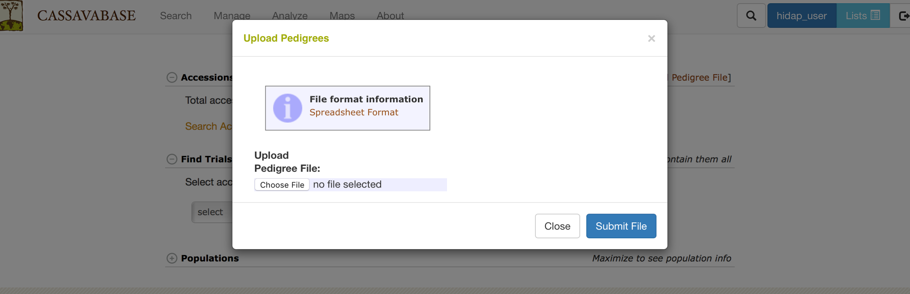

# Managing Accessions

The “Manage Accession” page provides links for adding new accessions.
You can choose to add accessions into the database by either using a List you have created or by uploading XLS or XLSX file. Both options will be detailed below.
To begin click on the "Add Accessions or Upload Accession Info" link.

```{r echo=FALSE, out.width='95%', fig.align='center'}

```

This will open a dialog allowing you to select either "Using Lists" or "Uploading a File".

## Add Accessions Using A List

First we will show how to add accessions "Using Lists".

```{r echo=FALSE, out.width='95%', fig.align='center'}

```

Here you select an accession list which you have previously made. If you need to create or edit your list you can do so now by clicking "Manage Lists".
Once you have selected your list you can click "Continue".

The first dialog which can appear will show the accessions which already exist in the database.

```{r echo=FALSE, out.width='95%', fig.align='center'}

```

Click "Continue". The next dialog which can appear will show accessions which have very similar matches to the accession names you are adding.
In the example below, there are two accession names that are very similar to accession names already in the database. 'TME0419' is very similar to 'TME419', and actually is probably a mistake that should not be added to the database.

```{r echo=FALSE, out.width='95%', fig.align='center'}

```

To avoid situations in adding a mistaken duplicate accession, the database gives you options for moving forward with these very similar looking accession names. You can either "continue saving the name in your list", "replace name in your list with selected existing name", "remove name in your list and ignore", or "add name in your list as a synonym to selected existing name".

```{r echo=FALSE, out.width='95%', fig.align='center'}

```

Clicking "Download Fuzzy Matches" will return a tabular result of the "fuzzy" accession name results shown.
Click "Make changes and continue" to move on.

The final dialog shows the accessions that will be added. Here you need to assign the species of these accessions. You can optionally group the accessions into a population and/or add an organization for the accessions.

```{r echo=FALSE, out.width='95%', fig.align='center'}

```

Once you click "Add Accessions", the new accessions will be created in the database and you will see the following confirmation dialog, which includes links to the newly created accessions.

```{r echo=FALSE, out.width='95%', fig.align='center'}

```

## Uploading Accessions and Accession's Info From A File

The process to upload accessions is very similar to using a list, but enables you to add a variety of properties, such as synonyms, to the accessions in bulk.

```{r echo=FALSE, out.width='95%', fig.align='center'}

```

Clicking on "Spreadsheet format" will show the following dialog.
Here it shows that the file must be XLS or XLSX format and can contain a number of header columns as attributes. It is important that you use exactly the same header column names as listed here. In columns that indicate that many attribute values can be passed at once using (s), such as synonym(s), you can pass a comma separated list of values, such as 'synonym1,synonym2'.

```{r echo=FALSE, out.width='95%', fig.align='center'}

```

Once you have selected your XLS or XLSX file for upload, click "Continue".

The following process is the same way as with lists:

The first dialog which can appear will show accession names which are already in the database.

Click "Continue" and the next dialog that can appear will show "fuzzy" matches for the accession names you are trying to upload. Here you can choose to prevent adding accession names which look very similar to each other as wrongly duplicated accessions.

Click "Continue" and the final dialog that will appear will show the information to be added into the database. Here it is divided into accession names that are new and accession names that already exist in the database; however, for the accession names that already exist it will show additional attributes that originated from your file that will be added to these accessions.

```{r echo=FALSE, out.width='95%', fig.align='center'}

```

Once you click "Add Accessions", the new accessions and information will be created in the database and you will see the following confirmation dialog, which includes links to the created and updated accessions.

```{r echo=FALSE, out.width='75%', fig.align='center'}

```

## Email alert for accession upload

When uploading accessions from a file, you have the option to receive email notifications about the status and results of your upload by clicking the "Email Alert" checkbox. By default, the system will use the email address associated with your account, but you have the option to enter a different email address if you prefer. After submitting, the upload process runs in the background, allowing you to continue using the interface without interruptions. Once the process completes, you will receive an email with the upload results, including any warnings or errors that may have occurred during the upload.
```{r echo=FALSE, out.width='75%', fig.align='center'}
knitr::include_graphics('assets/images/accession_upload_using_email.png')
```

## Add Parentage (Pedigree) Information to Accessions

Pedigree data can be uploaded from your computer by clicking on “Upload Pedigree File”

```{r echo=FALSE, out.width='95%', fig.align='center'}

```

***IMPORTANT!* Please use only tab-delimited text file format (.xls or .xlsx formats are NOT supported).**

You can find detailed information on how to prepare pedigree file by clicking on “File format information”

The currently supported format has four tab separated columns:

progeny name   female parent accession   male parent accession   type

Type can be biparental, self, backcross, sib, polycross, reselected, or open. In the case of the open type, the male parent accession field can remain blank. For all other types, both columns should be filled, even if they contain the same information as another column (such as self). 

```{r echo=FALSE, out.width='95%', fig.align='center'}

```
```{r echo=FALSE, out.width='75%', fig.align='center'}

```


## Working with grafts

Grafts are plants that are composed of a rootstock and a scion, which are genetically different and fused together, usually at the stem level.

To work with grafts, the grafts interface needs to be activated by adding a configuration parameter in the sgn_local.conf file. The parameter is show_grafting_interface. It should be set to 1 in sgn_local.conf, the default is 0 (in sgn.conf).

Grafts to be created need to be specified using an Excel file (xlsx format) with two columns. The first column should have the header "scion accession" and should list accession names that will be scions. The second column should have the header "rootstock accession" and should list accession names that will be rootstocks.

In the database, the graft accessions will created as single accessions. The graft accession will have two relationships, one to the scion accession (scion_of relationship) andone to the rootstock (rootstock_of relationship). These relationships are displayed on the pedigree viewer. The graft accession name is created from the scion accession name and the rootstock accession name, separated by the graft separator character. By default, the graft separator character is the plus sign '+'. The graft separator character can be changed in the sgn_local.conf file, using the parameter graft_separator_string. The graft separator string should not occur in any other accession names that are not grafts.

When the grafting interface is activated, a new button will be shown on the manage accessions page, called "Upload Grafts".

Clicking the button brings up the upload grafts dialog.

Select the Excel file containing the grafting information. The system will validate the file, for example, check whether the accessions are in the database, and if the headers are correct.

The validation result will be presented, and if problems are found, they will be listed. In addition, if there are problems, the Upload button will be grayed out and upload will not be possible. Conversely, if there are no problems, the Upload button will be activated and can be clicked to upload the data.

If the upload completes, a completion message is displayed with a summary what was uploaded.

Grafted accessions can be used like any other accession, for example, they can be used on field layouts. If you create a list of graft accessions, use the list type 'accessions'.

Note that you shouldn't create new grafts based on other grafts. The scion accession and the rootstock accession have to be different, otherwise they will not be created.

## Bulk renaming of accessions

Accessions can be renamed in bulk using the rename accessions feature. To rename accessions, prepare a tab delimited file with two columns: the first column should have the header "old name" and contain the accession names that need to be changed. The second column should have the header "new name" and contain the names that the accessions in column 1 should be renamed to.

The accession renaming feature is available from the Manage->Accessions page. Click on the "Rename Accessions" button. The first step is the upload of the file with a verification step. The verification step checks whether all the accession names in column 1 exist in the database, and whether all the accession names given in column 2 do NOT exist in the database. Only if both conditions are met, will the "rename" button become active, otherwise an error message is displayed listing the offending accession names.

Optionally, the old name can be automatically added as a synonym to the renamed accession, using the checkbox on the submit form. This option is clicked by default. Unclick the checkbox to NOT save any old names as synonyms.

Note that accession renaming should not be undertaken lightly. This feature is intended for special use cases, such as where accessions are created in a nursery with a name that is different from the accession name in the downstream breeding program.

It can also be used to rename accessions in bulk that have spelling mistakes and other issues. Please note however, that the tool does not make any attempt to change the names of associated elements, such a plots, that may have been constructed using accession names.

Because of the many implications of accession renaming, the feature is limited to accounts with the curator role.


