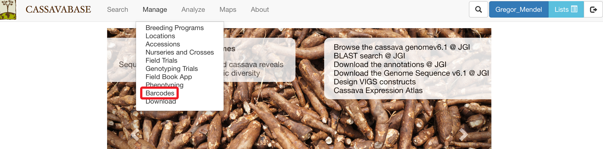
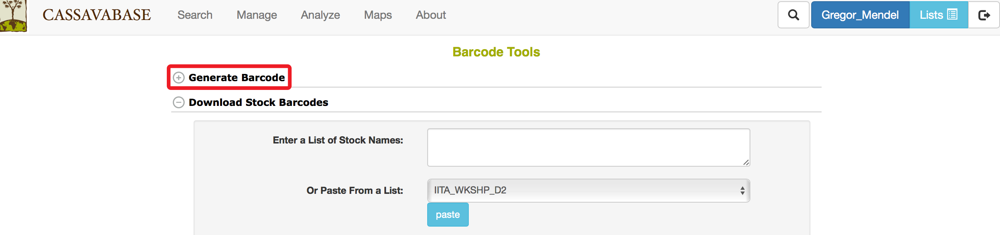
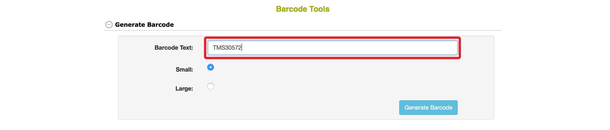
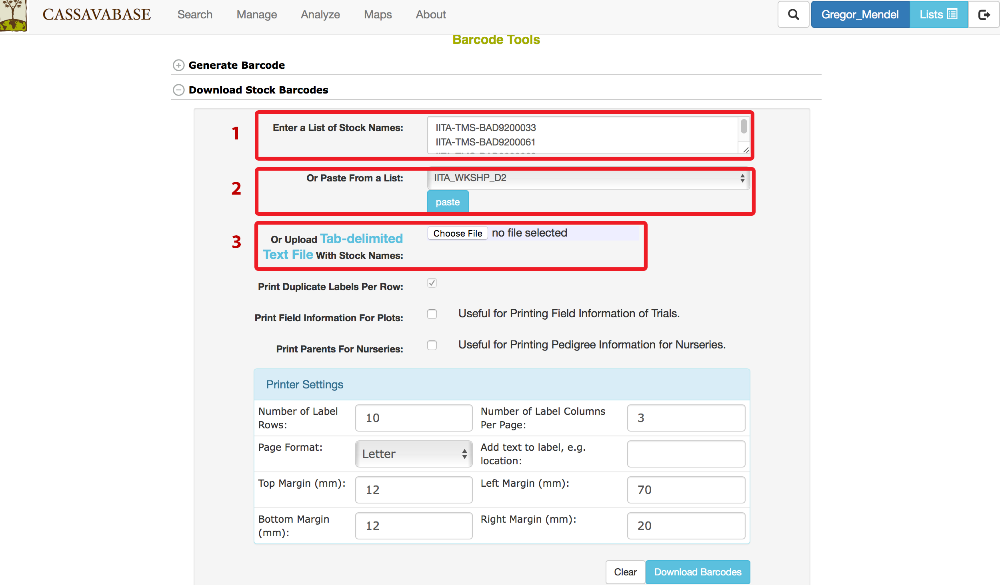
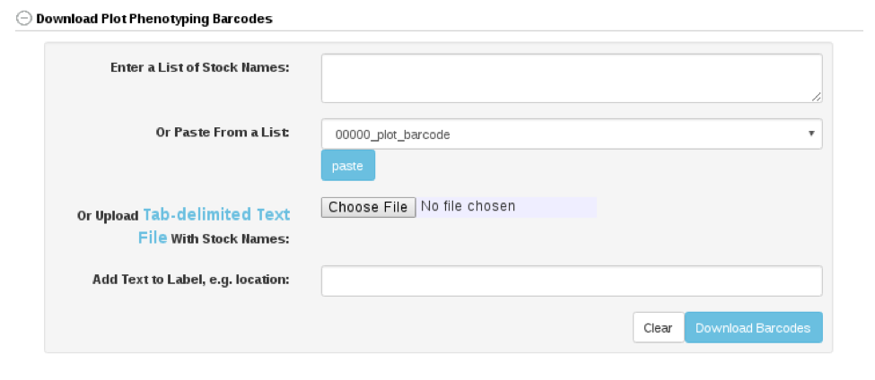

# Managing Barcodes

SGN databases provide tools for generating barcodes for stock identification. To access “Barcode Tools” page, clicking on “Barcodes” in the “Manage” menu.

```{r echo=FALSE, out.width='95%', fig.align='center'}

```

“Barcode Tools” page provides four options for generating barcodes:

-   Single barcode

-   Multiple barcodes

-   Plot phenotyping barcodes

-   Trial barcodes

To generate single barcode, clicking on “Generate Barcode” link on the “Barcode Tools” page.

```{r echo=FALSE, out.width='95%', fig.align='center'}

```

In the “Generate Barcode” section, specify the name of the barcode, size of the barcode, then clicking on “Generate Barcode”

```{r echo=FALSE, out.width='95%', fig.align='center'}

```

The database will generate a barcode for your stock. The barcode can be printed for your stock identification. It also appears on its corresponding stock page.

```{r echo=FALSE, out.width='95%', fig.align='center'}

```

If you have a list of stocks that you want to generate barcodes, you can use “Download Stock Barcodes” section. You have three options for entering stock names:

1.  Typing in stock names, or copy and paste from other file into the box (1)

2.  Choosing a list of stocks from your “Lists” (2), and transferring the list into the box (1) by clicking on “paste” button.

3.  Uploading a “Tab-delimited Text File” with stock names.

4.  Select an optional printing format from the available formats.

You can select printer settings that you prefer in the “Printer Settings” section. After you enter stock names and specify printer settings, clicking on “Download Barcodes” button at the bottom of the page.

```{r echo=FALSE, out.width='95%', fig.align='center'}

```


If you have a list of plots that you want to generate phenotyping barcodes, you can use “Download Plot Phenotyping Barcodes” section. You have three options for entering plot names:

1.  Typing in plot names, or copy and paste from other file into the box (1)

2.  Choosing a list of plots from your “Lists” (2), and transferring the list into the box (1) by clicking on “paste” button.

3.  Uploading a “Tab-delimited Text File” with plot names.

```{r echo=FALSE, out.width='95%', fig.align='center'}

```

If you have a list of trials that you want to generate barcodes, you can use “Download Trial Barcodes” section. You have three options for entering trial names:

1.  Typing in trial names, or copy and paste from other file into the box (1)

2.  Choosing a list of trial from your “Lists” (2), and transferring the list into the box (1) by clicking on “paste” button.

3.  Uploading a “Tab-delimited Text File” with trial names.

```{r echo=FALSE, out.width='95%', fig.align='center'}
knitr::include_graphics('assets/images/trial_barcode.png')
```
