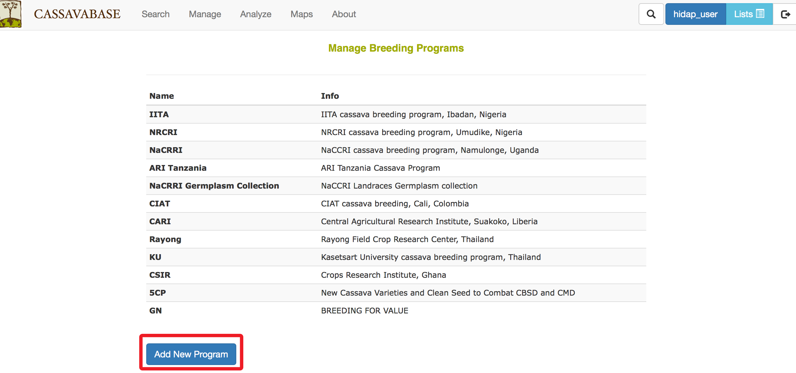
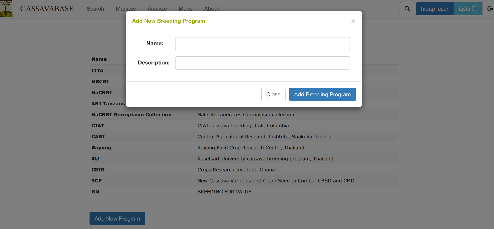

# Managing Breeding Programs

New breeding programs can be added by using “Add New Program” button on the “Manage Breeding Programs” page.

```{r echo=FALSE, out.width='95%', fig.align='center'}

```

Clicking on the “Add New Program” button will generate a blank form for you to fill out the name and description of the breeding program that you want to add. After completing the form, click on “Add Breeding Program” button to finish the process.

```{r echo=FALSE, out.width='95%', fig.align='center'}

```
