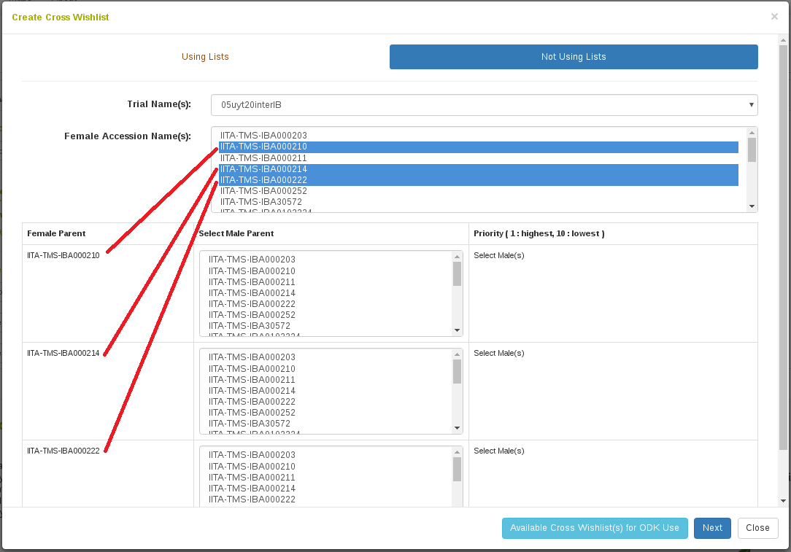

# Managing Crosses

Information for crosses can be managed using the “Crosses" option in the Manage menu.

```{r echo=FALSE, out.width='95%', fig.align='center'}

```

## Crossing Experiment

Different crosses in the same trial/nursery/project are grouped via "**crossing experiment**". Crossing experiments are organized based on their breeding programs. To find a crossing experiment, you can either type the crossing experiment name in the “Search” box, or look for the crossing experiment directly in its breeding program by clicking on the “**+**” icon. In each breeding program, crossing experiments can be placed directly in the breeding program, or organized in folders. The "**Folders**" section allows you to place crossing experiments in folders, move a crossing experiment in a folder to another folder, or rearrange your folders within a breeding program.

```{r echo=FALSE, out.width='95%', fig.align='center'}

```

```{r echo=FALSE, out.width='95%', fig.align='center'}

```

### Add New Crossing Experiment

To add a new crossing experiment, click on "Add Crossing Experiment" link.
```{r echo=FALSE, out.width='95%', fig.align='center'}

```

Required Information:

• “**Crossing Experiment Name**": enter a name for the crossing experiment. The crossing experiment name must not already exist in the database.

• “**Breeding program**": select a breeding program that is available in the database. New breeding programs can be added on the "Breeding program" page, accessible from the "Manage" menu. *Breeding Program Page*

• “**Location**”: select a location for the crossing experiment. New locations can be entered on the "**Locations**" page, accessible from the "**Manage**" menu. *Location Page*

• “**Year”**: select a year.

• “**Description**": enter a description for the crossing experiment.

After filling in the information, click "**Submit**" to generate the crossing experiment.

```{r echo=FALSE, out.width='75%', fig.align='center'}

```

## Cross

### Add New Crosses

#### Add a cross by using the "Add New Cross" dialog {-}

To add a single new cross, click on "Add Cross" link.

```{r echo=FALSE, out.width='95%', fig.align='center'}

```

Enter cross information in the popup dialog.

```{r echo=FALSE, out.width='95%', fig.align='center'}

```

Required Information:

• “**Crossing experiment**": select a crossing experiment available in the database.

• “**Location**": select a location available in the database.

• “**Cross name**": enter a name for the cross. The cross name must not already exist in the database.

• “**Cross type**": the options for cross types are: biparental, self, open pollinated, bulk, bulk selfed, bulk and open pollinated, double haploid, polycross, reciprocal and multicross.

```{r echo=FALSE, out.width='95%', fig.align='center'}
knitr::include_graphics('assets/images/new_cross_dialog_type.png')
```

• The “**Female Parent”** and “**Male Parent”** field are auto-complete fields for accessions that are already in the database. The parents specified will be entered in the pedigree of the new accessions generated by this cross.

Optional Information:

• “**Female Plot and/or Male Plot**": In addition to the accession names, specific plots used in the cross can also be added to the database. To retrieve plot names associated with each female/male accession, enter your trial name, then click "**Search Plots**".  Plot names of each parental accession in that field trial will be shown in the drop-down list, you can then select the plot used in the cross.

```{r echo=FALSE, out.width='95%', fig.align='center'}

```   

Additional crossing experimental information such as pollination date, number of flowers, number of fruits, number of seeds can be specified during adding new cross. Alternatively, this information can be updated or edited directly on the "**Cross Details**" page.  

If you know the number of accessions that are generated from the cross, they can be instantiated immediately in the database by clicking the "**Add accessions for progeny**" checkbox and specifying the number.

```{r echo=FALSE, out.width='95%', fig.align='center'}

```   

Click "Submit" to generate the cross.

#### Upload New Crosses {-}

To upload new crosses from an Excel file (.xls or .xlsx), click on "Upload Crosses" link.

```{r echo=FALSE, out.width='95%', fig.align='center'}

```

Select a crossing experiment and a location available in the database from drop-down lists and choose a file that you want to upload, then click "**Upload File**".

```{r echo=FALSE, out.width='95%', fig.align='center'}

```

Please check spreadsheet format carefully. The file must be an Excel file (.xls or .xlsx).

```{r echo=FALSE, out.width='95%', fig.align='center'}

```

### Update Crosses by Uploading

To upload progenies and/or experimental info of crosses already in the database, go to "**Manage-Upload**" page.

In the "**Crosses**" section, there are links for uploading progenies and experimental info.

```{r echo=FALSE, out.width='95%', fig.align='center'}

```

Please check spreadsheet format in each link carefully. The file must be an Excel file (.xls or .xlsx).

```{r echo=FALSE, out.width='95%', fig.align='center'}

```

```{r echo=FALSE, out.width='95%', fig.align='center'}

```

Note: crossing experimental information is customized based on the need for each crop. As a result, column headers for experimental info in your database may be different from the information shown in this manual.

## Cross Wishlist

An Android ODK application is being developed to record cross information on a mobile device in the field. To link this mobile application with the database, the Cross Wishlist can be used to create a plan for which crosses to perform.

This tool is available on the Manage Cross page. It is currently only available on certain databases, so when you click this link you may see an alert mentioning that the cross wishlist is not available on your database.

```{r echo=FALSE, out.width='95%', fig.align='center'}

```

### Create a Cross Wishlist

#### Step 1. Select the accessions to be crossed in your trial {-}

There are two interfaces for this step, either "Not Using Lists" or "Using Lists". Depending on if you already have a list of female and male accessions to use, you can decide on which interface to use. The end result of using either interface is the same.

```{r echo=FALSE, out.width='95%', fig.align='center'}

```

We will start by showing "Not Using Lists". First select the trial in which the crosses are to be performed. This will populate a select box with all the accessions used in that trial. From here, one or many accessions can be selected as the female accession.

```{r echo=FALSE, out.width='95%', fig.align='center'}

```

Once the female accessions are selected, a table is populated. Each row in this table begins with the female accession that was selected, followed by a select box with all the accessions used in the trial. From here, one or many accessions can be selected as the male to use in the cross.

```{r echo=FALSE, out.width='95%', fig.align='center'}

```

Once the male accessions are selected to cross with each female accession, a table indicating priorities appears. Priority is meant to indicate an order in which to attempt the cross; first the highest priority male will be considered, but if this cross is not possible then subsequent males will be considered. An equal priority can be given and this will not indicate a specific order to follow.

```{r echo=FALSE, out.width='95%', fig.align='center'}

```

Alternatively, we could have used the "Using List" interface instead. Here we select the trial in which the crosses will be performed and we provide a list of accessions to consider for the females and the males to be crossed.

```{r echo=FALSE, out.width='95%', fig.align='center'}

```

#### Step 2. Select the female plots to be considered in the crosses {-}

After selecting your lists, the table below is populated. The first column has all the female accessions specified and the header row has all the male accessions specified. The males to consider crossing with each female are indicated with priority.

```{r echo=FALSE, out.width='95%', fig.align='center'}

```

After female and male accessions are selected to cross, either by the "Nor Using List" or "Using List" interface, click Next. The next dialog will allow selection of specific female plots to use for the cross. Sections for each female accession selected will appear with the field layout displayed. Selecting all plots in which the female is present indicates that the cross should be performed on all plots where that female accession is present.

```{r echo=FALSE, out.width='95%', fig.align='center'}

```

#### Step 3. Transfer the cross wishlist to your mobile crossing application {-}

Clicking "Push Cross Wishlst for ODK Use" will send the cross wishlist plan to the ONA server for use by the mobile ODK application. Crosses can then be performed and recorded in the field using the mobile application. Afterwards, the crosses are sent back to our database and stored.

## Crossing Experiment Detail Page

Information for crosses in the same crossing experiment is compiled in the crossing experiment detail page.

```{r echo=FALSE, out.width='95%', fig.align='center'}

```

```{r echo=FALSE, out.width='95%', fig.align='center'}

```

Each cross name, female parent, male parent, female plot and male plot has a link to its own detail page, which contains information specific to each one.
Note: crossing experimental information is customized based on the need for each crop. As a result, the details of the information in your database may be different from the information shown in this manual.

## Cross Detail Page

Information of each cross can also be viewed in its detail page.

```{r echo=FALSE, out.width='95%', fig.align='center'}
knitr::include_graphics('assets/images/cross_page_1.png')
```

```{r echo=FALSE, out.width='95%', fig.align='center'}

```

 This page allows you to update or edit crossing experimental information and add progenies related to that cross.
 Note: crossing experimental information is customized based on the need for each crop. As a result, the details of the information in your database may be different from the information shown in this manual.

```{r echo=FALSE, out.width='75%', fig.align='center'}

```


```{r echo=FALSE, out.width='95%', fig.align='center'}
knitr::include_graphics('assets/images/cross_add_progenies.png')
```
