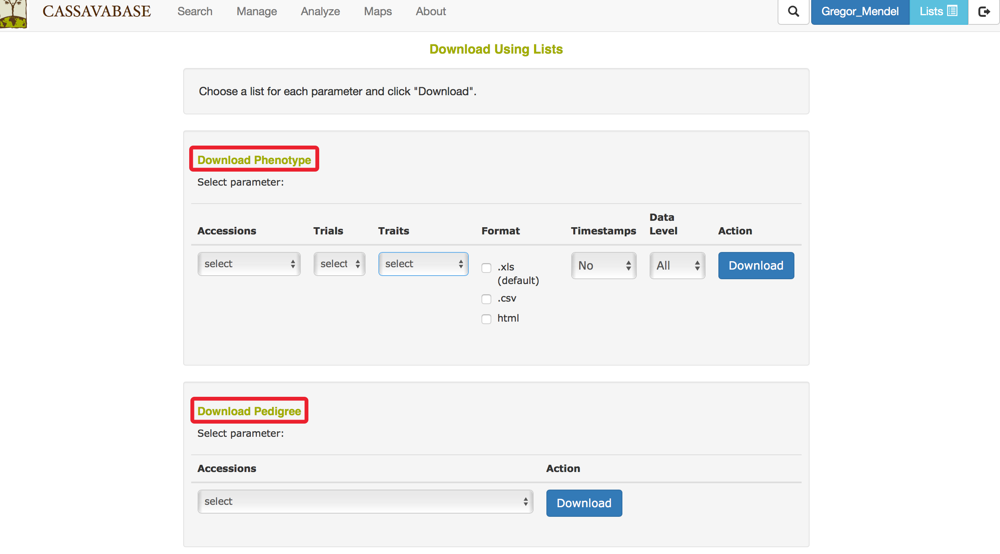
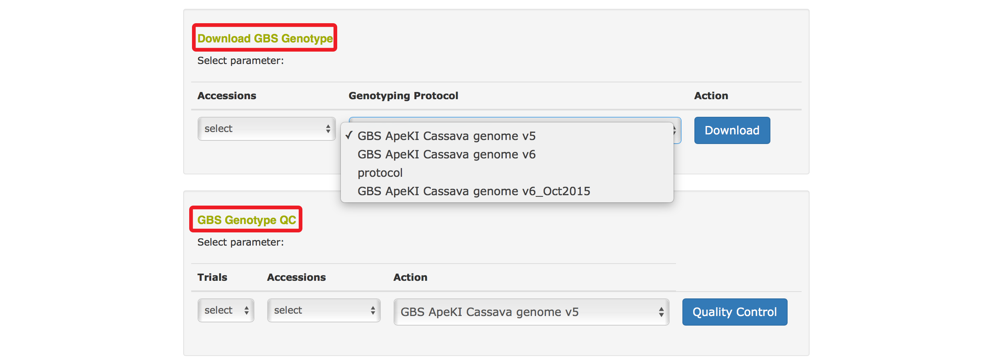

# Managing Downloads

You can download phenotype, trial meta-data, pedigree, GBS genotype and GBS genotype QC files from the database to your computer by using “Lists”. To download, clicking on “Download” in the “Manage” menu.

```{r echo=FALSE, out.width='95%', fig.align='center'}
knitr::include_graphics('assets/images/image255.png')
```

For each category, you can select a list of accessions from your “Lists” to download their phenotypes, pedigree, GBS genotype, GBS genotype QC. In the case of downloading trial meta-data, you would provide a list of trials, while for downloading phenotype and GBS genotype QC, you can also use a list of trials or traits.

```{r echo=FALSE, out.width='95%', fig.align='center'}
knitr::include_graphics('assets/images/trial_meta_data_download.png')
```

```{r echo=FALSE, out.width='95%', fig.align='center'}

```

```{r echo=FALSE, out.width='95%', fig.align='center'}

```
