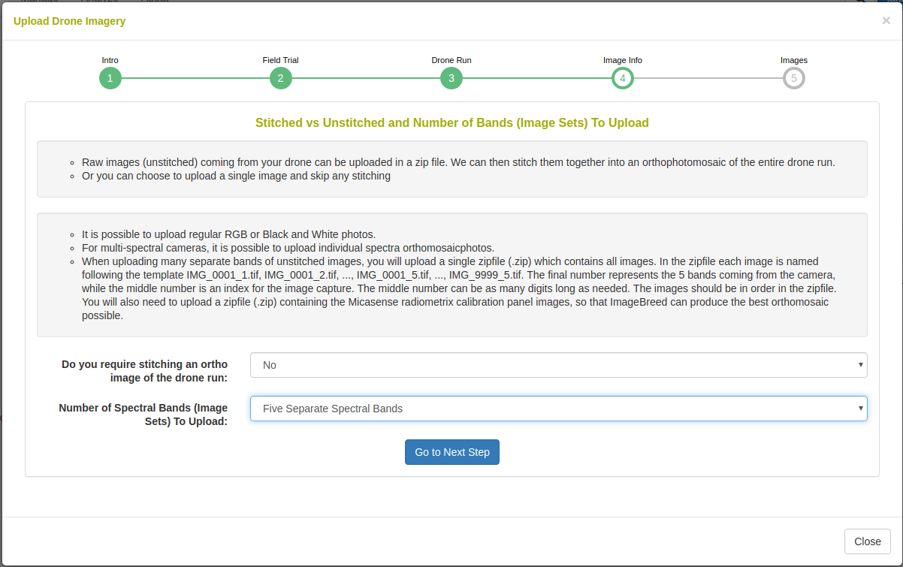

# Managing Drone Imagery

## Image-Phenotyping Dashboard

1. Upload raw image-captures in a compressed file (.zip) for orthophotomosaic assembly or upload previously stitched orthophotomosaic raster (.PNG, .JPG) imagery.
2. Dashboard shows all field trials and uploaded imaging events in collapsible sections.
3. Follow standard processes to manually create templates for assignment of plot-polygon images to the field experiment design.
4. All imagery is shown with the spectral category within collapsible sections. Figure shows NIR imagery.
5. Apply Fourier transform filtering, thresholding, and vegetation index masking. Plot-polygon images for all image processes are shown.
6. Extract and export phenotypic values from plot-polygon images for analyses and model training.

## Image Input

Clicking "Upload Imagery" will open the following dialog.

```{r echo=FALSE, out.width='95%', fig.align='center'}

```

Raw-captures can be uploaded in a compressed (.zip) file so that they can be assembled into an orthophotomosaic. If orthophotomosaic assembly is not required, raster images (.PNG, .JPG) can be uploaded. Example data is given for raw Micasense RedEdge 5-band multispectral captures and for stitched orthophotomosaics.

```{r echo=FALSE, out.width='95%', fig.align='center'}

```

To begin uploading images, a field trial must be selected. The field trial must already be saved in the database. For information about adding a field trial, please read the Field Trial documentation.

```{r echo=FALSE, out.width='95%', fig.align='center'}

```

The image data is added to an imaging (drone run) event. Here you can select a previously saved imaging event or you can create a new one by defining a name, description, and date.

```{r echo=FALSE, out.width='95%', fig.align='center'}

```

The uploaded data can be raw image-captures or complete raster images. Here you can select whether orthophotomosaic stitching is required.

```{r echo=FALSE, out.width='95%', fig.align='center'}

```

In the case that orthophotomosaic stitching is required, select 'yes'. On the next step you will see the following:
Upload a zipfile with the raw-captures.
When uploading Micasense RedEdge raw-captures, provide images of the Micasense calibration panels in a zipfile as well.

```{r echo=FALSE, out.width='95%', fig.align='center'}

```

In the case that orthophotomosaic assembly is not required, simple upload the raster images. Select the number of image bands that will be uploaded e.g. for a five band multispectral camera, select 5.

```{r echo=FALSE, out.width='95%', fig.align='center'}

```

In the caes that orthophotomosaic stitching is not required, select 'no'. On the next step you will see the following:

```{r echo=FALSE, out.width='95%', fig.align='center'}

```

Upload an image at each band with a unique name, description, and spectral type.

## Standard Process

Once imagery is uploaded, it will appear on the dashboard under the field trial. Clicking the "Run Standard Process" button will begin extracting plot-polygon phenotypes from the imagery.

```{r echo=FALSE, out.width='95%', fig.align='center'}

```

Clicking the button will open the following dialog.

```{r echo=FALSE, out.width='95%', fig.align='center'}

```

Select a drone run band to use in this process. In the case of the Micasense 5 band multispectral camera there will be 5 bands shown here; select the NIR channel in this case because it has the highest contrast. In the case of standard color images, there will only be the RGB Color Image option here.

```{r echo=FALSE, out.width='95%', fig.align='center'}

```

Rotate the image so that there the plots are oriented in a grid fashion. There can be a skew in the field layout, as seen in the following example.

```{r echo=FALSE, out.width='95%', fig.align='center'}

```

Perform a rough cropping of the image by clicking on the four corners of the field. Cropping is important to remove any extraneous parts of the image.

```{r echo=FALSE, out.width='95%', fig.align='center'}

```

This step shows a histogram of the cropped image. The standard process will magnitude threshold the top and low ends of the distribution.

```{r echo=FALSE, out.width='95%', fig.align='center'}

```

In this step, the template for the plot polygons in the experimental field design are associated to the image. First, defined the number of rows and columns in the field experiment. Then click the four corners of the image, in respect to the top right, top left, botton left, and bottom right positions. Next click on "Draw Plot Polygon Template". Review the template and clear/repeat the process until the template matches well. It is possible to "copy/paste" templates in the case where there are large breaks in the field design. Next, scroll down to the "assign Plot Polygons to Field Trial Entities" section. Select the location of Plot Number 1 as either "top left" or "top right" and whether the field design is serpentine or zigzag. Click on "Generate Assignments" and review that the names of the plots appear correctly in the overlay on the image. Finally, click "Finish and Save Polygons to Plots" when you have have confirmed the assignments.

```{r echo=FALSE, out.width='95%', fig.align='center'}

```

Next, the dialog shows you that the standard process will be repeated for all uploaded image bands.

```{r echo=FALSE, out.width='95%', fig.align='center'}

```

Next, choose which vegetation indices to apply.

```{r echo=FALSE, out.width='95%', fig.align='center'}

```

Next, choose the phenotypic values to extract. You must define the time point for which the phenotype is; if the field trial has a planting date, the time point will automatically be populated as image date minus the planting date.

```{r echo=FALSE, out.width='95%', fig.align='center'}

```

After completing the standard process, the job will continue in the background until it completes. You can check the status of the job from the dashboard.

## Ground Control Points

Ground control points can be saved after an imaging event has undergone the standard process on orhomosaics. Ground control points can then be used across imaging events on the same field experiment in order to automate the entire standard process.
