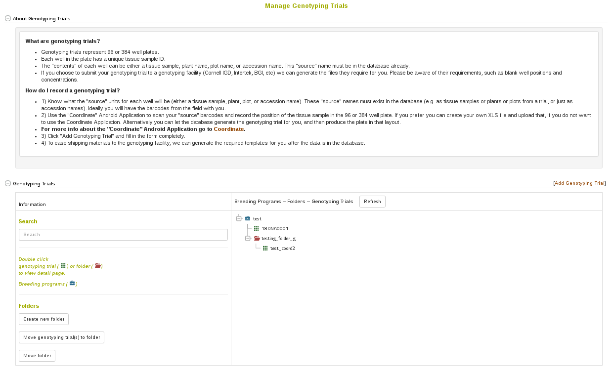
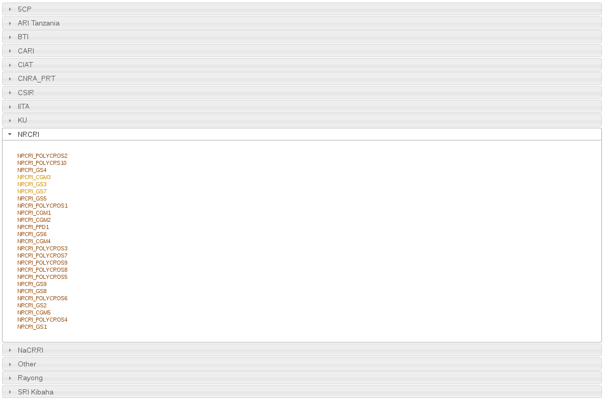
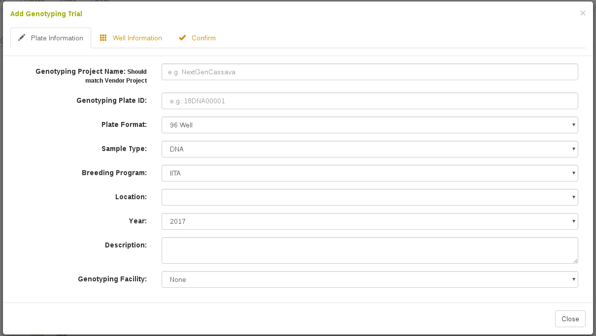
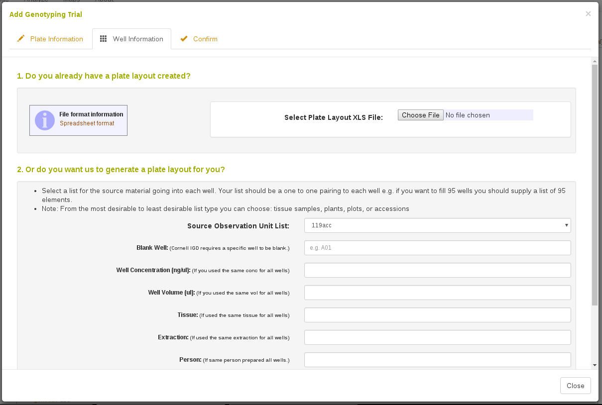
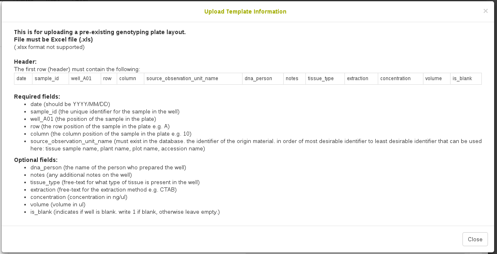
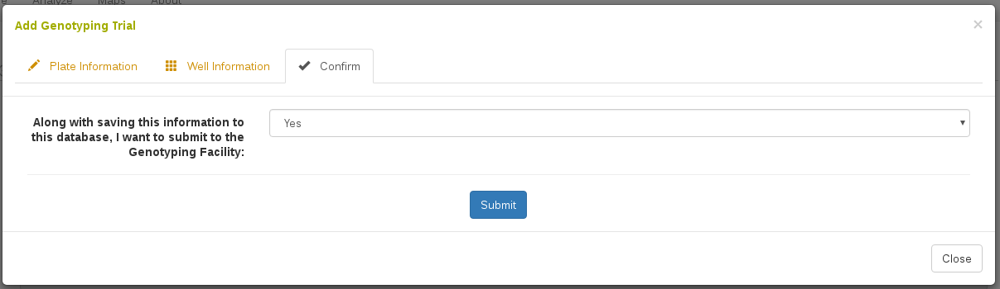
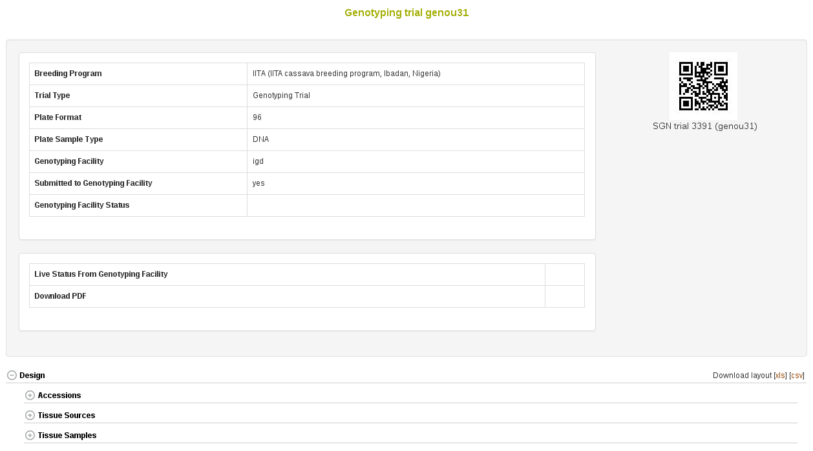
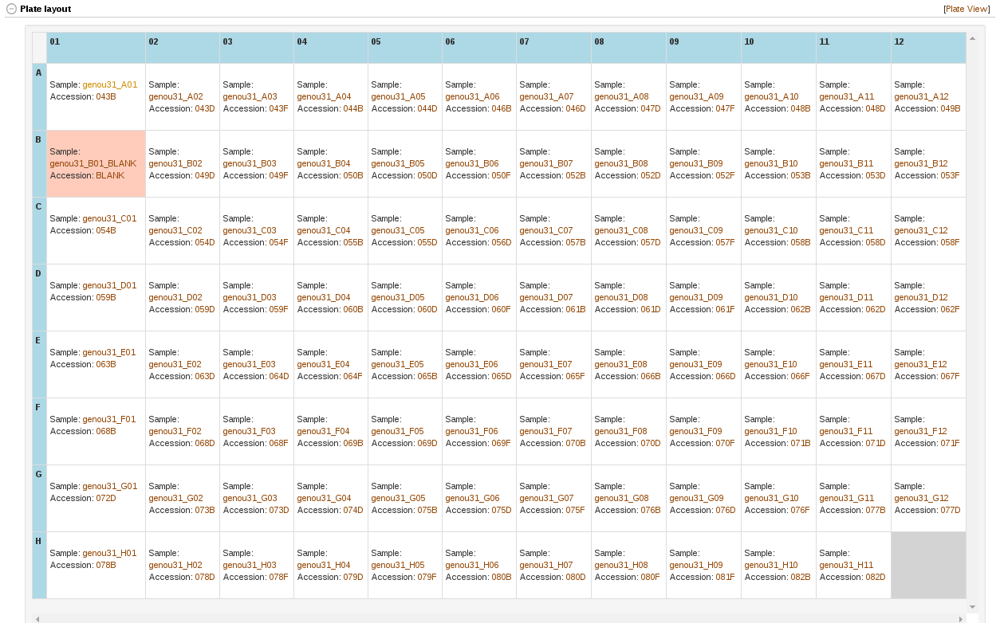

# Managing Genotyping Plates

Genotyping Plates represent the content of a genotyping plate sent to a genotyping facility (e.g. samples in specific wells). To streamline this process, it is possible to upload this information or let the database create a plate for you.
Once the genotyping plate is saved in the database it is then possible to export the information directly to genotyping facilities that are BrAPI compliant. The genotyping facility can then provide status information to us via BrAPI.

To begin go to Manage->Genotyping Plates.

```{r echo=FALSE, out.width='95%', fig.align='center'}

```

Here the genotyping plates are divided by Breeding Program. These sections can be expanded by clicking on one.

```{r echo=FALSE, out.width='95%', fig.align='center'}

```

## Adding a New Genotyping Plate

To begin, click on "Add Genotyping Plate". Notice that this form is split into three sections: "Plate Information", "Well Information", and "Confirm". The first section is for defining information about the genotyping plate, such as a Plate identifier, plate format (96 well), etc. The second section is for defining the samples in the wells, such as sample names, sample concentrations, well position, etc. The final section is for Submitting the info.

All fields in the Plate Information section are required.

```{r echo=FALSE, out.width='95%', fig.align='center'}

```

In the Well Information section you can choose to either 1) Upload an XLS or XLSX spreadsheet with your sample layout or 2) let the database create the sample layout.

```{r echo=FALSE, out.width='95%', fig.align='center'}

```

If you choose to upload an XLS or XLSX spreadsheet, the Spreadsheet Template info requires the following:

```{r echo=FALSE, out.width='95%', fig.align='center'}

```

In either case, the sample identifier is generally a concatenation of Plate name and well position, e.g. MyGenotypingTrial1_A01.
In either case, you need to provide a "source_observation_unit_name" for each sample. This can be a tissue sample name, a plant name, a plot name, or an accession name; however, in any case, the identifier must already exist in the database. This allows us to link the sample in the well to specific field trial plots, or, plants, or tissue_samples. If you only know which accession is in the well, you can use the accession name.

In the final Confirm section you can decide whether to submit this information to the genotyping facility you selected. This requires that the genotyping facility is BrAPI compliant to work.

```{r echo=FALSE, out.width='95%', fig.align='center'}

```

## Genotyping Plate Detail Page

If you open a specific genotyping plate, it will take you to the detail page.
Here you can see the Accessions used in the plate (if you created the trial and the source_observation_unit_names you used were plots, this will still work because we know the accession of the plot or plant or tissue sample).

```{r echo=FALSE, out.width='95%', fig.align='center'}

```

Further down you can see a graphical representation of your plate with well positions. This can be 96 well or 384 well depending on your plate format.

```{r echo=FALSE, out.width='95%', fig.align='center'}

```
