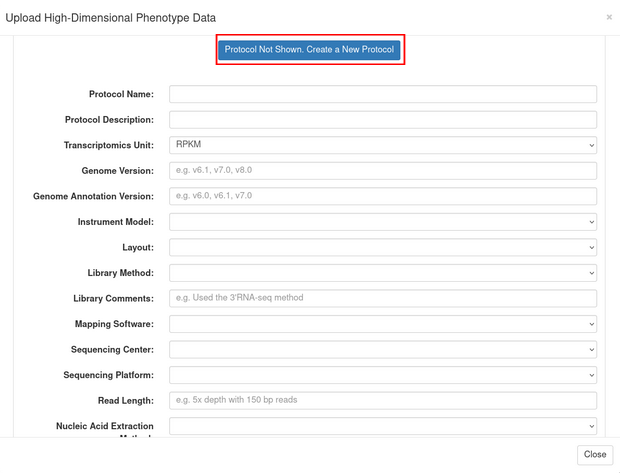
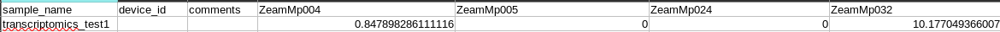

# Managing High Dimensional Phenotyping Data

## Managing Transcriptomic Data

### Uploading Transcriptomic Data

To upload transcriptomic data, go to the transcriptomics page by clicking "Transcriptomics" under the Manage tab.

```{r echo=FALSE, out.width='95%', fig.align='center'}
knitr::include_graphics('assets/images/transcriptomics_menu.png')
```

Click the "Upload Transcriptomics Data" button to open the upload workflow dialog. On the second step "Samples", you will be prompted to make sure that your samples are already in the database. You can refer to the "Managing Tissue Samples" chapter for instructions on how to create a sampling trial. After creating a sampling trial or confirming that your samples exist, move on to the "Protocol Info" step. Here you can select an existing protocol, or create a new protocol. To create a protocol, click the "Protocol Not Shown. Create a New Protocol" button. From here you can fill in information about your new protocol and when finished, click "Go to Next Step".

```{r echo=FALSE, out.width='95%', fig.align='center'}

```

You will need to have two csv files when uploading transcriptomics data. The first is the data matrix file, which should have these headers:

```{r echo=FALSE, out.width='95%', fig.align='center'}
knitr::include_graphics('assets/images/data_matrix_headers.png')
```

The names in the sample_name column should match the sample names you created in your sampling trial file. The header marked "transcript_name_columns" should be replaced with the transcript names you want to upload, each in its own column in the header and the respective expression value below. Example:

```{r echo=FALSE, out.width='95%', fig.align='center'}

```

The second file is the transcript details file, which should have these headers:

```{r echo=FALSE, out.width='95%', fig.align='center'}
knitr::include_graphics('assets/images/transcript_details_headers.png')
```

Each row under the transcript_name column should contain each transcript name from your data matrix file. For example:

```{r echo=FALSE, out.width='95%', fig.align='center'}
knitr::include_graphics('assets/images/transcript_details_example.png')
```

Once these two files are uploaded, click verify to check that they are formatted correctly and that the samples exist. If there are no errors, you can then click store to store your transcriptomics data.

### Downloading Transcriptomics Data

To download your data, click the "Uploaded Transcriptomics Data" dropdown menu on the Transcriptomics page. Then click the "Your Uploaded Transcriptomic Data" dropdown. From here you will be able to see the transcriptomics data that you have uploaded. Click the "Download" button next to the data that you wish to download.

```{r echo=FALSE, out.width='95%', fig.align='center'}
knitr::include_graphics('assets/images/download_transcriptomics.png')
```
