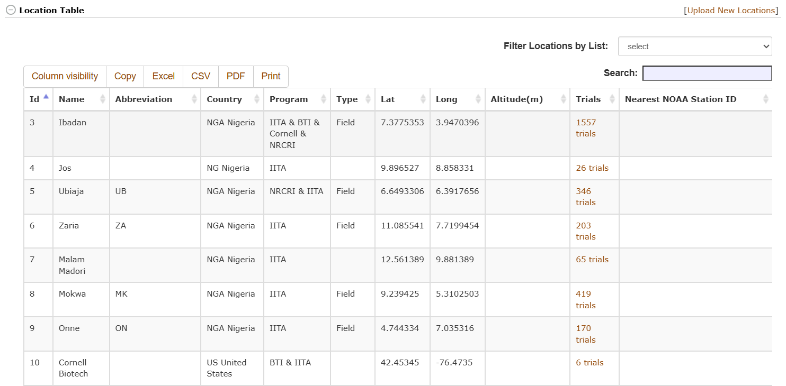
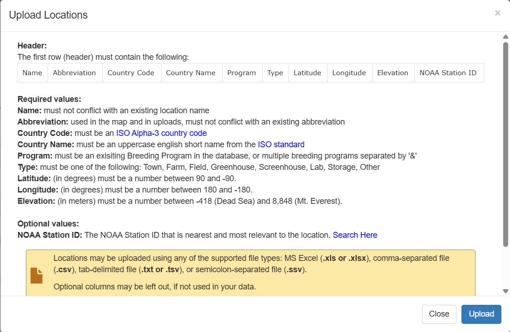
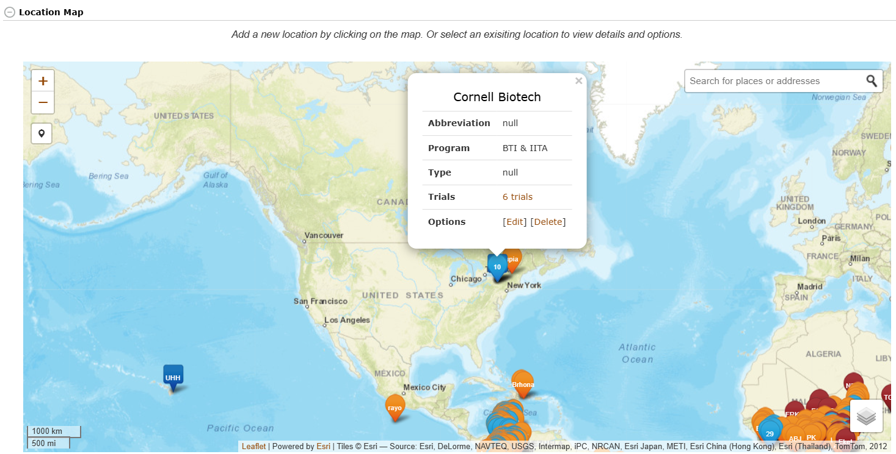

# Managing Locations

Field locations can be managed using the “**Manage Locations**” page. On this page, locations in the database are organized based on their breeding programs. Each location has a link to trials conducted in that location. To add a new location, click on the “Upload New Locations” button that links to the “Upload Locations” form.

```{r echo=FALSE, out.width='95%', fig.align='center'}

```

The "Upload Locations" describes how to build a spreadsheet with location data for upload. Name, abbreviation, country code, country name, program, type, latitute, longitude, and elevation are all required. The NOAA station ID is optional. Link a spreadhsheet to the form and click "Upload" to add those locations to the database. 

```{r echo=FALSE, out.width='95%', fig.align='center'}

```

Alternatively, locations can be viewed and added via the map. Hover over an icon on the map to see the location details and trials linked to that location. Click on the map to open the new location dialog. Fill in the same information that would be used in the spreadsheet upload to add a new location. 

```{r echo=FALSE, out.width=95%, fig.align='center'}

```
