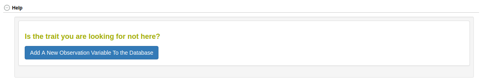
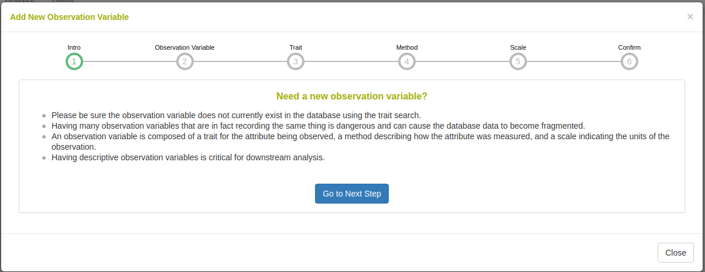
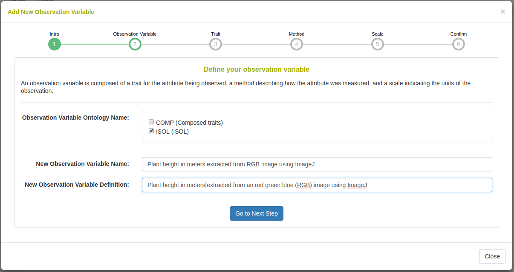
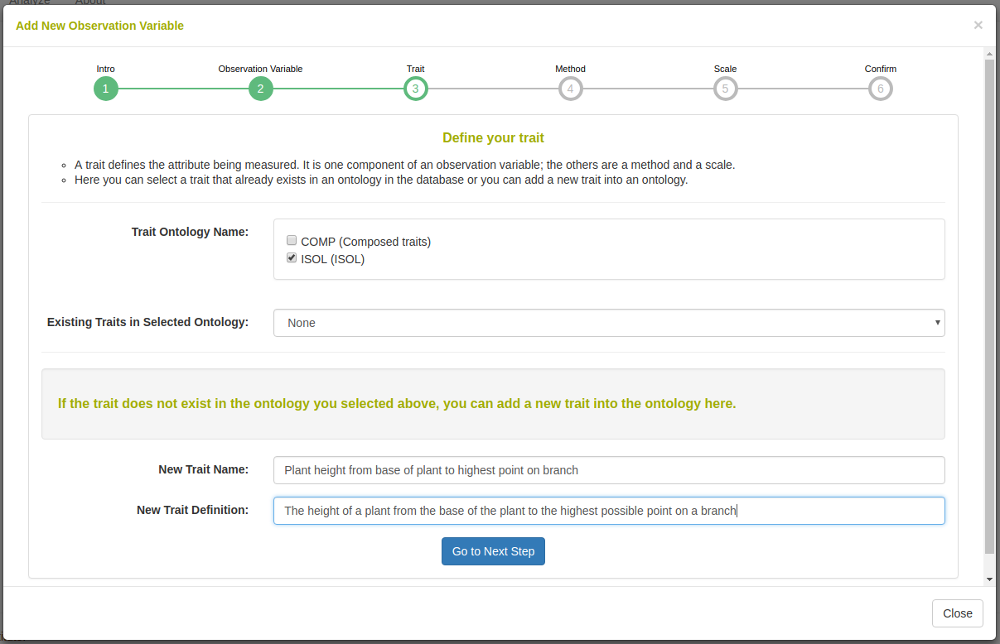
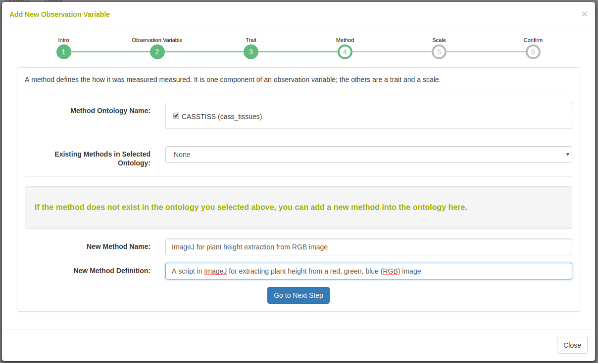
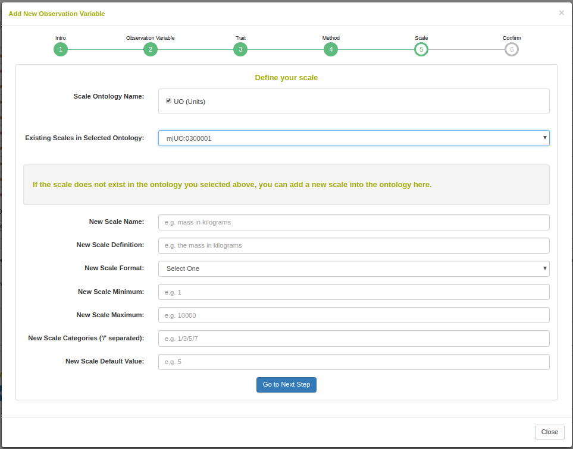
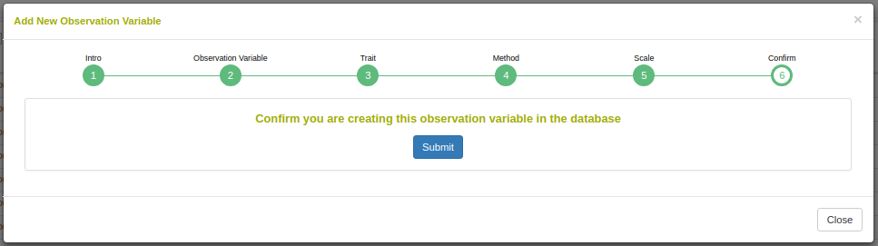

# Managing Observation Variables

## Managing Observation Variables with Traits, Methods, and Scales

Observation variables are the identifiers used when collecting phenotypic data. An observation variable is composed of a trait, a method, and a scale. The trait describes the attribute being measured e.g. 'Plant Height'. The method defines the protocol in which the trait was observed e.g. 'Using a one meter long measuring stick'. The scale defines the units or dimensions for which the measurement was taken e.g. 'Meters'.

Generally, observation variables are defined in ontologies that are predefined. We often use ontologies from cropontology.org. In this case, you will not be able to define your own observation variables directly; instead, you will need to contact us and we will add the observation variable for you.

For databases where the user has greater control, we have an interface to allow addition of observation variables, along with traits, methods, and scales. To begin, go to the Search->Traits page.

If the database you are on allows you to directly add observation variables, you will see the following button at the bottom of the page.

```{r echo=FALSE, out.width='95%', fig.align='center'}

```

When you click the button, the following workflow will appear. You should be logged in or else it will not allow addition of the observation variable.
The workflow begins with an introduction.

```{r echo=FALSE, out.width='95%', fig.align='center'}

```

On the next workflow step, you select the ontology that you want to insert the new observation variable into. You must also give a name and a definition for the new observation variable.

```{r echo=FALSE, out.width='95%', fig.align='center'}

```

On the next workflow step, you select the trait ontology to use. Once you select a trait ontology, a select containing all the terms in the selected ontology will appear. You can either select a trait or if it does not exist in the select, you can create a new one by giving a name and a definition for the new trait.

```{r echo=FALSE, out.width='95%', fig.align='center'}

```

On the next workflow step, you select the method ontology to use. Once you select a method ontology, a select containing all the terms in the selected ontology will appear. You can either select a method or if it does not exist in the select, you can create a new one by giving a name and a definition for the new method.

```{r echo=FALSE, out.width='95%', fig.align='center'}

```

On the next workflow step, you select the scale ontology to use. Once you select a scale ontology, a select containing all the terms in the selected ontology will appear. You can either select a scale or if it does not exist in the select, you can create a new one by giving a name and a definition for the new scale. You can also define a format, minimum, maximum, categories, and default value for the new scale.

```{r echo=FALSE, out.width='95%', fig.align='center'}

```

On the last page of the workflow, you confirm the submission.

```{r echo=FALSE, out.width='95%', fig.align='center'}

```

Afterwards, you can use the newly created observation variable ontology term in your phenotyping.
