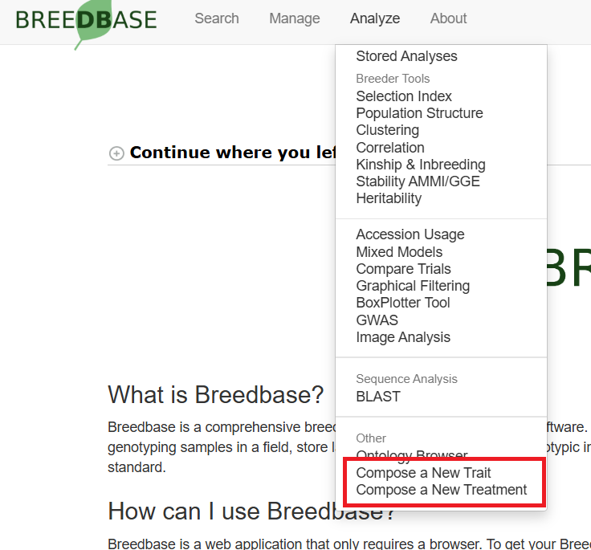
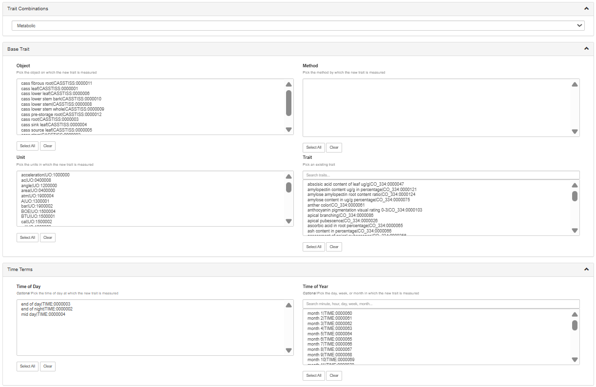
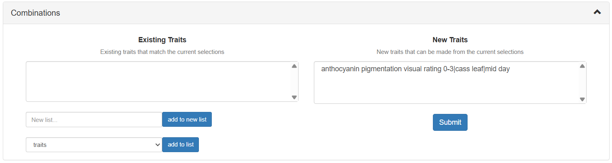
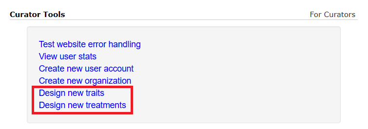
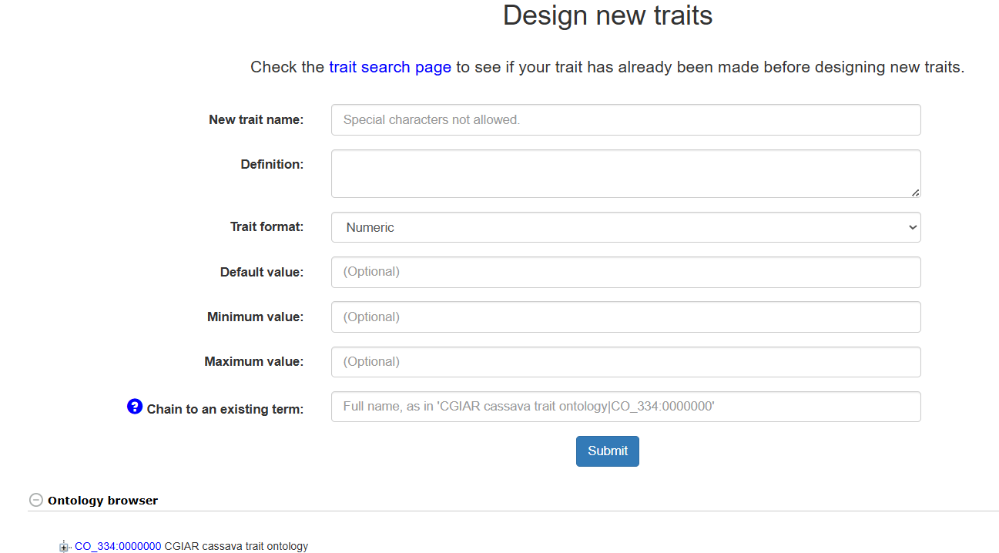

# Managing Observation Variables

## Managing Observation Variables with Traits, Methods, and Scales

Though the information in this section pertains to traits, it also applies to experimental treatments. In general, anything that can be done with a trait can be done with a treatment.

Observation variables are the identifiers used when collecting phenotypic data. An observation variable is composed of a trait, a method, and a scale. The trait describes the attribute being measured e.g. 'Plant Height'. The method defines the protocol in which the trait was observed e.g. 'Using a one meter long measuring stick'. The scale defines the units or dimensions for which the measurement was taken e.g. 'Meters'.

Generally, variables are defined in ontologies that are predefined. We often use ontologies from cropontology.org. In this case, you will not be able to define your own variables directly; instead, you will need to contact us and we will add the variable for you. We will discuss manual trait or treatment creation later in this section.

Before setting out to introduce new traits, visit the trait search page under the *Search* tab to make sure it isn't already present. Once a set of traits, methods, units, scales, and other terms have been added to the database, they can be composed into an observation variable from the *Analyze* tab under *Compose a new trait*.

```{r echo=FALSE, out.width='95%', fig.align='center'}

```

A base trait term can be combined with an object/plant part, collection method, measurement unit, and time terms to combine into a new observation variable. The types of combinations available to be made determine which of these can be combined. The types of composed traits available to be made is determined in your server configuration - contact a server administrator with questions.

```{r echo=FALSE, out.width='95%', fig.align='center'}

```

To proceed, select one or more term from each box. At the bottom of the page, you will see existing composed traits that match your selections as well as the new composed traits that can be made. Select one or more of the possible new composed traits and click 'Submit' to create them.

```{r echo=FALSE, out.width='95%', fig.align='center'}

```

Afterwards, you can use the newly created observation variable ontology term in your phenotyping. The same interface can also be used for treatments, but on the *Compose a new treatment* page.

For databases where the user has greater control, we have an interface to allow curators to add new traits or treatments. 

If the database you are on allows you to directly add observation variables (contact a server administrator to change this), you will see links in the tools section of the user profile page.

```{r echo=FALSE, out.width='95%', fig.align='center'}

```

On the trait design page, you will see a form prompting you for the trait name, definition, and optional data like the default value, minimum, maximum, or categories. At the bottom of the page, the ontology browser is duplicated for your convenience.

```{r echo=FALSE, out.width='95%', fig.align='center'}

```

The final input box allows you to choose the parent term for the new term. The trait format dropdown allows you to specify numeric traits, categorical traits, or a new ontology. New ontologies allow you to organize your traits into hierarchies. For example, an 'Agronomic trait' sub-ontology could be made to include all agronomic trait measurements in the same group. Note that once a new term has been designated as numeric or categorical, it cannot have more child terms - it is the end of the hierarchy.

Once a new trait has been submitted, the page will refresh and the trait will be available for use in the composition tool.