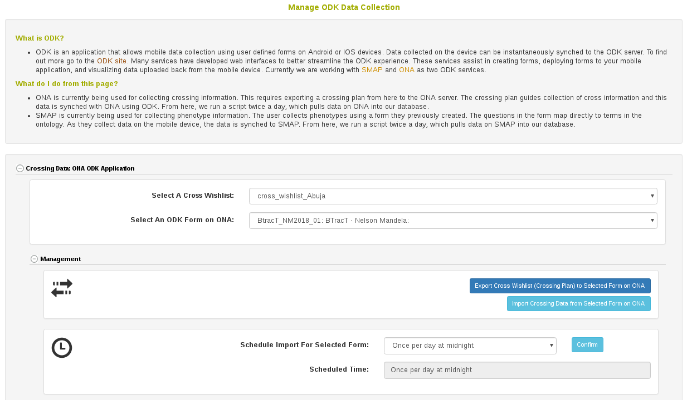
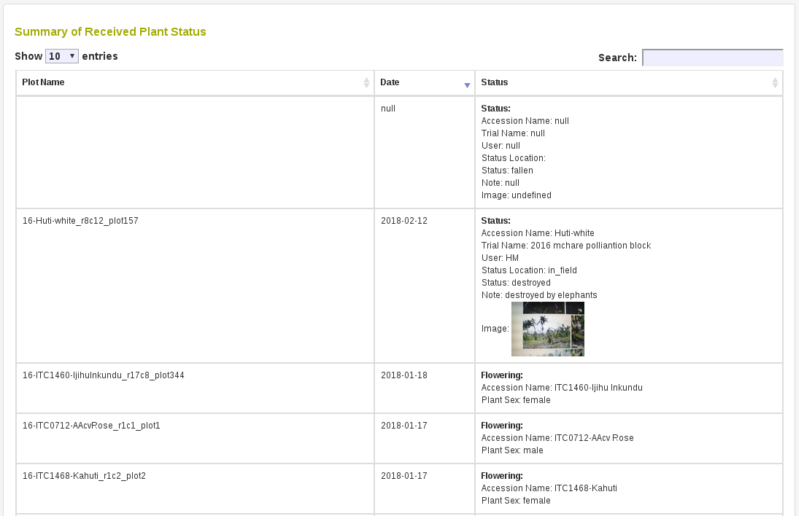
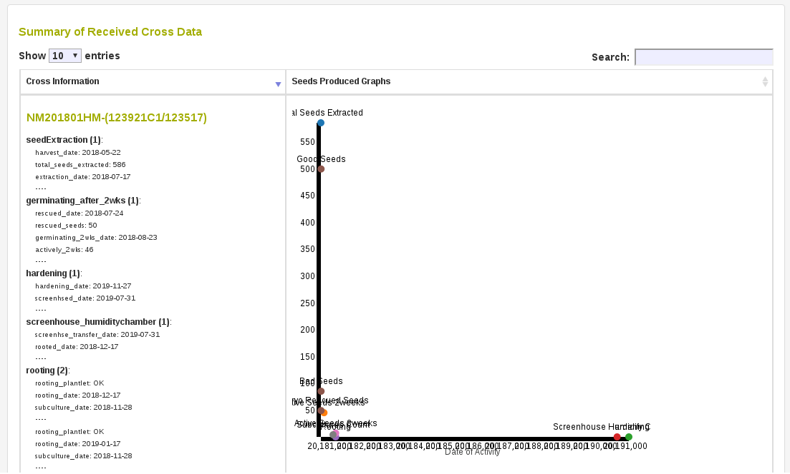
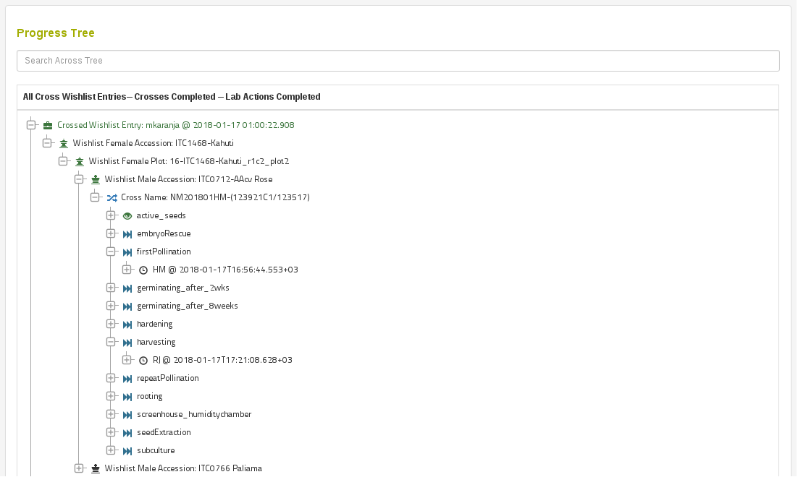

# Managing ODK Data Collection

To access this page go to Manage and then ODK Data Collection.
ODK is used for remotely collecting data on Android and IOS devices. We currently are working to support two ODK service providers, namely ONA and SMAP. We are using ONA to collect crossing information, including all lab activities following seed production. We are using SMAP for phenotypic data collection.

## ONA Crossing Information

### Managing ONA Crossing Information

```{r echo=FALSE, out.width='95%', fig.align='center'}

```

To begin collecting data using the ONA ODK form you must first have a crossing plan in the form of a Cross Wishlist. To do this from this page, click the "Export Cross Wishlist to ONA" button. Please refer to the "Create Cross Wihlist" help section for more information.
It is possible to view the current available cross wishlists by clicking the "Export Cross Wishlist to ONA" button and then clicking "Available Cross Wishlists".

Once your cross wishlist is available, you can use your mobile ODK application to record crosses being done realtime. You can also record all laboratory activities following seed extraction up to greenhouse plantlet hardening.

As you collect data using your mobile ODK application, your responses will be synchronized with our database. The "Schedule Import for Selected Form" section gives you options to perform the import daily or more frequently. It is also possible to initiate a data import from ONA at anytime by clicking "Import Crossing Data from Selected Form on ONA".

### Reviewing Plant Status

The mobile ODK application has options to collect information about the status of plants in the field, such as if they are flowering. Images for each plant can also be recorded.
The database will report this information here in a summary table that looks like the following. Notice that images are also transferred to the database.

```{r echo=FALSE, out.width='95%', fig.align='center'}

```

### Graphical Summary For Performed Crosses

There is a section to summarize activities done for each cross. In this table each row represents a single cross performed. All the activities that have been performed will be shown here, such as "first pollination" and "embryo rescue". The scatter plot shown tracks seed numbers generated on the Y axis and date of activity on the X axis.

```{r echo=FALSE, out.width='95%', fig.align='center'}

```

### Summary Information For Performed Crosses

There is a secondary section to summarize what has been done across the entire Cross Wishlist. This tree structure shows all activities performed for a cross and shows how these crosses relate to the Cross Wishlist.

```{r echo=FALSE, out.width='95%', fig.align='center'}

```
