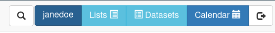
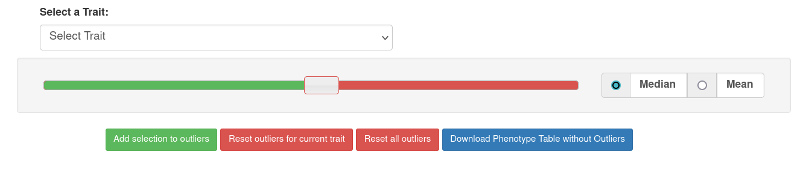
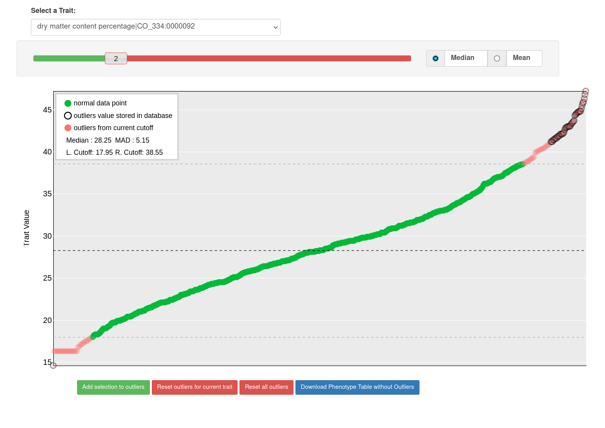
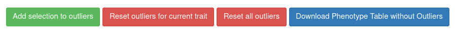

# Managing Outliers in Dataset

## What is Outliers Functionality in Dataset ?

```{r echo=FALSE, out.width='95%', fig.align='center'}

```

As in step [The Search Wizard]
we can create a dataset.

The dataset incorporates a feature to identify outlier points, which we may choose to exclude from a specific dataset. It's important to note that these exclusions only apply at the dataset level, and no data is permanently removed from the database. Additionally, outlier categorization can be modified at any time, and these changes are visible to all other functionalities within the system.  
  
Each dataset stores a wholly unique set of outlier points, completely independent of any other dataset in the database. Outliers are specifically designated for traits within datasets, exclusively encompassing phenotype data. If a particular dataset lacks traits as a part of wizard selection, this functionality is not available.  
  
Each trait has its own set of defined outliers.

## Accessing Trait Visualization

Once you've selected a specific trait, the web application provides access to a visualization of the data points associated with that trait.

```{r echo=FALSE, out.width='95%', fig.align='center'}

```

## Interpreting Visual Elements


Once you've selected a specific trait, the web application provides access to a visualization of the data points associated with that trait.  

- **Green Points**: As per the legend, represent values for the selected trait that fall below the cut-off point set by the slider. (non-outliers)
- **Black Outlined Points**: These data points are outlined with black borders, indicating that they are currently designated as outliers in the database.
- **Red Points**: The red data points denote the cut-off points established by the slider for the allowable deviation value.

```{r echo=FALSE, out.width='95%', fig.align='center'}

```

## Choosing Cut-Off Values

You have two fundamental options for setting cut-off points:

- **Median with MAD**: This option involves using the median (middle value) along with the Mean Absolute Deviation (MAD) as a reference point for determining cut-off values.
- **Mean with Standard Deviation**: Alternatively, you can choose to use the mean (average) in conjunction with the Standard Deviation to set cut-off points.

## Setting Deviation Multiplier

The slider allows you to specify the deviation multiplier from a central point, which influences the cut-off values.


## Utilizing Graph Controls

Beneath the graph, you'll find four buttons, each serving a distinct function:

- **Add selection to outliers**: This button enables you to save the current cut-off points to the database for future reference.
- **Reset outliers for current trait**: You can use this option to reset outliers for the selected trait.
- **Reset all outliers**: This button allows you to reset outliers for the entire dataset.
- **Download Phenotype Table without outliers**: You can download the phenotype data table in a comma-separated value format file, using this feature, with outliers excluded for selected dataset.

```{r echo=FALSE, out.width='95%', fig.align='center'}

```

These tools and functions are designed to provide you with control and insights when working with data visualization and outliers.