# Managing Datasets

## What is a Dataset?

Similar to Lists, Datasets can be used to save selected data in the database to your account to be reused later or shared with other users.  While Lists only contain items from a single data type (for example a selection of Accessions), Datasets contain selected items across multiple data types (for example a selection of Accessions, Locations, Phenotyping Trials, and Traits used in an analysis).  Datasets can be created to make selections in the Search Wizard reusable, used as inputs in some of the analysis tools, shared with other users by making them public, and exported to FigShare to make the data more easily accessible to external users.

## Managing Datasets

### Dataset Creation

Datasets are created from within the Search Wizard:

1. First, make your selection in the Search Wizard.  Select the data types you want saved in the dataset and the specific items to include for each data type.

2. Enter the name of the new Dataset and click the "Create" button to save the dataset.

```{r echo=FALSE, out.width='95%', fig.align='center'}
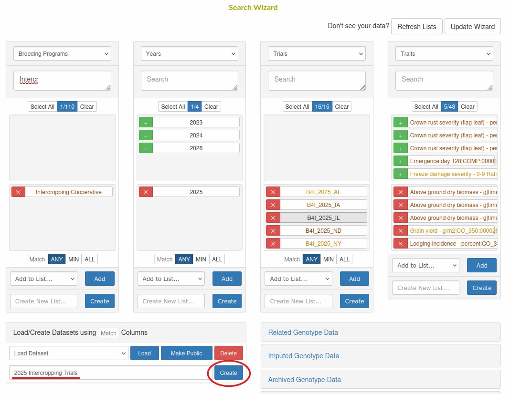
```

### Existing Datasets

To use a saved Dataset in the Search Wizard, select the Dataset name in the drop down menu below the Search Wizard columns and click the "Load" button.  This will set the Search Wizard column selections to all of the data types and items in the selected Dataset.

```{r echo=FALSE, out.width='95%', fig.align='center'}
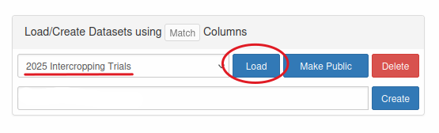
```

You can also view a table of all of your saved Datasets and any public Datasets from other users by clicking the Datasets button in the top right of the toolbar.

```{r echo=FALSE, out.width='95%', fig.align='center'}
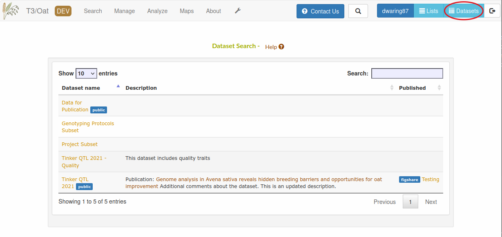
```

From this table, you can select an individual Dataset to modify its properties (description, visibility, etc), check for outliers, view the Dataset compatibility for analysis tools, run some analyses, and publish the Dataset to FigShare.

```{r echo=FALSE, out.width='95%', fig.align='center'}
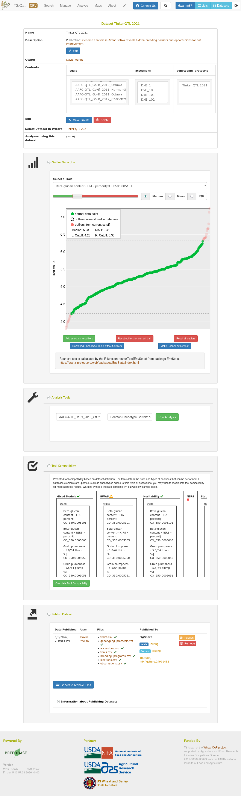
```

## Outlier Detection

```{r echo=FALSE, out.width='95%', fig.align='center'}
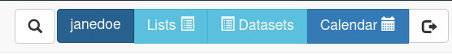
```

As in step [The Search Wizard]
we can create a dataset.

The dataset incorporates a feature to identify outlier points, which we may choose to exclude from a specific dataset. It's important to note that these exclusions only apply at the dataset level, and no data is permanently removed from the database. Additionally, outlier categorization can be modified at any time, and these changes are visible to all other functionalities within the system.  
  
Each dataset stores a wholly unique set of outlier points, completely independent of any other dataset in the database. Outliers are specifically designated for traits within datasets, exclusively encompassing phenotype data. If a particular dataset lacks traits as a part of wizard selection, this functionality is not available.  
  
Each trait has its own set of defined outliers.

### Accessing Trait Visualization

Once you've selected a specific trait, the web application provides access to a visualization of the data points associated with that trait.

```{r echo=FALSE, out.width='95%', fig.align='center'}
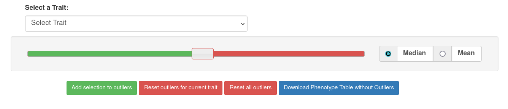
```

### Interpreting Visual Elements


Once you've selected a specific trait, the web application provides access to a visualization of the data points associated with that trait.  

- **Green Points**: As per the legend, represent values for the selected trait that fall below the cut-off point set by the slider. (non-outliers)
- **Black Outlined Points**: These data points are outlined with black borders, indicating that they are currently designated as outliers in the database.
- **Red Points**: The red data points denote the cut-off points established by the slider for the allowable deviation value.

```{r echo=FALSE, out.width='95%', fig.align='center'}
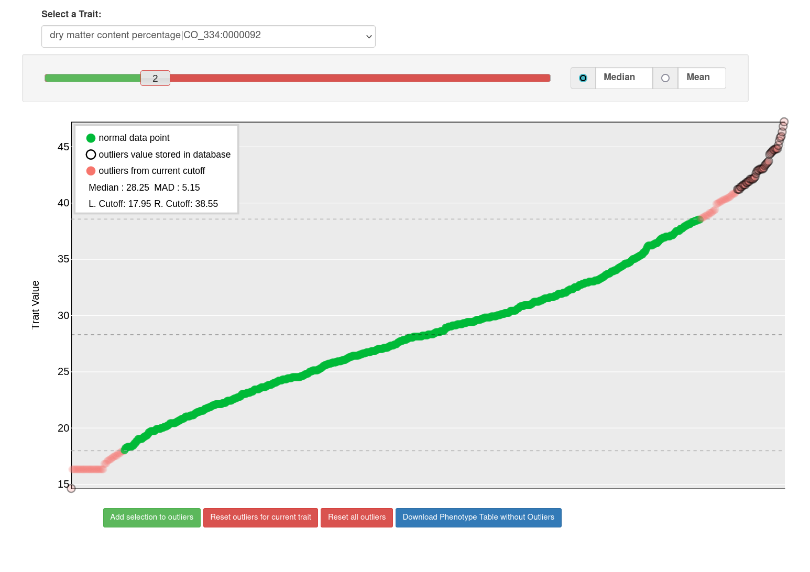
```

### Choosing Cut-Off Values

You have two fundamental options for setting cut-off points:

- **Median with MAD**: This option involves using the median (middle value) along with the Mean Absolute Deviation (MAD) as a reference point for determining cut-off values.
- **Mean with Standard Deviation**: Alternatively, you can choose to use the mean (average) in conjunction with the Standard Deviation to set cut-off points.

### Setting Deviation Multiplier

The slider allows you to specify the deviation multiplier from a central point, which influences the cut-off values.


### Utilizing Graph Controls

Beneath the graph, you'll find four buttons, each serving a distinct function:

- **Add selection to outliers**: This button enables you to save the current cut-off points to the database for future reference.
- **Reset outliers for current trait**: You can use this option to reset outliers for the selected trait.
- **Reset all outliers**: This button allows you to reset outliers for the entire dataset.
- **Download Phenotype Table without outliers**: You can download the phenotype data table in a comma-separated value format file, using this feature, with outliers excluded for selected dataset.

```{r echo=FALSE, out.width='95%', fig.align='center'}
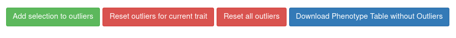
```

These tools and functions are designed to provide you with control and insights when working with data visualization and outliers.

## Publishing a Dataset

The owner of a Dataset can generate a static snapshot of the data within their Dataset at the point in time when the archive is created.  This creates plain-text files that are stored on the breedbase server and stay the same even if the underlying data in the database has changed.  When enabled on the database, the owner can also export that snapshot to an external service, such as FigShare, to make the data more easily accessible to external users.  In addition, a DOI (digital object identifier) can be generated to create a persistent link to the published data that can be used as a reference in a publication.

To publish a Dataset:

1. **Generate the archived files** - this creates a static snapshot of the data within the dataset at the time when the files are generated.  The data in this snapshot will stay the same even if the underlying data in the dataset is modified in the database.  The snapshot consists of plain-text files (.csv, .vcf, etc) for all of the data contained within the Dataset.  It also extrapolates to include relevant data types that are not explicitly defined by the Dataset.  For example, if you have phenotyping trials selected in the Dataset but do not explicitly include locations or traits, the archive will include location and trait information for all of the locations of the selected trials in the datasets and all of the traits observed by the trials in the datasets.  If you explicitly include traits in the dataset, then the archive will only include those defined traits.

```{r echo=FALSE, out.width='95%', fig.align='center'}
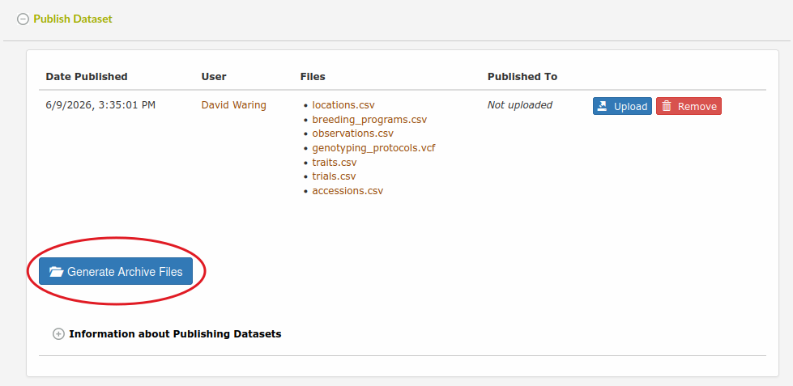
```

2. **Upload the files to an external service** - this will upload the archived files to the external service.  You will be given the option to upload the files to a new dataset or an existing dataset on the external service.

```{r echo=FALSE, out.width='95%', fig.align='center'}
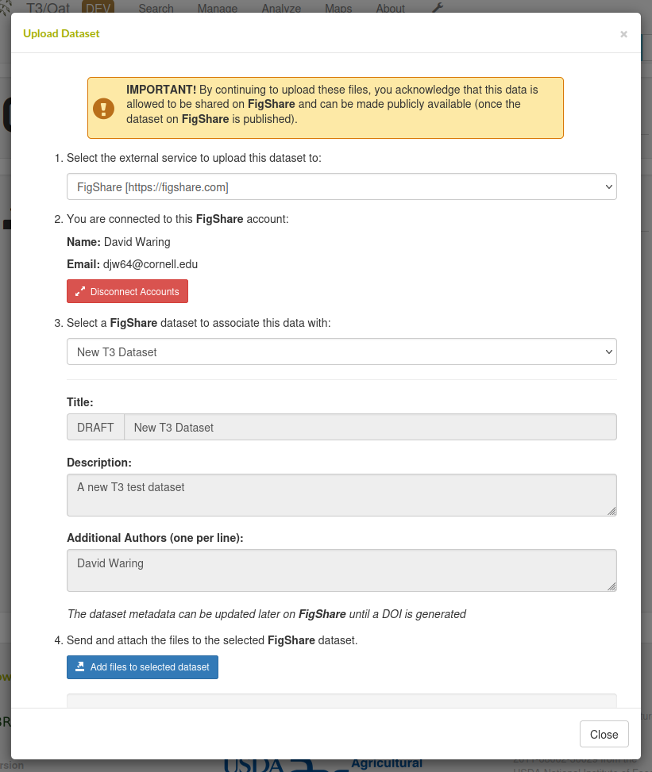
```

3. **Publish the external dataset** - once the files have been uploaded to an external dataset, you can make the external dataset publicly available for others to find. This will make the data available to anyone that has access to the external service - it does not change any visibility settings on breedbase. **The external dataset cannot be removed onced it is published**. 

```{r echo=FALSE, out.width='95%', fig.align='center'}
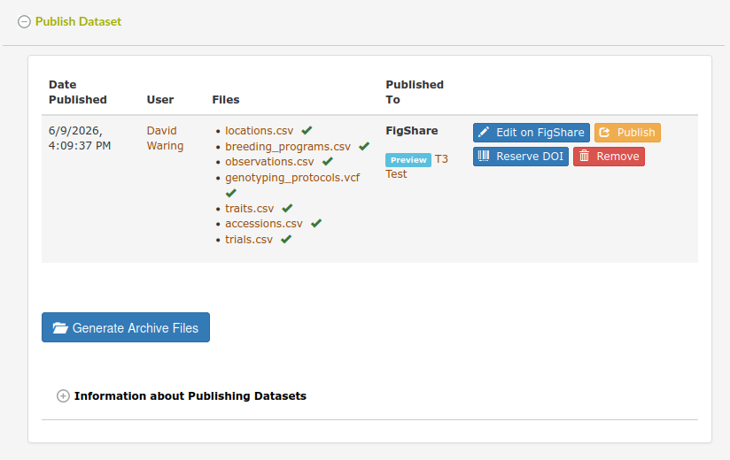
```

4. **Reserve a DOI** - generate a Digital Object Identifier (DOI) for the external dataset that can be used as a reference in publications. If the external dataset is still private, the DOI will become active once the external dataset is published and made public.

```{r echo=FALSE, out.width='95%', fig.align='center'}
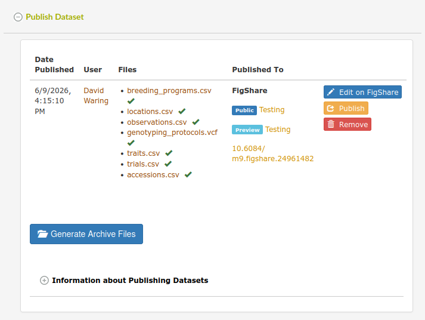
```

You can make additional changes to the external dataset's metadata and uploaded files _until the external dataset has been published_.  There are more detailed edit options on the website for the external service - click the Edit button to open the external service's edit webpage. Once the external dataset has been published, all new changes will be made to a new version of the external dataset, which will have to be published again to make the changes public.  Any previously published versions will be preserved and still accessible.  **The external dataset cannot be removed onced it is published**. 