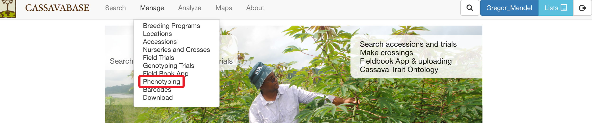
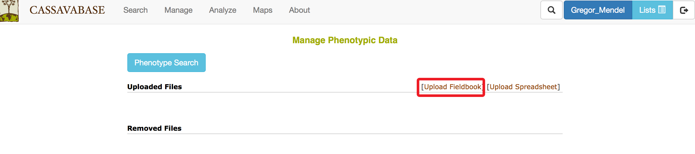
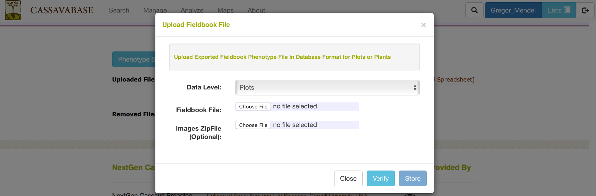
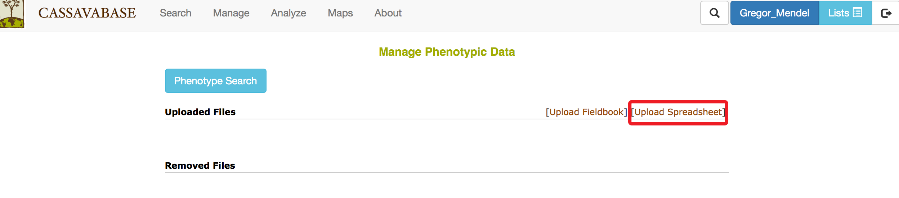
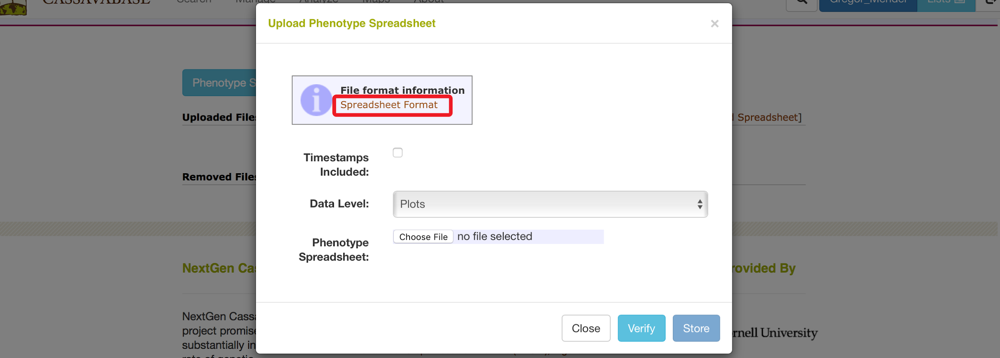
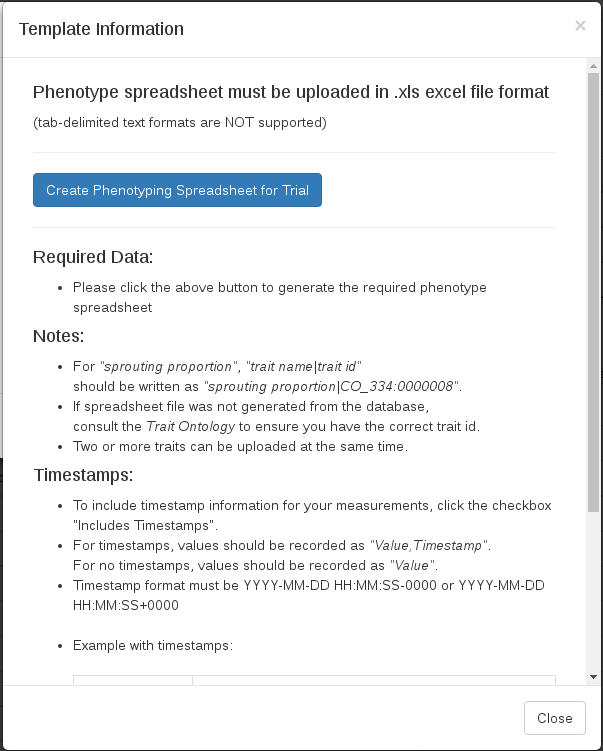
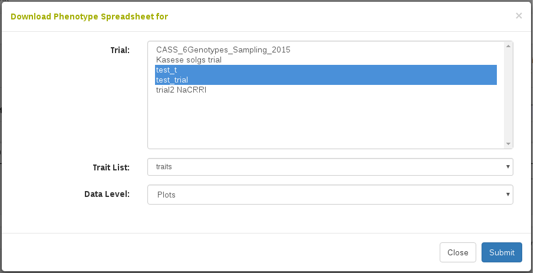
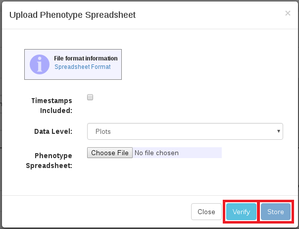

# Managing Phenotypic Data

To facilitate uploading process for phenotypic data, “Manage Phenotypic Data” page provides two options for uploading: Field Book Phenotype file in database format and phenotype file in Excel (.xls or .xlsx) file format. To access “Manage Phenotypic Data” page, clicking on “Phenotyping” in the “Manage” menu.

```{r echo=FALSE, out.width='95%', fig.align='center'}

```

## Uploading Fieldbook Phenotypes

### Export Field Book Database File

The database upload of Field Book phenotype data relies on the "Database" format from the Field Book. Please make sure to export the "Database" format from the Field Book if you intend to upload the data using the Field Book Upload we describe below. If you prefer to use the "Table" format that the Field Book exports, you can modify this format to work with the Speadsheet Upload we describe below.

### Upload Field Book Database File

To upload a Field Book Phenotype file in a database format, click the “Upload Fieldbook” link

```{r echo=FALSE, out.width='95%', fig.align='center'}

```

The “Upload Fieldbook” link on this page and “Upload” link on the “Field Book Tools” page open the same dialogue. Please follow instructions for uploading phenotypic files on the \@ref(using-fieldbook-app) page.

```{r echo=FALSE, out.width='95%', fig.align='center'}

```

## Uploading Spreadsheet Phenotypes

To upload a phenotype file in an Excel (.xls or .xlsx) file format, click the “Upload Spreadsheet” link.

```{r echo=FALSE, out.width='95%', fig.align='center'}

```

Please specify “Data Level” (Plots or Plants) and select the Excel file that you want to upload.

```{r echo=FALSE, out.width='95%', fig.align='center'}

```

### Generating Spreadsheet File

You can find more file format information by clicking on “Spreadsheet Format” link. Clicking on "Spreadsheet Format" will open the following dialog.

```{r echo=FALSE, out.width='75%', fig.align='center'}

```

Clicking on "Create Phenotyping Spreadsheet" will bring up a dialog where you can indicate the trial(s) you are interested in and the trait list you are interested in. Clicking "Submit" will download the xlsx file onto your computer, where you can then fill in the phenotypes.

```{r echo=FALSE, out.width='95%', fig.align='center'}

```

### Uploading Spreadsheet File

To ensure that the file has a correct format for uploading, click on the “Verify” button. This will check the contents of the file and also perform quality checks on the values in the file. These checks include checking the trait definition for categorical values, minimum and maximum values, and data type checking. It will also check if there are already values uploaded for the given observation units and traits. If there are, there is an option to overwrite the existing values with the new values in your file. If the file is valid, only then can you click "Store" to store the information in the database.

```{r echo=FALSE, out.width='75%', fig.align='center'}

```
