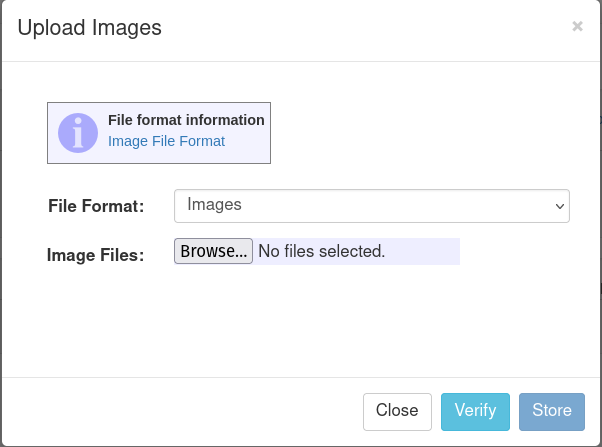
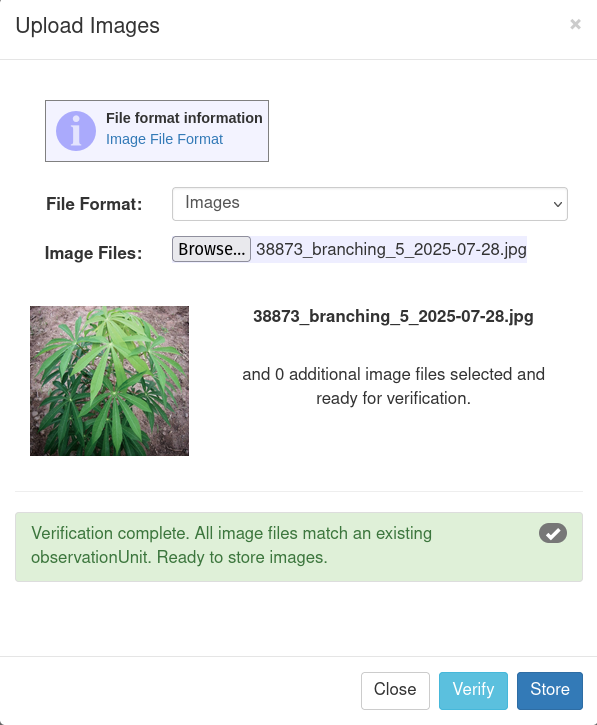
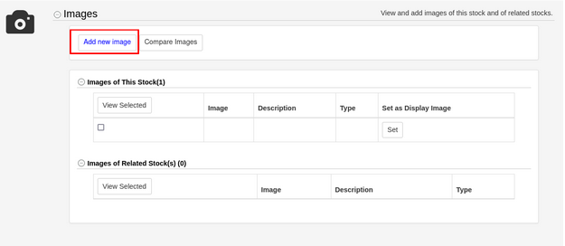

# Managing Phenotypic Image Data

## Uploading Image files

Clicking "Phenotyping" under Manage, and then "Upload Images" will open this dialog:

```{r echo=FALSE, out.width='95%', fig.align='center'}

```

If uploading images directly, select the file format "Images". A single image or multiple selected images can be uploaded using this file format. Each of these images must have been downloaded from the Fieldbook app, or have a filename that follows this structure: observationUnitName, traitname, number, timestamp joined by underscores. The filename can not include any underscores other than the ones separating each value. For example: 38873_branching_5_2025-07-28.jpg

If the images have been taken in the Fieldbook app, they will have EXIF data that includes their associated stocks and traits. This EXIF data will be automatically parsed and the associations will be made when the images are uploaded.

After selecting your images for upload, clicking verify will check if your filenames or image metadata is correct and corresponds to existing stocks in the database.

```{r echo=FALSE, out.width='95%', fig.align='center'}

```

If the verification is successful, click store to save these images in the database.

If uploading images with associated phenotypic data, select the file format "Images with Associated Phenotypes". A spreadsheet with the phenotypic values needs to be uploaded alongside a zipfile of images. The spreadsheet can be in .xls or .xlsx format, and the column headers need to be:

observationUnitName \| observationVariableName \| value \| timestamp \| image_name \| person

The image_name column should match the file names of the associated images in the zipfile.

## Uploading Images Directly to Stocks

In the Images section on a stock details page you can add a new image associated with that stock by clicking the "Add Image" button. This will associate any images uploaded through this dialog with the corresponding stock.

```{r echo=FALSE, out.width='95%', fig.align='center'}

```
