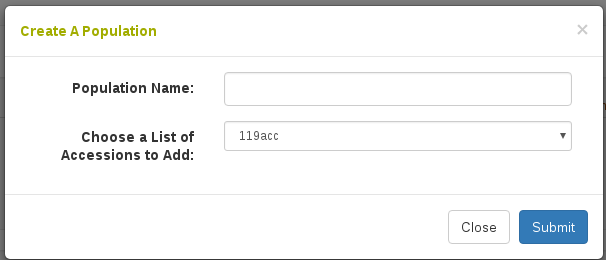

# Managing Populations

Populations are modeled as groups of accessions. This grouping can be useful in downstream analyses. To manage these populations go to Manage Accessions and scroll tp the bottom.

```{r echo=FALSE, out.width='95%', fig.align='center'}
knitr::include_graphics('assets/images/manage_populations.png')
```

To add a new population click "Create Population". The following dialog will appear where you choose a list of accessions and give a name to the new population. Please note it is also possible to create a population when you are uploading new accessions into the database.

```{r echo=FALSE, out.width='75%', fig.align='center'}

```

Click on the plus (+) button next to Populations to see all the available populations. Click on a population name to see the accessions in the population.

```{r echo=FALSE, out.width='95%', fig.align='center'}
knitr::include_graphics('assets/images/manage_populations_expand_table.png')
```

From here you can delete accessions from a population as well as add new accessions to the population.

```{r echo=FALSE, out.width='95%', fig.align='center'}
knitr::include_graphics('assets/images/manage_populations_table.png')
```
