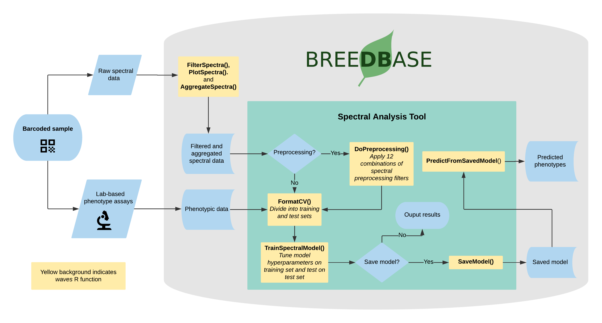

# Managing Spectral Data

Breedbase has implemented a flexible spectral data storage protocol that handles spectral data irrespective of the source spectrometer. Spectral data storage and analysis in Breedbase makes use of the R package *waves* for outlier identification, plotting, sample aggregation, and prediction model training.

```{r echo=FALSE, out.width='95%', fig.align='center'}

```

---
## Upload Spectral Data
Spectral data can be added as a CSV file that includes metadata in the leftmost columns followed by one column per spectral measurement to the right. Rows represent a single scan or sample, each with a unique ID that must match to a Breedbase observationUnitName. Future data transfer using [BrAPI](https://brapi.org) will allow for interoperability with data collection software.

To upload a spectral dataset, navigate to the 'Manage NIRS Data' page by selecting 'NIRS' in the 'Manage' menu and click the blue 'Upload NIRS' button. This will open an upload workflow. A link to the required file format and an example .csv file can be found by clicking in the light blue info box in this workflow. Another example of the file format is shown below.

* **id**: Optional identifier for each NIRS read. The id must be an integer.
* **sampling_id**: Optional identifier for each sample. Strings are allowed.
* **sampling_date**: Optional field. The format allowed is: YYYY-MM-DD.
* **observationunit_name**: Required field that matches existing data in the database. It can be the plot name, subplots, plant name, or tissue sample, depending how your trial is designed.
* **device_id**: Optional field to identify your device. Strings are allowed.
* **device_type**: Required field. It is possible upload data for a single device type. They can be: SCiO, QST, Foss6500, BunchiN500, or LinkSquare.
* **comments**: Optional field for general comments.
All other columns are required wavelengths. You can add how many columns you want upload -- there is no limit.

```{r echo=FALSE, out.width='95%', fig.align='center'}

```

```{r echo=FALSE, out.width='95%', fig.align='center'}

```

## Evaluate and Remove Outliers
Spectral calibration models can be heavily affected by the presence of outliers, whether they come from spectrometer spectral artifacts or user errors. Mahalanobis distance (Mahalanobis, 1936) is a measure of the distance between a single observation and a larger distribution and is commonly used in the identification of outliers in a multivariate space (Des Maesschalck et al, 2000). The *FilterSpectra()* function in the R package [*waves*](https://CRAN.R-project.org/package=waves) calculates the Mahalanobis distance of each observation in a given spectral matrix using the *stats::mahalanobis()* function. Observations are identified as outliers if the squared distance is greater than the 95th percentile of a $\chi$^2^-distribution with *p* degrees of freedom, where *p* is the number of columns (wavelengths) in the spectral matrix (Johnson and Wichern, 2007). In Breedbase, this procedure is applied on a per-dataset basis on upload and outliers are given binary tags "Outlier."

## Plot Spectra
After outlier identification, a plot is generated using the *PlotSpectra()* function in [*waves*](https://CRAN.R-project.org/package=waves). This function uses the filtered spectra and *ggplot2::ggplot()* to create a line plot with outliers highlighted by color. A list of rows identified as outliers are shown beneath the plot. Plots are saved as .png files and linked to the original input datasets. Plot image files can be downloaded via the "Download Plot" button in the upload workflow.

```{r echo=FALSE, out.width='95%', fig.align='center'}

```

## Aggregate Spectra
To obtain a stable and reliable spectral profile, most spectrometer manufacturers recommend that multiple spectral scans are captured for each sample. While some spectrometers aggregate these scans internally, many do not, requiring the user to do so before analysis can take place. Breedbase handles these cases upon data upload following filtering steps by calling the *AggregateSpectra()* function from [*waves*](https://CRAN.R-project.org/package=waves), saving the aggregated scans for future access through the search wizard feature. Scans are aggregated by sample mean (e.g. plot-level basis) according to the provided observationUnitName field. After aggregation, the user exits the upload workflow and the raw data file is saved in the upload archive.

## References
* De Maesschalck, R., Jouan-Rimbaud, D., and Massart, D. L. (2000). The Mahalanobis distance. Chemom. Intell. Lab. Syst. 50(1): 1-18.
* Johnson, R. A. \& Wichern, D. W. (2007). Applied Multivariate Statistical Analysis (6th Edition). p 773.
* Mahalanobis, P. C. (1936). On the generalized distance in statistics. National Institute of Science of India.

[**Analysis tool documentation**](#spectral-analysis)
