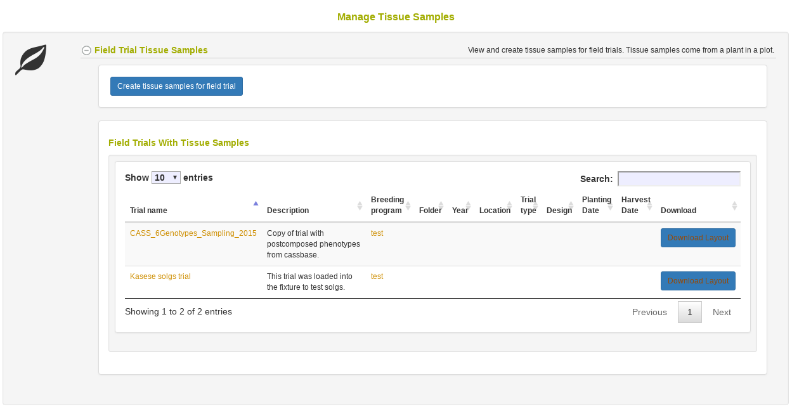
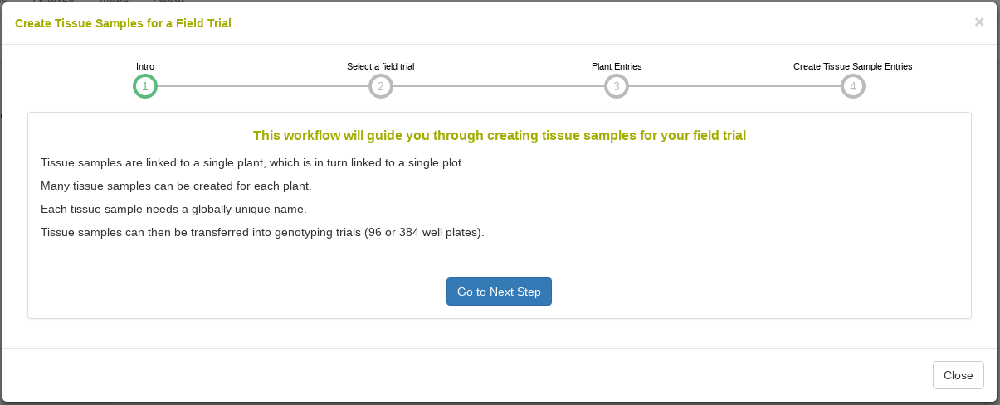
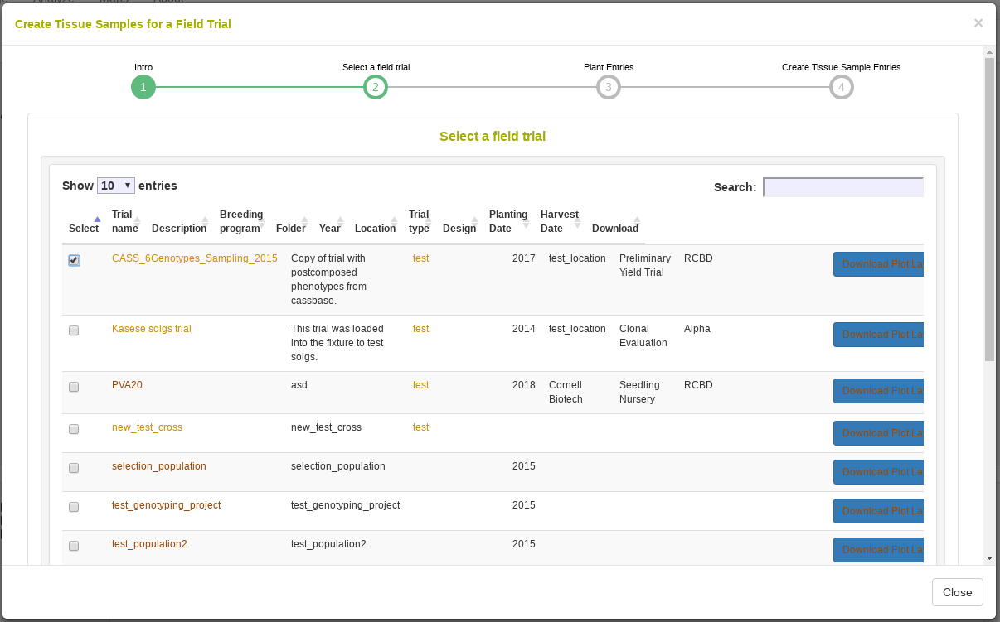
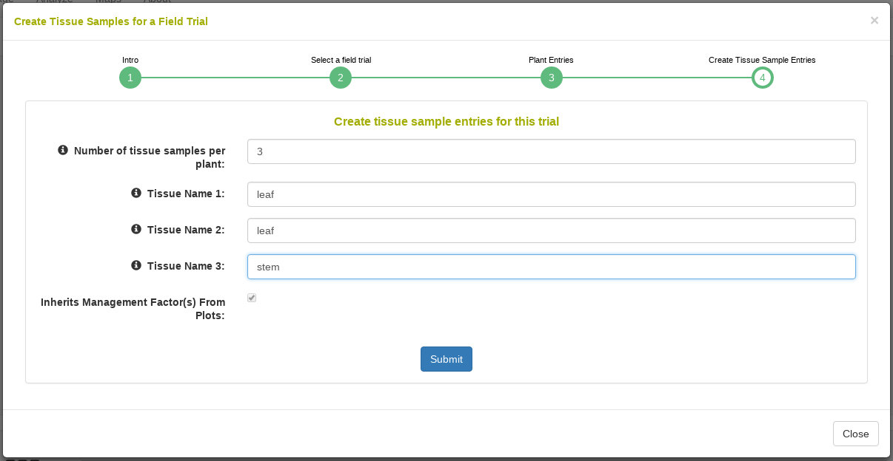
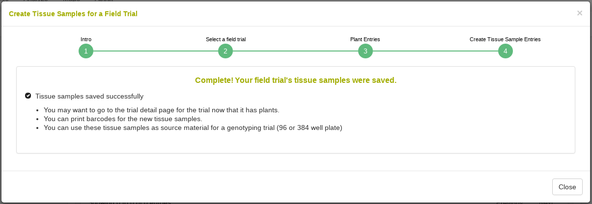
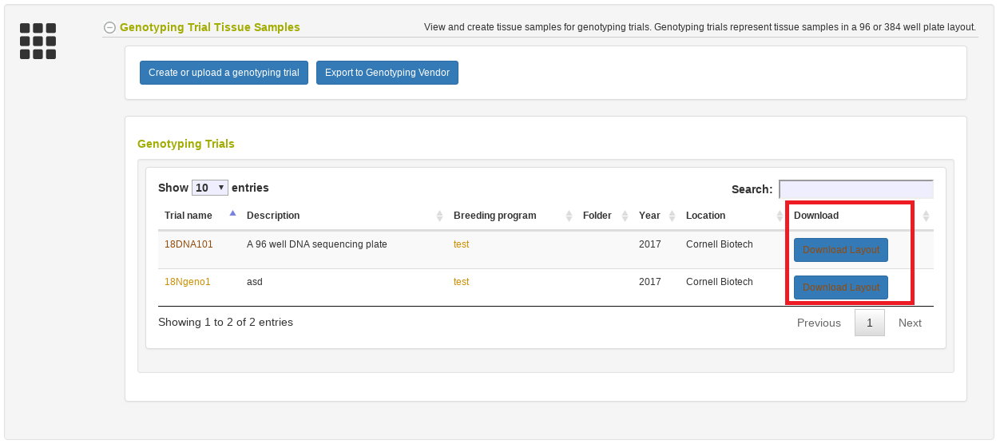
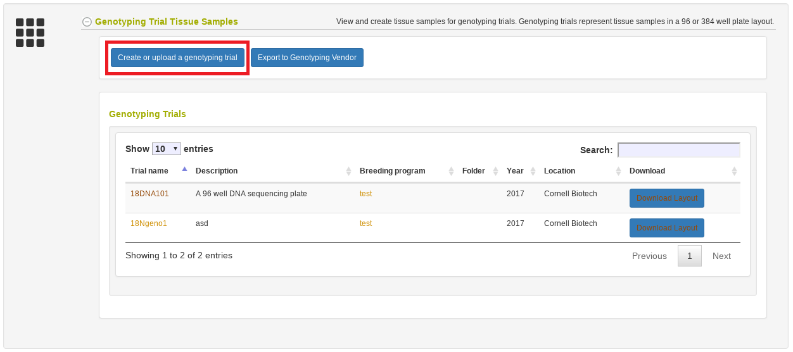

# Managing Tissue Samples

To access this page go to Manage and then Tissue Samples.

## Tissue samples from field trials

A field trial contains plots planted with a specific accession. Each plot can contain many plants, which in turn can contain many tissue samples.
On the manage tissue sample page we can see the field trials that contain tissue samples already. We can choose to download the tissue sample layout as seen in the below picture.

```{r echo=FALSE, out.width='95%', fig.align='center'}
knitr::include_graphics('assets/images/manage_tissue_samples_create_tissues_field_trial_download.png')
```

If the field trial you want to collect tissue samples from is not in the above table, you can click the button highlighted below.

```{r echo=FALSE, out.width='95%', fig.align='center'}

```

Once you have clicked this button, you will enter a workflow that begins with the following introduction.

```{r echo=FALSE, out.width='95%', fig.align='center'}

```

Once you click next, you will need to select your trial.

```{r echo=FALSE, out.width='95%', fig.align='center'}

```

Next, if your trial currently only has plot entries saved, you will be asked to enter how many plants are in each plot.

```{r echo=FALSE, out.width='95%', fig.align='center'}
knitr::include_graphics('assets/images/manage_tissue_samples_create_tissues_field_trial_num_plants.png')
```

Finally you will be asked how many tissue samples you want for each plant. You can specify a string to include in the tissue sample name, such as leaf or root.

```{r echo=FALSE, out.width='95%', fig.align='center'}

```

Afterwards you should see the following success message, indicating that the tissue samples are saved.

```{r echo=FALSE, out.width='95%', fig.align='center'}

```

## Genotyping Plate Tissue Samples (96 or 384 well plates)

A genotyping plate represents a 96 or 384 well plate. You can use the Coordinate Android application to create your plate layout, or you can upload your own Excel plate layout, or you can use the database to generate a plate layout.
Ideally, you will use tissue sample names originating from a field trial as the "source" for each well tissue sample, but you can also use plant names, plot names, or accession names.

From the manage tissue samples page, you can see the genotyping plates saved in the database. You can also download the layouts as shown below.

```{r echo=FALSE, out.width='95%', fig.align='center'}

```

If you need to create a new genotyping plate, you can click the button shown below. This will guide you through a workflow for uploading or creating the new plate layout.

```{r echo=FALSE, out.width='95%', fig.align='center'}

```

Genotyping vendors require you to send a plate layout during submission. You can download the plate layout as shown above, or you can go to a genotyping plate detail page to download the Intertek formatted file.

In the future you will be able to directly export your genotyping plate plate layout to vendors.
