# Managing VCF Data

## Uploading VCF Data

Genotyping data in VCF can be loaded from the web-interface. Breedbase can store any genotypic variants from a VCF, allowing for polyploids, structural variants, etc. without problems.

To begin go to Manage->Genotyping Plates and click the button seen below:
Note that you do not need to have genotyping plates uploaded to upload VCF data; you may upload genotyping data to accessions or you can upload genotyping data for tissue samples in genotyping plates.

```{r echo=FALSE, out.width='95%', fig.align='center'}
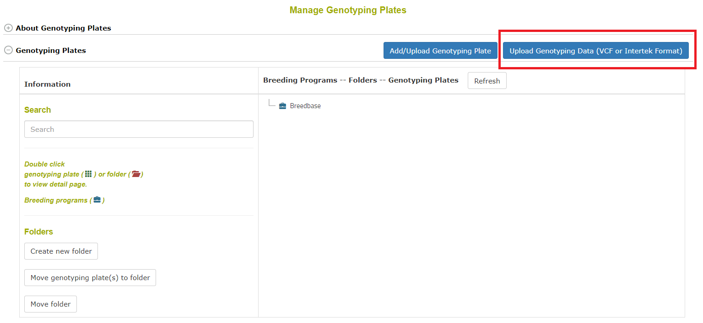
```

The workflow begins with an intro:

```{r echo=FALSE, out.width='95%', fig.align='center'}
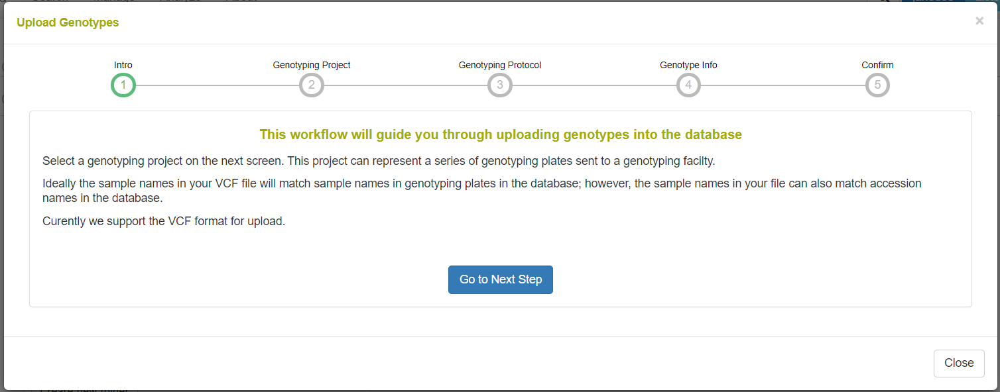
```

On the following step in the workflow, a genotyping project is defined or selected. A genotyping project is a high-level entity for grouping several genotyping events. It is defined with a name, description, name, breeding program, and genotyping facility (IGD, Intertek, etc.).

```{r echo=FALSE, out.width='95%', fig.align='center'}
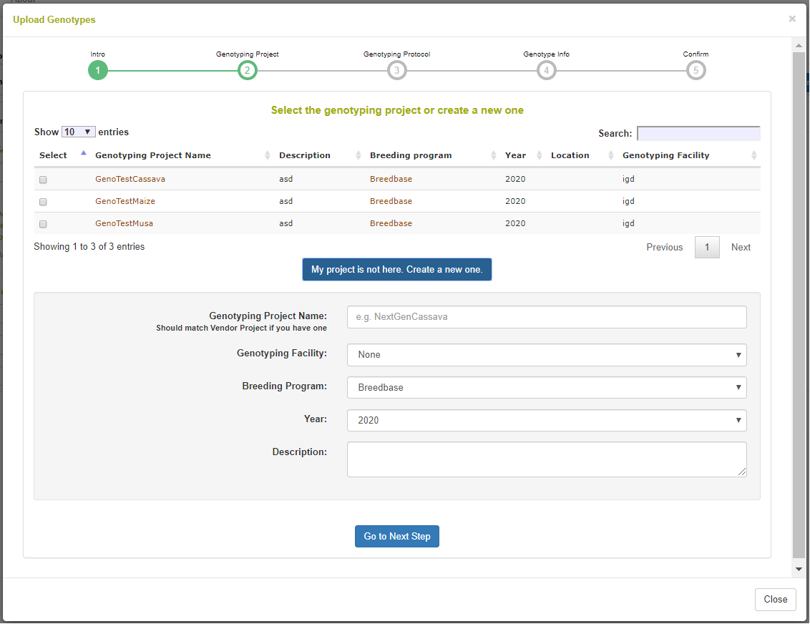
```

The following step is to define or select a genotyping protocol. A genotyping protocol represents the set of markers being called against a specific reference genome. A genotyping protocol is defined with a name, description, reference genome name, species name, and a location of data generation. Note in the picture that you can select whether the samples in your file are accessions or tissue samples in the database; tissue samples are for when a genotyping plate is stored in the database. There is an option to parse the sample names for appended sequencing numbers from IGD, where the sample names are like "accession:igdnumber".

```{r echo=FALSE, out.width='95%', fig.align='center'}
knitr::include_graphics('assets/images/manage_genotyping_data_upload_dialog_protocol.png')
```

The final step is to select the VCF from your computer and upload it. The web interface can be used to upload files arbitrarily large; it is a NGINX configuration to set this size.

```{r echo=FALSE, out.width='95%', fig.align='center'}
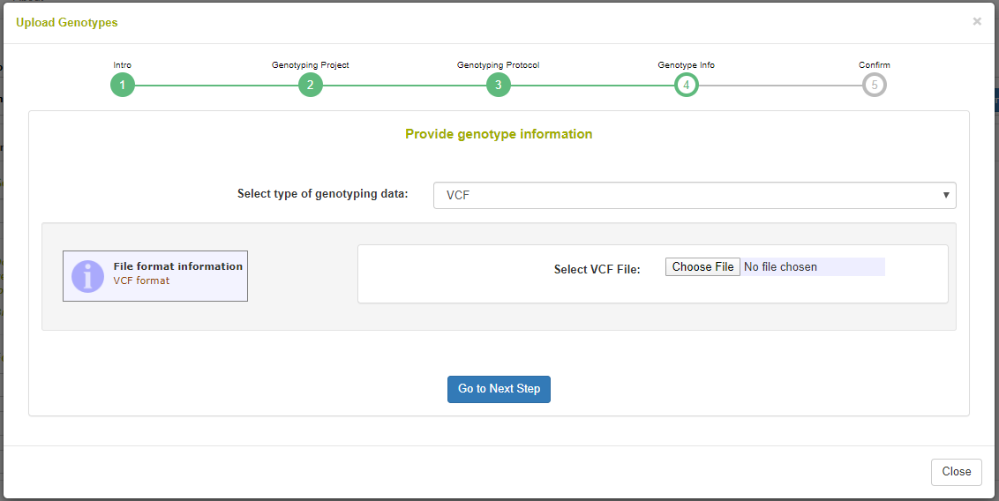
```

## Searching and Downloading VCF Data

The Search Wizard is the primary means of querying data in the database. Go to Search->Wizard to begin.

Once genotyping protocols are stored, select Genotyping Protocols from the first dropdown menu. Then if you select one or more and select Accessions from the second dropdown menu, you will see the accessions for which genotypes were stored. As seen in the following picture, there is a section for filtering genotypes by chromosome, start position, and end position. Genotypes can be downloaded in VCF or DosageMatrix formats.

```{r echo=FALSE, out.width='95%', fig.align='center'}
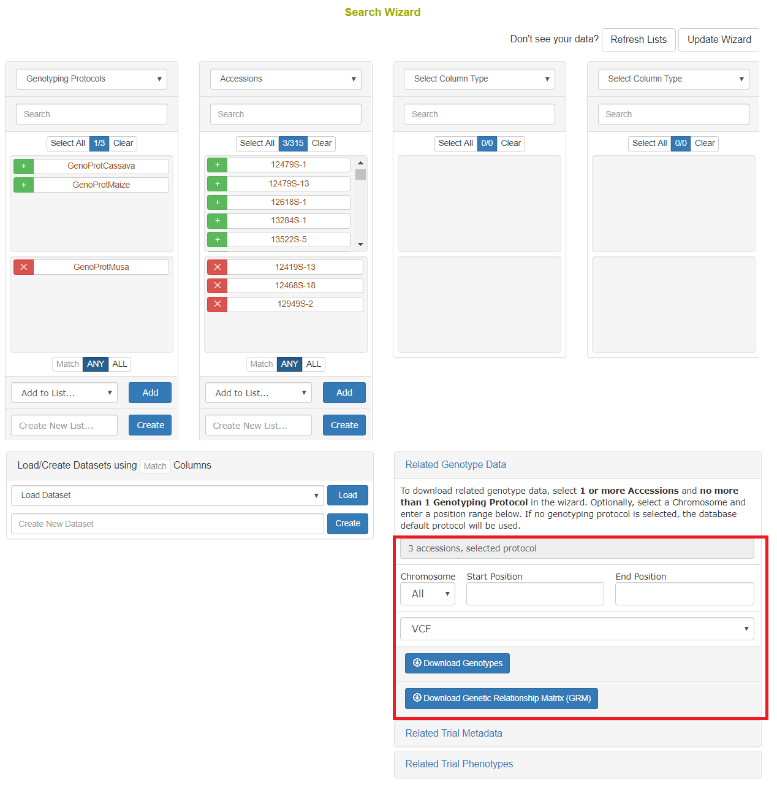
```

Using the "Default genotyping protocol" which is configured in a system, you can query over field phenotypic evaluations before downloading genotypes and phenotypes.

```{r echo=FALSE, out.width='95%', fig.align='center'}
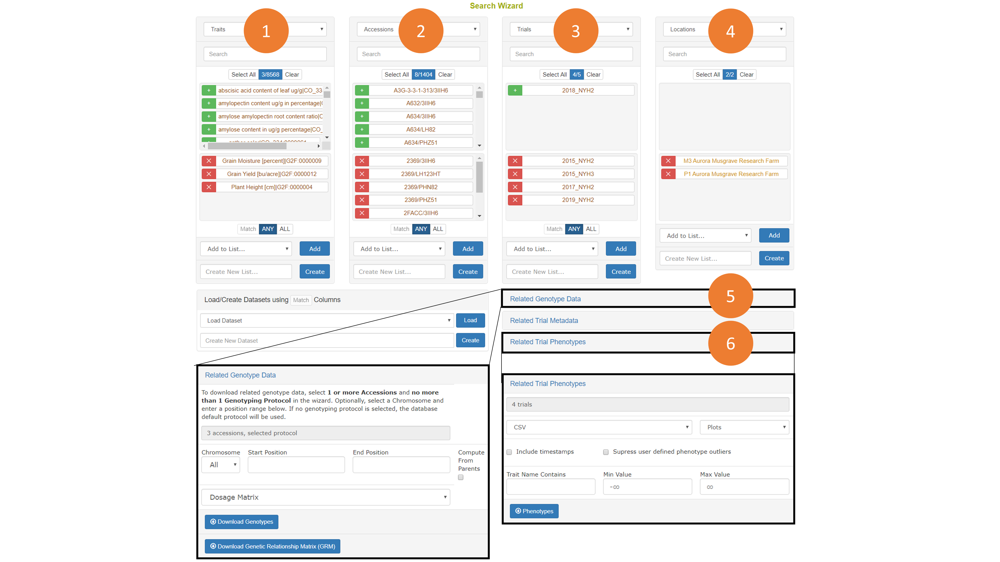
```

## Searching Protocols

Genotyping protocols can be search by going to Search->Genotyping Protocols. To download genotypes accessions must be selected, though any combination of search criteria can be used to filter and select those accessions. If a genotyping protocol is not selected, then the default genotyping protocol set in the configuration will be used. Genotyping protocols can also be selected in the wizard.

```{r echo=FALSE, out.width='95%', fig.align='center'}
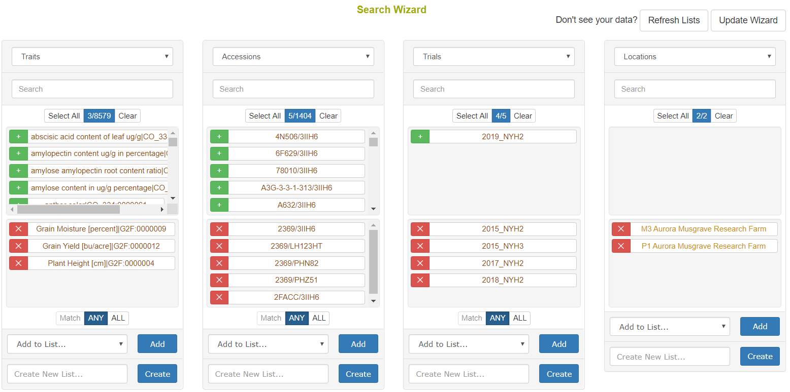
```

The genotyping download menu on the Search Wizard presents options for filtering by chromosome, start position, and end position. Genotypes can be downloaded in VCF of Dosage Matrix formats. The genomic relationship matrix (GRM) can be downloaded for the selected accessions in a tab-delimited matrix format or in a three-column format that is useful in Asreml. Genotypes can be computed from the parents in the pedigree if those parents are genotyped by clicking on the "compute from parents" checkbox. Additionally, the GRM can be computed using genotypes of parents in the pedigree if the "compute from parents" checkbox is selected.

```{r echo=FALSE, out.width='75%', fig.align='center'}
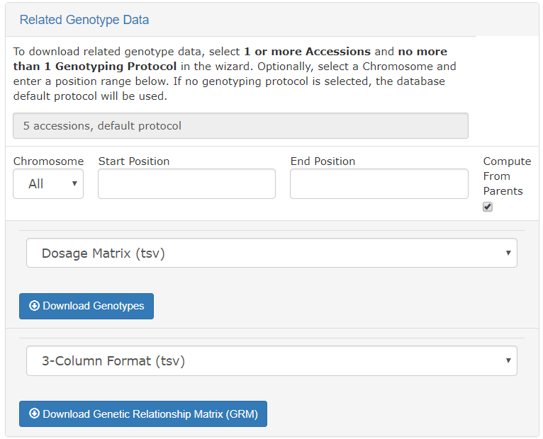
```

As is described elsewhere, the Search Wizard presents a way to filter phenotypic values by minimum and maximum values, and allow for download in CSV and Excel formats.

```{r echo=FALSE, out.width='75%', fig.align='center'}
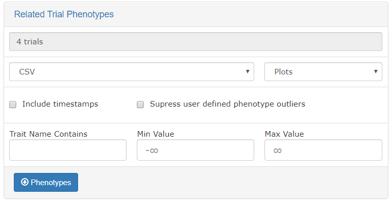
```


## Detail Pages and Deletion

The genotyping protocol detail page will show all information about the protocol such as the reference genome used, the header information lines in the uploaded VCF file, the markers involved, and the samples genotyped.

The markers section will show all markers used and their annotations, such as position, chromosome, alternate allele, reference allele, marker format, etc.

```{r echo=FALSE, out.width='95%', fig.align='center'}
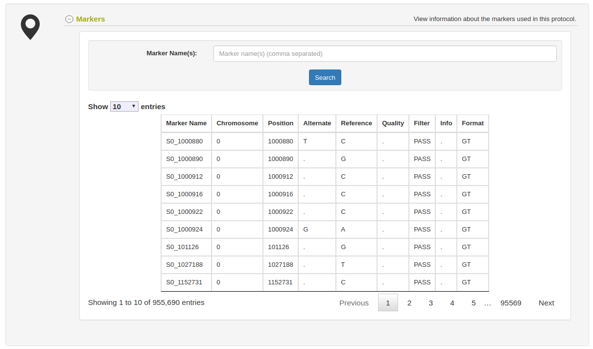
```

The samples section will show all samples genotyped. Notice the Download links in the table which can be used to easily get the VCF file results for each genotyped samples with all markers in the genotyping protocol. For getting mulitple samples at once, use the Search Wizard as discussed above.

```{r echo=FALSE, out.width='95%', fig.align='center'}
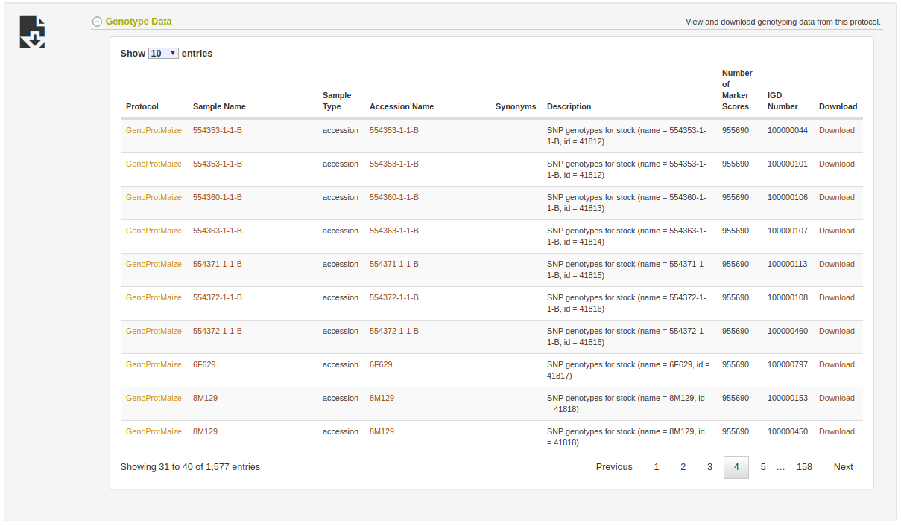
```

The genotyping protocol and all associated genotyping data can be deleted from the genotyping protocol page.

```{r echo=FALSE, out.width='95%', fig.align='center'}
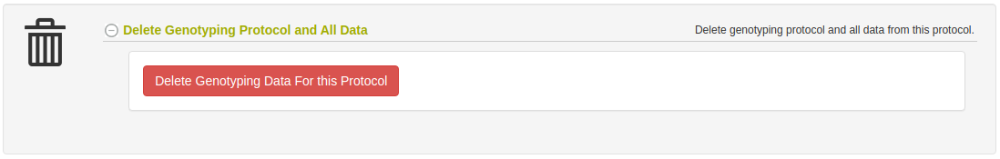
```
