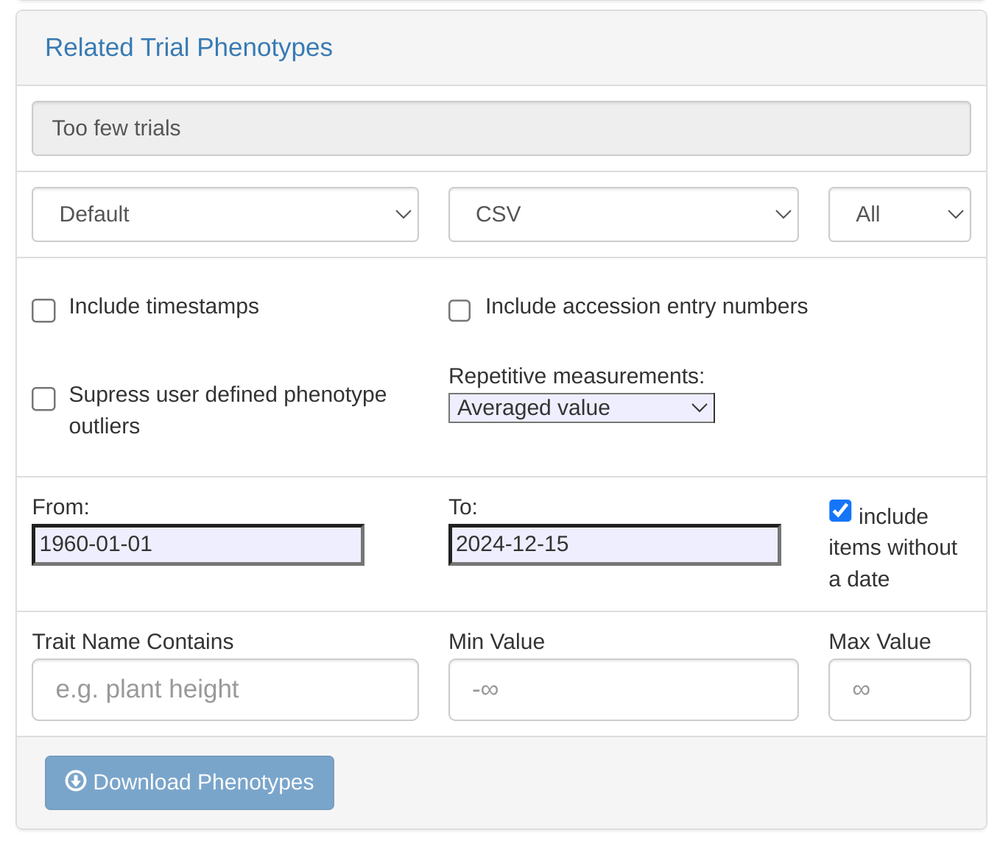
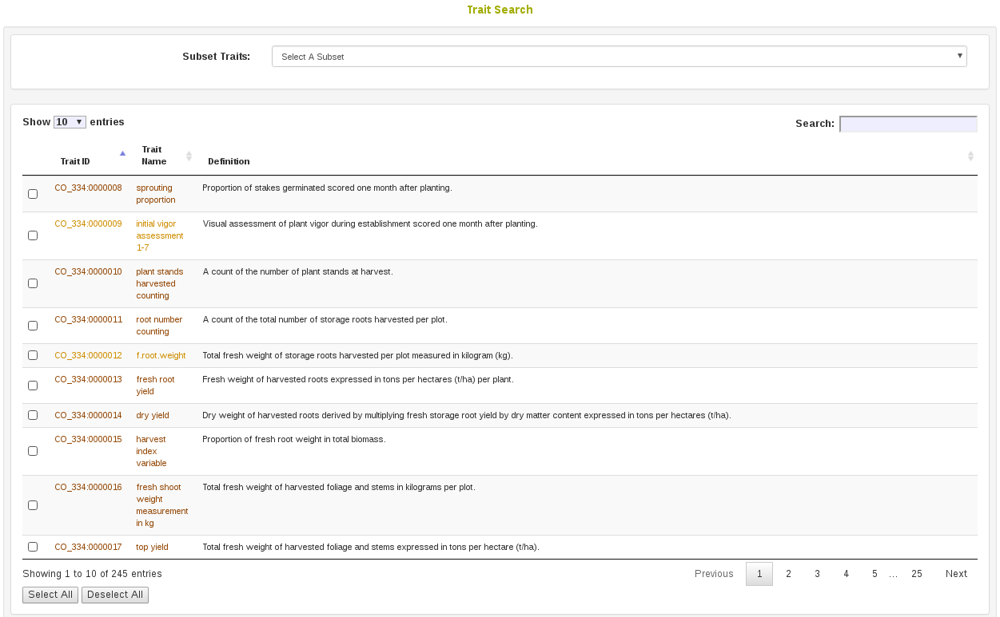

# Searching the Database

You can search for information on the database by using the following search options: Wizard, which uses combined criteria specified by users; Accessions and Plots; Trials; Markers; Images; People; FAQ.

```{r echo=FALSE, out.width='95%', fig.align='center'}
knitr::include_graphics('assets/images/image267.png')
```

## The Search Wizard {#search-wizard}

```{r echo=FALSE, out.width='95%', fig.align='center'}

```

### How the Search Wizard Works

The search wizard presents a number of select boxes, which are initially empty. You start searching by picking a category of data from the dropdown above the left-most select box.

Once a category has been picked, the database will retrieve all the options within this category and display them within the first select box. You then select one or more options from the first select box, which activates the second dropdown.

You can then select a category from the second dropdown, and repeat this same search process through all four dropdowns and select boxes.

```{r echo=FALSE, out.width='95%', fig.align='center'}

```

-   In the example above, the "locations" category was chosen in the first dropdown. The first select box then displayed all the possible locations in the database. The option Ibadan was selected.

-   This activated the second dropdown. The category “years” was chosen in the second dropdown. The second select box then displayed all the years that are linked in the database to the location Ibadan. From that list, the options 2011 and 2012 were selected.

-   This activated the third dropdown. A final category, “accessions”, was chosen in the third dropdown. The third select box was then populated with the 3847 accessions in the database that are linked with the location Ibadan in the years 2011 or 2012.

In addition to the basic search operations demonstrated above, users can take advantage of two more features:

**Load Selection from List**

```{r echo=FALSE, out.width='25%', fig.align='center'}

```

-   Instead of picking a category in the first dropdown, users can instead populate the first selectbox from a list by scrolling down in the first dropdown to the "Load Selection from List" subheading and selecting a list. This is useful for starting queries with a list of plots, as this category is not among the options in the first dropdown.

**ANY/MIN/ALL** Toggle

```{r echo=FALSE, out.width='25%', fig.align='center'}

```

-   By default, the search wizard combines options within a category using an OR query. In the example above, in the third panel the wizard retrieved accessions associated with the location 'Ibadan' in **ANY** of the years "2011 **OR** 2012"

-   If the user clicked the toggle below the second select box to change it to **ALL** before choosing accessions in the third dropdown, the wizard would instead retrieve accessions associated with the location 'Ibadan' in the years "2011 **AND** 2012". This will be a smaller set of accessions, because any accessions used only in 2011, or only in 2012 will be excluded.

-   A more advanced search could use the **MIN** toggle option.  This allows the user to make a query in between an ANY or ALL query, where a minimum number of matches from the selected column will be used as a filter for the next column.  The minimum can be provided as either a percentage (%) or an actual count of items (#).  In the example above, if the years 2011, 2012, and 2013 were selected in the second column, the user could enter '2' in as the minimum and select '#' as the minimum match type.  This would select accessions in the third column that were used in 2 or more of the selected years.<br />

```{r echo=FALSE, out.width='25%', fig.align='center'}

```

### How to use retrieved data 

#### Getting more Info {-}

Any option in the wizard select boxes (except for years) can be clicked to open a page with more details. The new page is opened in a new tab.

#### Saving to a list {-}

You can store the highlighted items in any selected box to lists. This is done using the inputs and buttons directly below the select box. **Don’t forget, you must be logged in to work with lists!**

```{r echo=FALSE, out.width='50%', fig.align='center'}
knitr::include_graphics('assets/images/add_create_list.png')
```

-   To **add items to an existing list**, first pick an existing list using the "Add to List..." dropdown on the left. Then click the "Add" button. A popup window will confirm the action, and display the number of items added to your existing list.

-   To **store items to a new list**, first type a new list name in the "Create New List..." text input on the left. Then click on the "Create" button. A popup window will confirm the action, and display the number of items added to your new list.

#### Downloading Data {-}

You can download trial metadata, phenotypes and genotypes associated with the highlighted items in the wizard select boxes. This is done using the buttons in the download section at the bottom of the page. **Don’t forget, you must be logged in to download data!**

```{r echo=FALSE, out.width='75%', fig.align='center'}

```

##### Metadata {-}

Trial metadata can be downloaded by selecting a subset of trials from the database or based on your search categories.  To download, click on "Related Trial Metadata", a dialog will appear. Select download format and click the "Metadata" button to complete your download. 

```{r echo=FALSE, out.width='75%', fig.align='center'}

```

##### Phenotypes {-}

The phenotypes download is quite flexible, and can download a subset of all the trial data in the database based on whichever categories and options you currently have selected. Simply click on the “Related Trial Phenotypes” link, review the options, changing or adding any additional parameters you like, then click ‘Download Phenotypes’.

```{r echo=FALSE, out.width='75%', fig.align='center'}

```

##### Genotypes {-}

The genotype download is more stringent. It requires a minimum of one accession and one genotyping protocol to be selected in the wizard select boxes. The text box in the download section of the page will help track what has been selected. Once clicked, the “Download Genotypes” button will download a genotype file for the selected accessions.

#### Saving the wizard selections {-}

As discussed above, the selections of the individual select boxes in the wizard can be saved separately to a list. The lists can be used as inputs in other tools on the site. However, sometimes creating a selection is quite time consuming and restoring the selections from four different lists would be cumbersome too. Therefore, the selections can be saved together in a dataset, and named for later retrieval. This is done in the section "Load/Create Datasets" that is below the first two wizard select boxes. To select an existing dataset, one uses the "Load Dataset" dropdown. A particular dataset can be chosen, and the "Load" button can be clicked to retrieve and display the dataset in the wizard. To create a new dataset using items that are selected in the wizard, one can enter the name of the new dataset in the "Create New Dataset" text box. Once the dataset has been given a name, clicking the "Create" button will save the new dataset.

```{r echo=FALSE, out.width='75%', fig.align='center'}

```

### Updating the Wizard

The search wizard uses a copy of the database, or a cache, to return results quickly. If data appears to be missing, it usually means that the cache needs to be updated. Users with submitter privileges or above can do this using the ‘Update Wizard’ button. One can also use the ‘Refresh Lists’ button to update the available lists.

```{r echo=FALSE, out.width='75%', fig.align='center'}
knitr::include_graphics('assets/images/wizard_update_list_refresh.png')
```

This will take just a few seconds in small databases, but may take a few hours to complete in larger databases.

## Accessions and Plot Search

Accessions and their related materials (cross, plant, plot, population, tissue\_sample, training population) can be searched by using “Search Accessions and Plots” page. On this page, “accession” is the default stock type; however, you can change stock type by selecting an option from the drop-down list.
From this page you can construct detailed queries for stock types. For example, by using the "Usage" section, the "Properties" section, and the "Phenotypes" section you could search for accessions which were diploids used in a specific year and location and were also phenotyped for height. You can also search for accessions based on genetic properties, such as the location of an introgression on a specific chromosome.

```{r echo=FALSE, out.width='95%', fig.align='center'}

```

It is possible to query over any of the available properties, such as "ploidy_level", "country of origin", "introgression_chromosome", etc.

```{r echo=FALSE, out.width='95%', fig.align='center'}

```

In the search result table it is possible to select any of the available properties to view.

```{r echo=FALSE, out.width='95%', fig.align='center'}

```

At the bottom of the accession search there is a phenotype graphical filtering tool. Here you can filter down accessions based on combinations of trait performance. The filtered down accessions are then able to be saved to a list.

```{r echo=FALSE, out.width='95%', fig.align='center'}

```

For information on adding Accessions please see the Managing Accessions help.
For information on how field trial plots, plants, tissue samples, and subplots are added to the database, please see the Managing Field Trials help.

## Trials Search

Trials on the database can be searched based on trial name, description, breeding program, year, location, trial type, design, planting date, and harvest date.

```{r echo=FALSE, out.width='95%', fig.align='center'}

```

## Trait Search

On the Trait Search page (menu item `Search > Traits`), traits in the database can be searched by ID, name, or descripiton. Optionally, a starting list of traits can be selected to filter down results.

```{r echo=FALSE, out.width='95%', fig.align='center'}

```

Selecting traits in the results of the search allows one to add the selected results to a trait list, or create a new trait list from the select results.

```{r echo=FALSE, out.width='95%', fig.align='center'}

```

## Ontology Browser

A more advanced tool for searching for Traits is the ontology browser, available by clicking on Analyze and Ontology Browser. From here you can search ontologies and see the various classifications of terms in a tree display.

```{r echo=FALSE, out.width='95%', fig.align='center'}

```

The terms which appear in the Trait Search in 2.4 are only variable terms. The ontology browser shows these variables as different from their grouping terms by indicating VARIABLE_OF like in the following screenshot.

```{r echo=FALSE, out.width='95%', fig.align='center'}

```

## Search Seedlots

Seedlots are different from Accessions in that they represent the physical seed being evaluated in an experiment. Seedlots have things like physical storage locations and seed quantities, which accessions do not. To search for available seedlots you go to Manage and then click Seed Lots. By clicking Search Seedlots, you can specify query information. The results from your search will be in the table below the search form.

```{r echo=FALSE, out.width='95%', fig.align='center'}

```

```{r echo=FALSE, out.width='95%', fig.align='center'}
knitr::include_graphics('assets/images/manage_seedlots.png')
```

