# Using Field Book App {#using-fieldbook-app}

```{r echo=FALSE, out.width='95%', fig.align='center'}
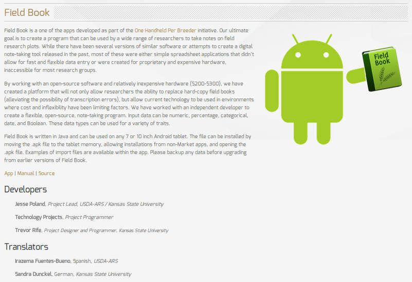
```

SGN databases support the Android Field Book App for collecting phenotypic data in the field with tablet computers. The app is available here:

[*https://play.google.com/store/apps/details?id=com.fieldbook.tracker*](https://play.google.com/store/apps/details?id=com.fieldbook.tracker)

-   The app can also be downloaded directly from the Google Play store. There is no charge for the app.

-   Field Book App requires two files for collecting data: Field layout file and trait file.

-   SGN databases can generate the field layout file and trait file, which can be downloaded onto your computer, then transferred to an Android tablet device.

## A typical workflow

1. Creating a [*field layout file*](#creating-layout-files) based on the design of field trial

2. Creating a [*trait file*](#creating-trait-files) from the list of traits

3. Downloading the field layout file and trait file from the database to your computer

4. Downloading the field layout file and trait file to the tablet (where the Field Book App is installed)

5. Collecting phenotypes

6. Exporting phenotypes from Field Book App to your computer

7. [*Uploading the exported phenotype file*](#uploading-pheno-files) from your computer to the database

## Creating Field Layout Files for the Field Book App {#creating-layout-files}

There are two alternative methods for creating “Field Layout Files”.

1.  Using “Field Book Tools” page

2.  Using “Trial Detail” page.

### Creating “Field Layout Files” by using “Field Book Tools” page.

To access “Field Book Tools” page, clicking on “Field Book App” in the “Manage” menu.

```{r echo=FALSE, out.width='95%', fig.align='center'}
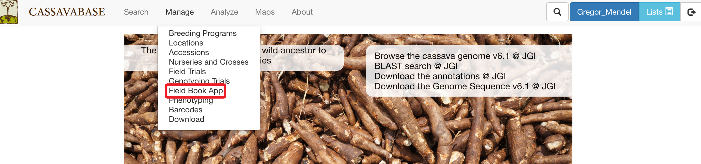
```

On the “Field Book Tools” page, clicking on “New”

```{r echo=FALSE, out.width='95%', fig.align='center'}
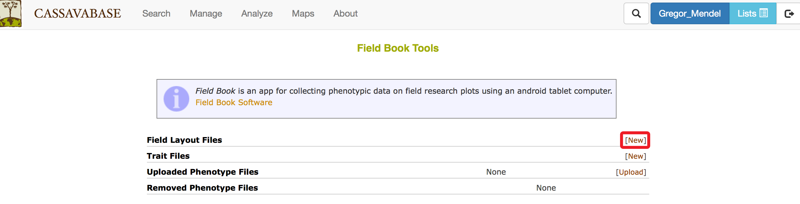
```

On the “Download Fieldbook” window, selecting trial name and data level (plots or plants), then clicking on “Submit” button.
A treatment can be selected, which allows you to record phenotypes based on treatment application.
A list of traits can be selected, which provides a summary of an accession's global performance for those traits in the Fieldbook.

```{r echo=FALSE, out.width='95%', fig.align='center'}
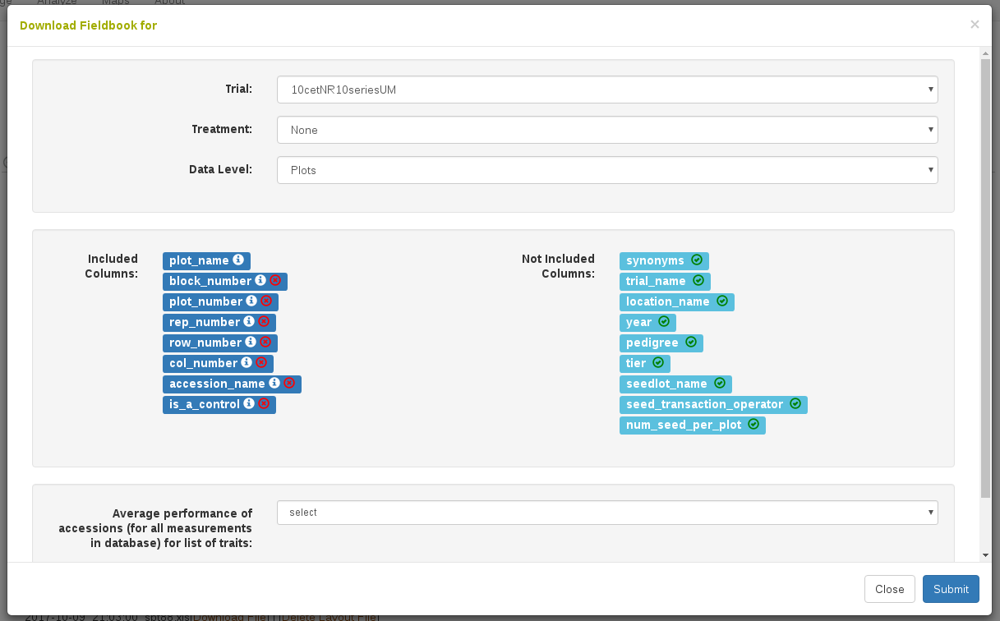
```

If the field book layout file was successfully created, a pop-up window will indicate that the field book layout file was saved successfully. Clicking on the file name will immediately download the file onto your computer. The file is also available to download on the “Field Book Tools” page, if you need to re-download it.

```{r echo=FALSE, out.width='75%', fig.align='center'}
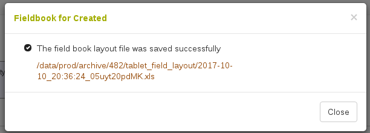
```

To download field layout file to your computer, clicking on “Download File”, the file can then be transferred to your tablet. If you no longer want to keep the field layout file, clicking on “Delete Layout File”.

```{r echo=FALSE, out.width='95%', fig.align='center'}
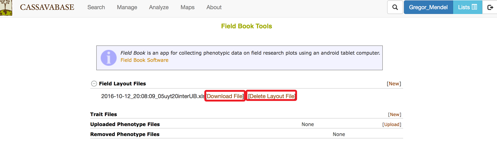
```

### Creating “Field Layout Files” by using “Trial Detail” page.

To create “Field Layout Files”, go to the “Trial Detail” page of the trial that you want to create the file. On the “Trial Detail” page, scrolling down to the bottom of the page to find “Android Field Book Layout” in the “Files” section, then clicking on the “Create Field Book” link.

```{r echo=FALSE, out.width='95%', fig.align='center'}
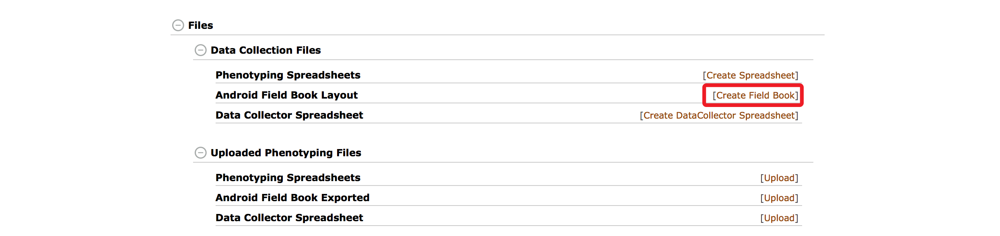
```

Clicking on the “Create Field Book” link will open a new window showing the name of the trial that you selected, as well as data level (plots or plants).
A treatment can be selected, which allows you to record phenotypes based on treatment application.
A list of traits can be selected, which provides a summary of an accession's global performance for those traits in the Fieldbook.
To proceed, clicking on “Submit” button.

```{r echo=FALSE, out.width='95%', fig.align='center'}
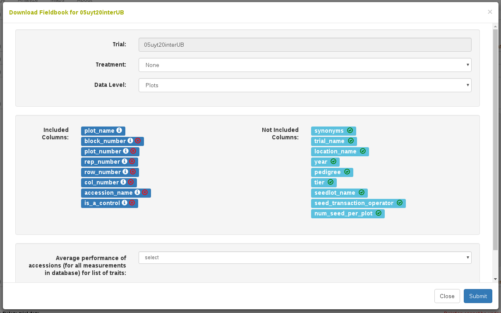
```

If the field book layout file was successfully created, a pop-up window will indicate that the field book layout file was saved successfully. Clicking on the file name will immediately download the file onto your computer. The file is also available to download on the “Field Book Tools” page, if you need to re-download it.

```{r echo=FALSE, out.width='75%', fig.align='center'}

```

To download field layout file to your computer, clicking on “Download File”, the file can then be transferred to your tablet. If you no longer want to keep the field layout file, clicking on “Delete Layout File”.

```{r echo=FALSE, out.width='95%', fig.align='center'}
knitr::include_graphics('assets/images/image94.png')
```

## Creating Trait Files for the Field Book App {#creating-trait-files}

Steps to Create a Trait File:

### Creating a Trait List

After you logged in, lists can be created and managed using the Search Wizard or the "Lists" link. For more information on how to create lists, click [*here*](#working-with-lists).

```{r echo=FALSE, out.width='95%', fig.align='center'}
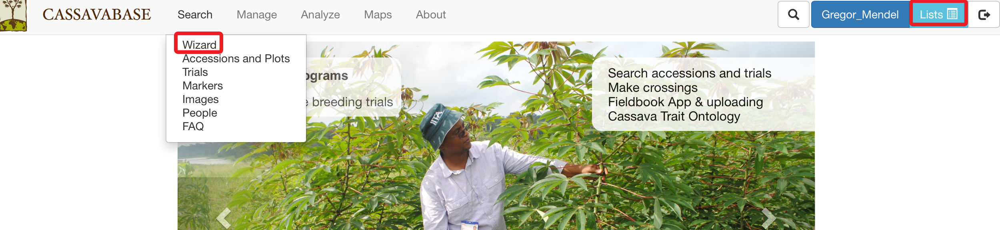
```

### Creating a Trait File

After you have your trait list, clicking on the "**Field Book App**" link found under the "**Manage**" menu tab. This will take you to the “Field Book Tools” page.

```{r echo=FALSE, out.width='95%', fig.align='center'}
knitr::include_graphics('assets/images/image133.png')
```

To create a new trait file, finding the heading “Trait Files”, then clicking on the “New” link.

```{r echo=FALSE, out.width='95%', fig.align='center'}
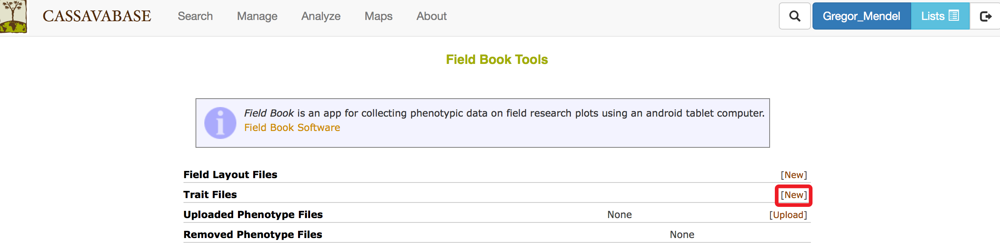
```

Clicking on the "New" link will open a dialogue box titled "Create Trait File". Please enter your “Trait file name” and select “List of traits to include” from drop-down list that you previously created. You can only use traits included in the list. Check the box titled "Include Notes Trait" if you would also like to record and upload general plot notes in the field. Click "OK" to submit.

```{r echo=FALSE, out.width='95%', fig.align='center'}
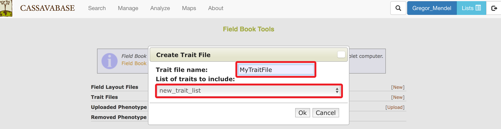
```

If your trait file was successfully created, a new window will indicate that the trait file was saved, then clicking on “Close”.

```{r echo=FALSE, out.width='95%', fig.align='center'}
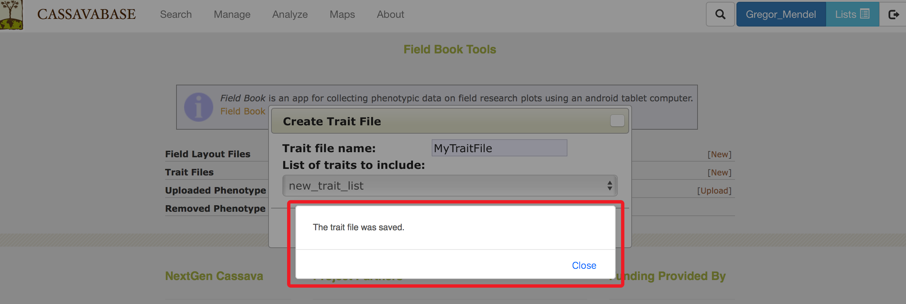
```

After the trait file was saved, you will see your file listed in the “Field Book Tools” page. Clicking on “Download” link to download the trait file to your computer.

```{r echo=FALSE, out.width='95%', fig.align='center'}
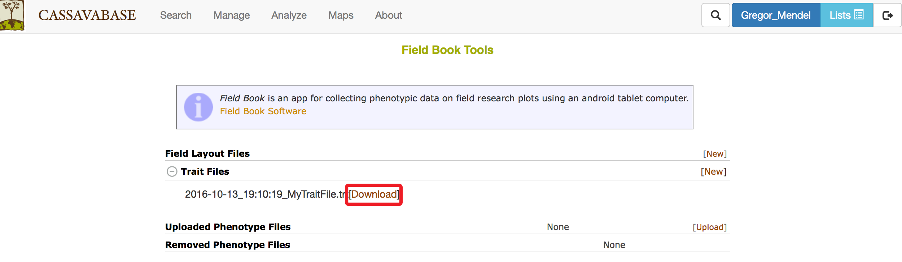
```

After downloading the trait file to your computer, the file can be transferred to an Android Tablet. You need the Android Field Book App to open the file. The Android Field Book App can be downloaded at: *http://www.wheatgenetics.org/bioinformatics/22-android-field-book*

## Transferring Files from Your Computer to Android Tablet

### Files on your computer

After downloading, Field Layout files and Trait files can be found in the “Downloads” folder of your computer. Field Layout files on your computer will have a prefix “fieldbook\_layout\_” added to the beginning of the file name. For example: **"2014-01-28\_19:14:34\_Trial Demo\_location 6767.xls"** on the the database website will be saved as **"field\_book\_layout\_2014-01-28\_19:14:34\_Trial Demo\_location 6767.xls"** on your computer.

```{r echo=FALSE, out.width='95%', fig.align='center'}
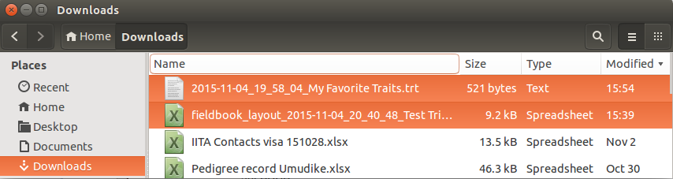
```

The files can be transferred to Android tablet by copying the files into the tablet's Internal Storage File.

### Files on your Android tablet

To transfer Field Layout file and Trait file to your Android tablet, connecting an Android tablet to your computer, then clicking on tablet icon on your computer. Clicking on the tablet icon will open a window showing an “Internal Storage” file.

```{r echo=FALSE, out.width='95%', fig.align='center'}
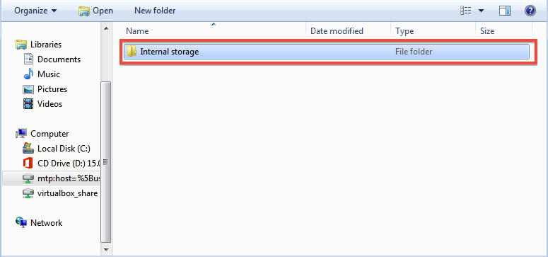
```

After you installed the Android Field Book App, all files for the app are stored in the “fieldBook” folder within the “Internal storage” folder.

```{r echo=FALSE, out.width='95%', fig.align='center'}
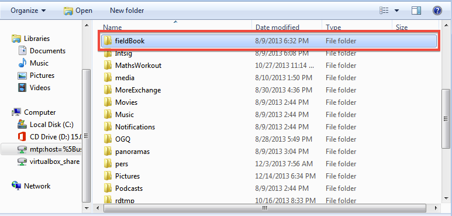
```

Within the “fieldBook” folder, there are five sub-folders:

-   field\_export

-   field\_import

-   plot\_data

-   resources

-   trait

**Field Layout files must be copied into the “field\_import” folder.**

```{r echo=FALSE, out.width='95%', fig.align='center'}
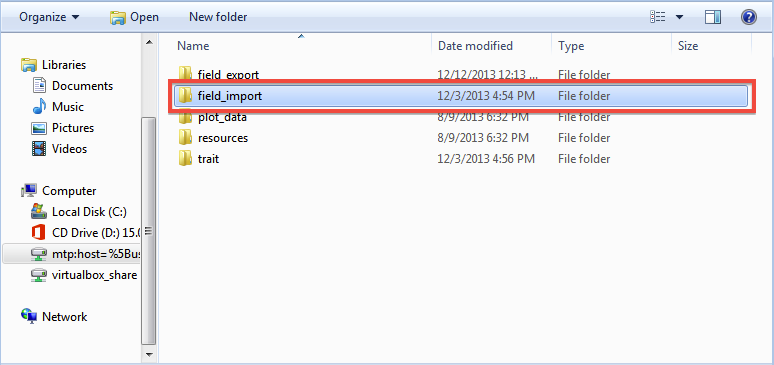
```

**Trait files must be copied into the “trait” folder.**

```{r echo=FALSE, out.width='95%', fig.align='center'}
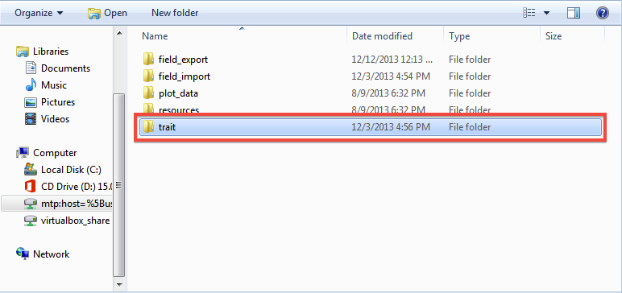
```

You can either drag and drop, or copy the Field Layout file and the Trait file from your computer to the folders in your Android tablet.


## Setting up “Field Book App” for data collection

After you transferred the Field Layout file and Trait file from your computer to Android tablet, you still need to set up “Field Book App” on your tablet for data collection.

To set up the Field Book App:

1. **To open the Field Book App in the Android Tablet, clicking on the Field Book App icon, which is a green rectangle.**
```{r echo=FALSE, out.width='50%', fig.align='center'}

```

2. **To import Field Layout files, clicking on the "Fields" section of the main menu of the Field Book App.**
```{r echo=FALSE, out.width='50%', fig.align='center'}
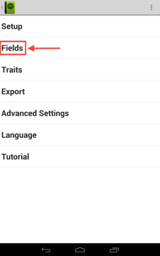
```

Clicking on the "Fields" tab will open a new dialogue that will let you select the file that you want to import.

```{r echo=FALSE, out.width='50%', fig.align='center'}
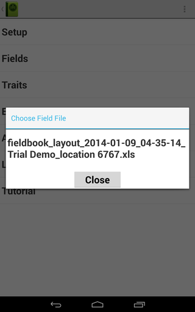
```

Choosing a Field File will generate a new dialogue that will ask you to choose between an Excel or CSV format. Since the data from the database is in Excel format, choose the Excel option.

```{r echo=FALSE, out.width='50%', fig.align='center'}
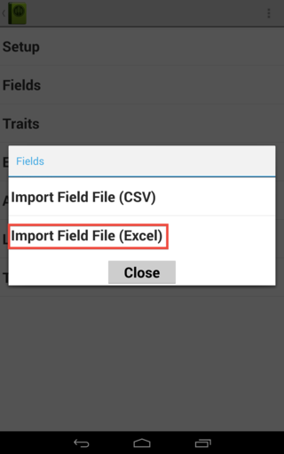
```

After submitting the file format, a final dialogue box will appear. Please provide information about the file that you want to import. Please ensure that "plot\_name" is set as the unique identifier. To finalize the process, clicking “OK” button.

```{r echo=FALSE, out.width='50%', fig.align='center'}
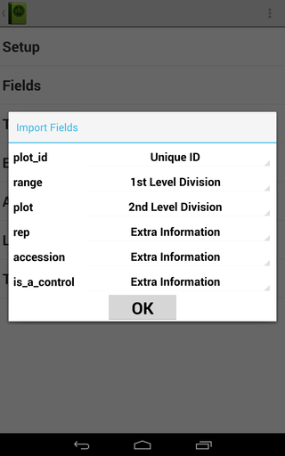
```

3. **To import Trait Files, clicking on the "Traits" tab on the main menu of the Field Book App.**
```{r echo=FALSE, out.width='50%', fig.align='center'}
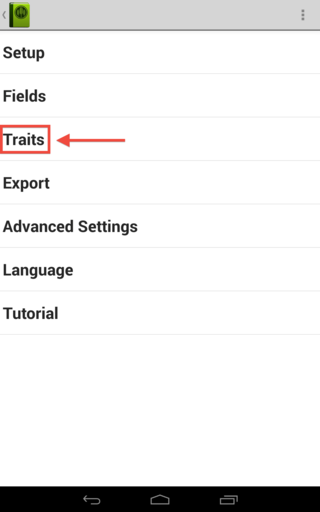
```
Then, clicking on the three dots symbol found on the upper right corner of the Field Book screen. This will open a drop down menu with the choices "Import" and "Export". Clicking on "Import"
```{r echo=FALSE, out.width='50%', fig.align='center'}
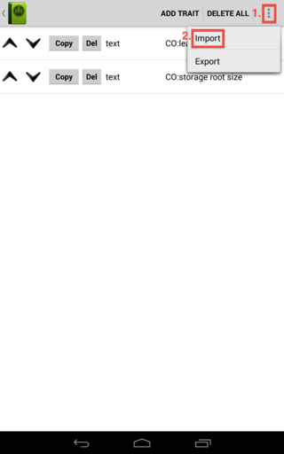
```
Clicking on "import" will open a new dialogue that displays a list of trait files that you can select to import to the Field Book App.
```{r echo=FALSE, out.width='50%', fig.align='center'}
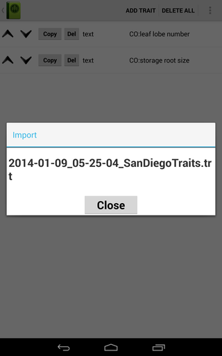
```
The trait file is now imported into the Field Book App. The traits page will show all trait files and available traits.
```{r echo=FALSE, out.width='50%', fig.align='center'}
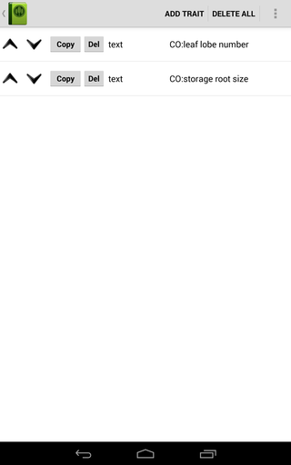
```


## Exporting Files from Field Book App

Data that were collected on the Field Book App can be exported back to your tablet folder, which can then be transferred to your computer.

To export files containing data from the Field Book App to your tablet, clicking on the "Export" link on the main menu page of the Field Book App.

```{r echo=FALSE, out.width='50%', fig.align='center'}
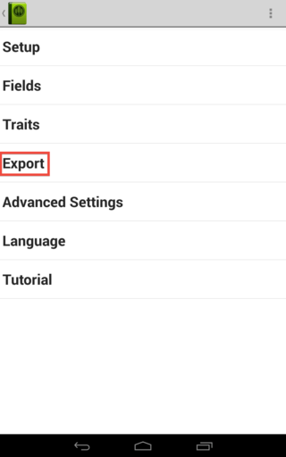
```

Clicking on the "Export" link will open a new dialogue window. To ensure that data are exported in a correct format for the database, checking the "Database Format" box, then clicking on “OK” button.

```{r echo=FALSE, out.width='50%', fig.align='center'}
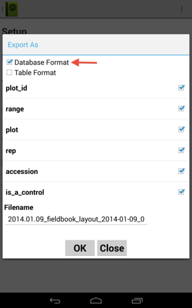
```

The exported file can then be found in the “field\_export” sub-folder within the “fieldBook” folder on your tablet. Once you connect your tablet to your computer, you can directly transfer the file to your computer.

```{r echo=FALSE, out.width='95%', fig.align='center'}
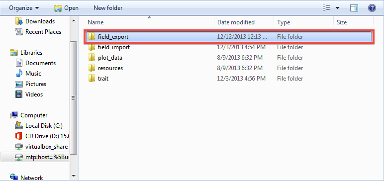
```

```{r echo=FALSE, out.width='95%', fig.align='center'}
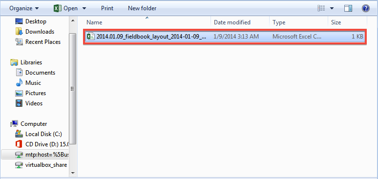
```


## Uploading Phenotype Files to an SGN database {#uploading-pheno-files}

To upload phenotype files to the database, clicking on “Field Book App” in the “Manage” menu.

```{r echo=FALSE, out.width='95%', fig.align='center'}
knitr::include_graphics('assets/images/image302.png')
```

On the “Field Book Tools” page, clicking on “Upload” link in the “Uploaded Phenotype Files” section.

```{r echo=FALSE, out.width='95%', fig.align='center'}
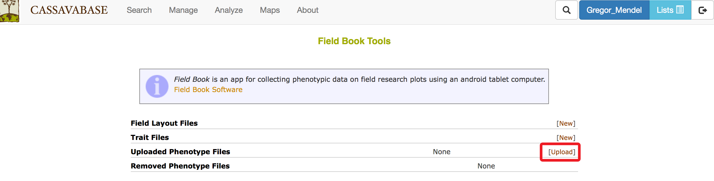
```

Clicking on the "Upload" link will open a new dialogue asking you to choose a file that you want to upload to the database website. Please ensure that "plot\_name" is the first column of the file to be uploaded. To make sure that the file has the correct format for uploading, click on the “Verify” button. After the file format has been verified, click on the “Store” button.

```{r echo=FALSE, out.width='95%', fig.align='center'}
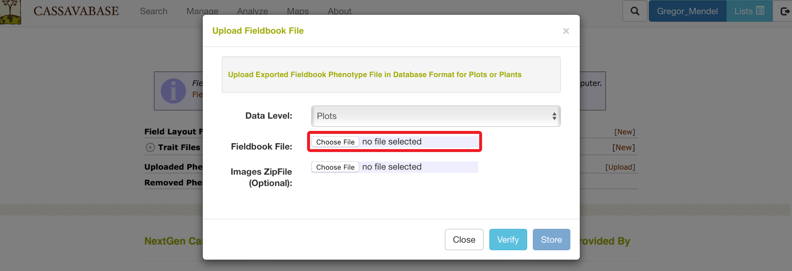
```

The list of uploaded phenotype files can be found on the Field Book Tools page

```{r echo=FALSE, out.width='95%', fig.align='center'}
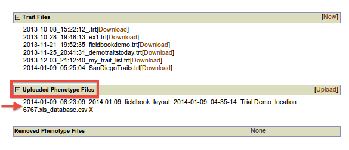
```

The uploaded files will also be seen in the corresponding “Trial Detail” page.

```{r echo=FALSE, out.width='95%', fig.align='center'}
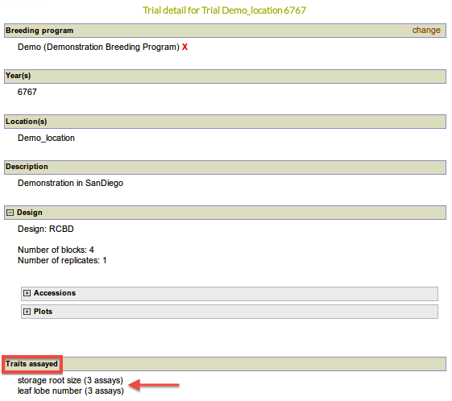
```
