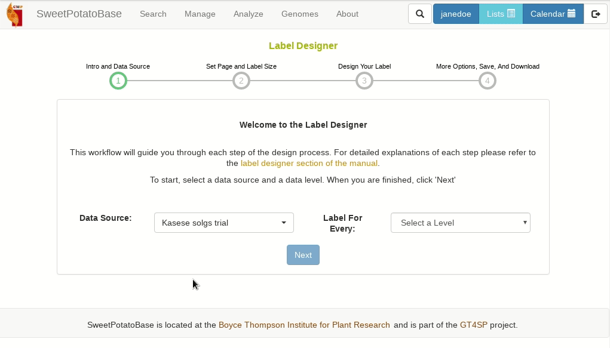
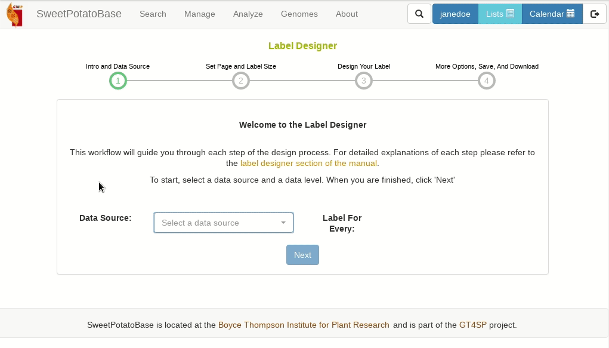
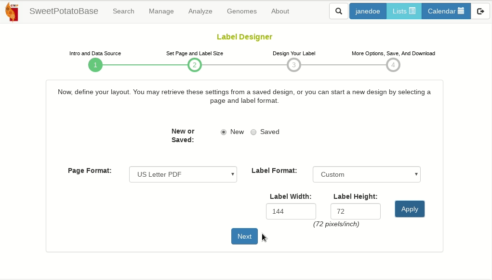
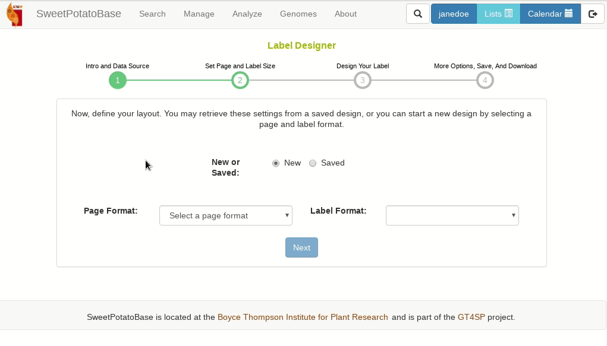
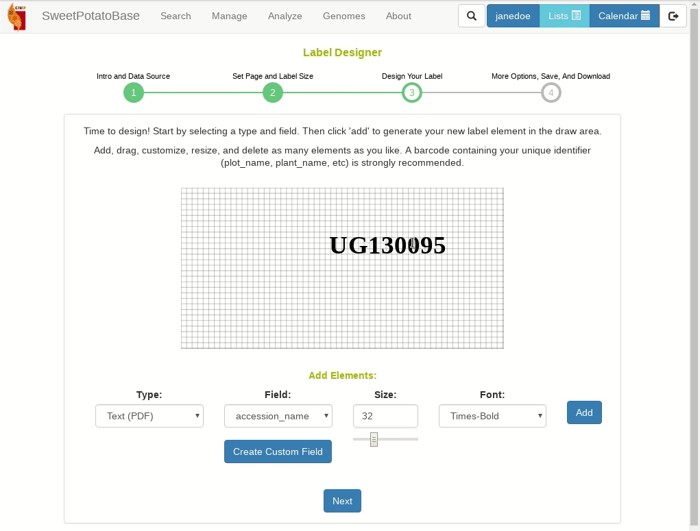
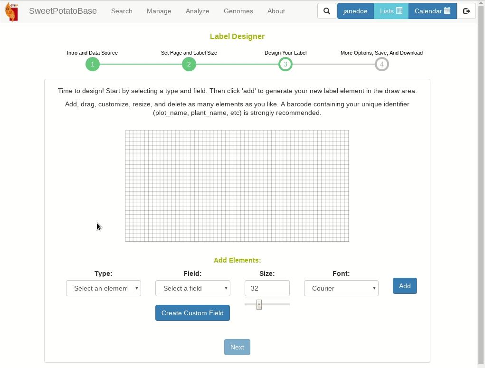
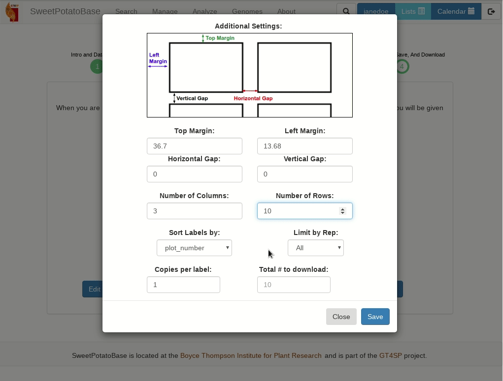
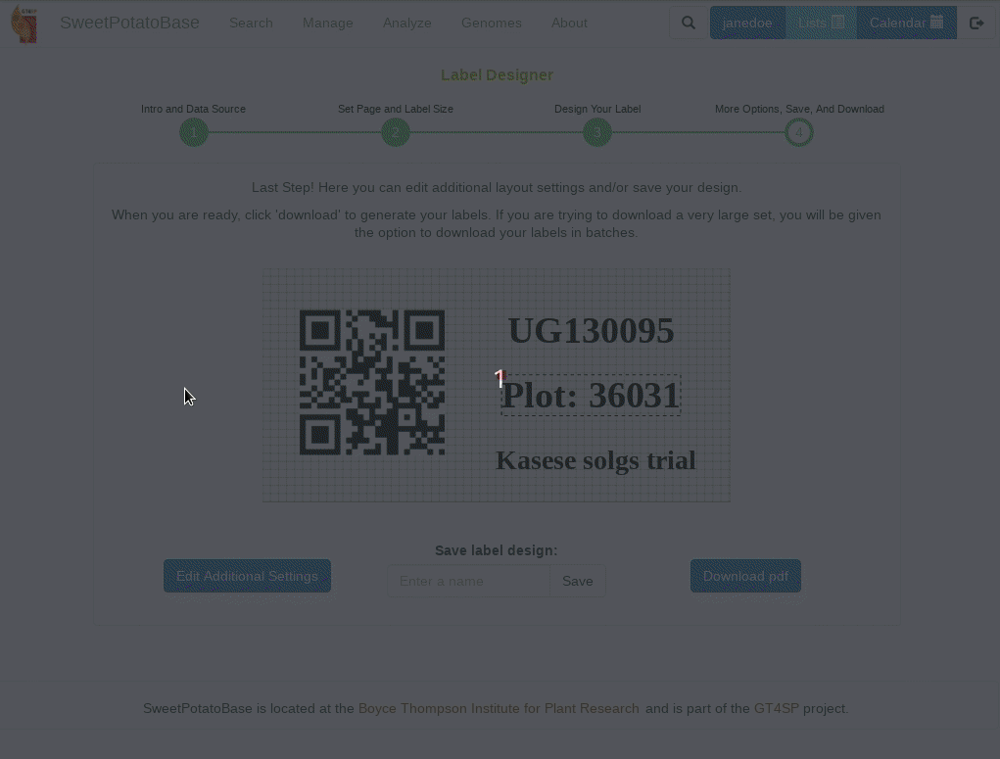

# Using the Label Designer

Breedbase provides an interactive design tool for creating custom labels. To access the Label Desginer, click on “Label Designer” in the “Manage” menu. The following sections explain your many options as you advance through each step of the design workflow.

### First Select a Datasource

The first step is to select a data source. Since the label designer can generate labels for different data types, you can optionally filter the source selection by the data type you're interested in.  Then, select a field, genotyping, or crossing trial to populate your labels with the trial design information. Or select a list to populate your label with the list contents.
For data sources with multiple levels of information you will also be asked to pick a level (plot, plant, etc.) before proceeding. To generate plot-level labels for more than one trial at once, select a list of trials as the source and plot as the level.

```{r echo=FALSE, out.width='95%', fig.align='center'}
if (knitr:::is_latex_output()) {
  
} else {
  
}
```


### Set Page and Label Size

Now choose whether to create a new design or load a saved design. If you choose new, you will be prompted to select a page size and label size.
If you do not see your page or label size as an option, then select Custom and enter your desired dimensions in pixels, or 1/72nds of an inch.
If you choose saved, you will be prompted to select a saved design then will be taken directly to the design step with the saved design elements preloaded.


```{r echo=FALSE, out.width='95%', fig.align='center'}
if (knitr:::is_latex_output()) {
  
} else {
  
}
```


### Design Your Label

Below is a draw area where you can begin adding elements to your label. First select a type, then field, size, and font, then click 'Add'
You can add text to an exisiting field or create a completely custom field by clicking 'Create Custom Field'
Once added, you can drag and drop elements, or delete them by clicking on the red box in their upper left corners.
Barcodes can also be resized by dragging on the green box in their lower right corners.
If you are creating labels for a trial it is highly recommended to include a barcode encoding your plot, plant, or tissue sample names.
These are your unique identifiers that will need to included with any phenotypic or genotypic measurements loaded into the database.
When you are satisfied with your design, click next!

```{r echo=FALSE, out.width='95%', fig.align='center'}
if (knitr:::is_latex_output()) {
  
} else {
  
}
```

### Adjust Formatting, Save, and Download

Last step! Here you can tweak your formatting and page layout, save your design, or download your labels.
The additional settings dialog will allow you to fine tune the print margins and margins between labels. The units are pixels or 1/72nds of an inch. It's not recommended to change these until you've already done a test print.
You can also set the # of copies per label, filter by rep, or download just the first page for test purposes.
To save you're design just type a unique name and hit save. This will save your design to your list manager where you can set it to public to share it with others.
Finally if you are ready just hit download to generate and download your labels!
```{r echo=FALSE, out.width='95%', fig.align='center'}
if (knitr:::is_latex_output()) {
  
} else {
  
}
```
