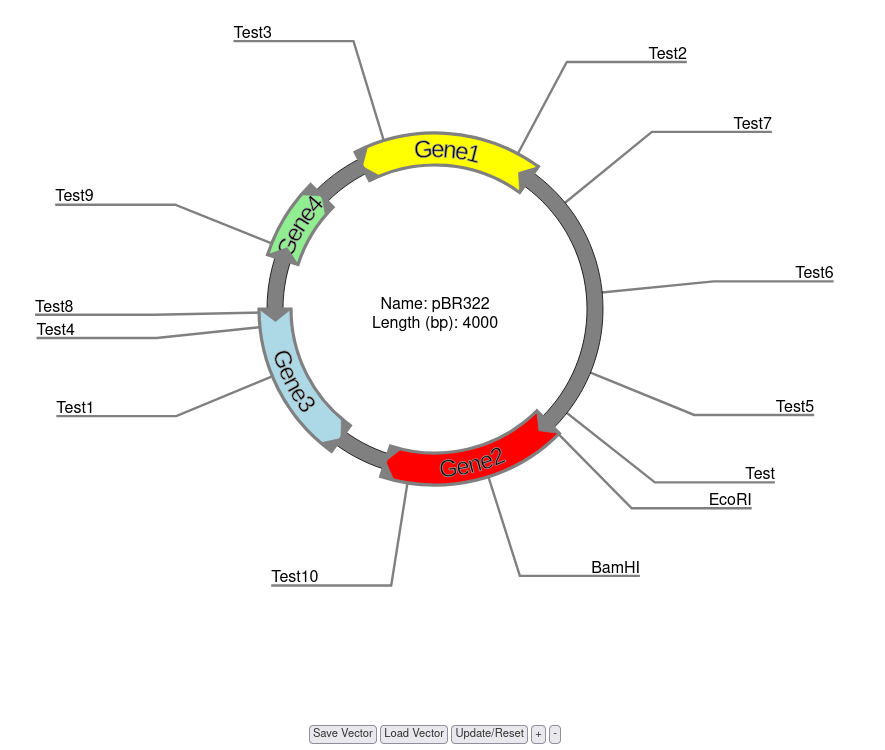
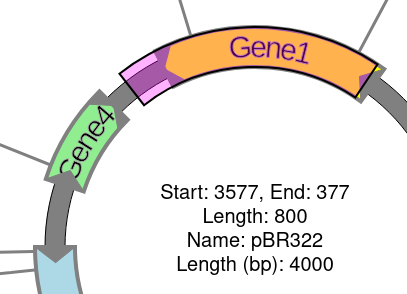
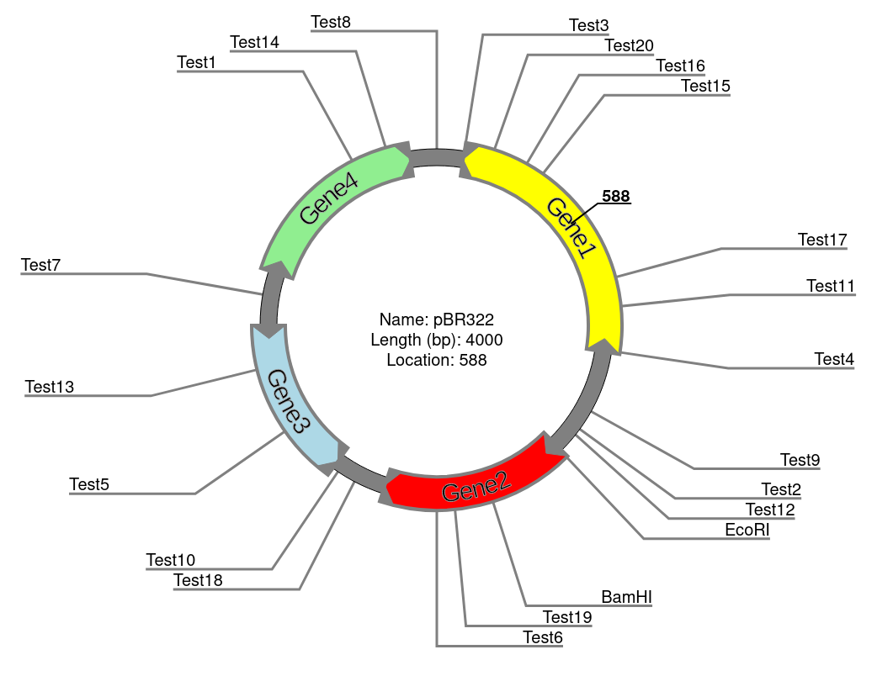
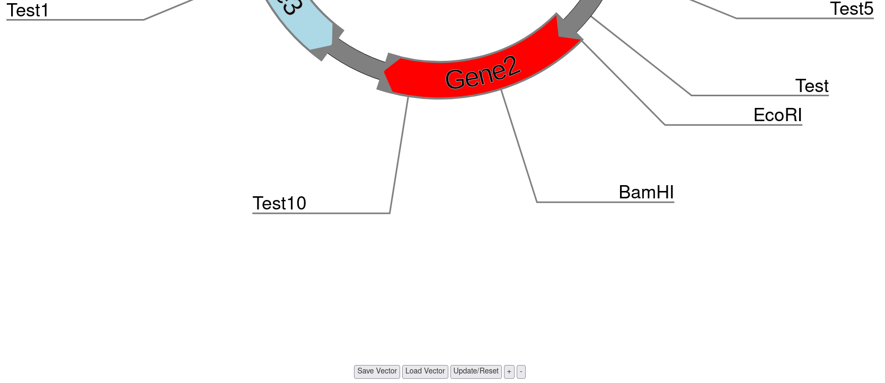
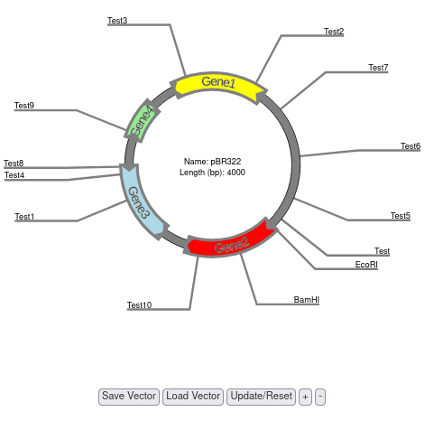

# Vector Viewer

BreedBase provides a vector viewer tool that can generate, save, or upload vectors onto BreedBase.

```{r echo=FALSE, out.width='95%', fig.align='center'}

```

The vector viewer tool comes with many interactive features:

-   Highlighting

-   Location display

-   Zooming in / panning out

-   A feature and restriction enzyme table that support real time editing, deleting, or adding

<!-- -   Load data from GenBank (uncomment this when this feature is complete) -->

<!-- -   Save data (uncomment this when this feature is complete) -->

To highlight a region of the vector viewer, click and drag your cursor clockwise. To delete the new highlight, either start a new highlighted segment by clicking on the vector, or click the "Update/Reset" button.

```{r echo=FALSE, out.width='95%', fig.align='center'}

```

To find the location of a spot on the vector, hover your cursor over the vector and a number will appear. That is the location, in base pairs, of your cursor.

```{r echo=FALSE, out.width='95%', fig.align='center'}

```

To zoom in and pan out, click the "+" or the "-" button underneath the vector.

```{r echo=FALSE, out.width='95%', fig.align='center'}

```

```{r echo=FALSE, out.width='95%', fig.align='center'}

```

To add a feature or restriction site, click "Add". To edit a feature or restriction site, select the feature or restriction site of choice, click "Edit", and make any wanted changes. To delete a feature or restriction site, selected the feature or restriction site that you want to delete and then click "Delete".

```{r echo=FALSE, out.width='95%', fig.align='center'}

```

<!-- To load data from GenBank (fill in the instructions here when this is finished) -->

<!-- To save data (fill in the instructions here when this is finished) -->
